# Sessionboard Clone — Complete Build Plan (rev. 4, implementation rebaseline)

**Codename:** openboard · **Deadline:** Wed Aug 12, 10:00 PM PT (real calendar: **Sat Aug 8 → Wed Aug 12** — delta #21) · **Team model:** 1 architect/integrator + 6 parallel AI-agent-assisted workstream agents — WS-B (the critical path) runs **two** agents, B1 (builder) and B2 (public runtime), from Sat AM.
**Source docs (detail by reference):** `plan/environments.md` (canonical provisioning), `plan/analysis/*.md` (6 feature analyses), `plan/design/data-model.md` (full DDL), `plan/design/app-architecture.md`, `plan/design/platform-integrations.md`, `plan/design/quality-strategy.md`.

**Design-doc conflict resolutions (binding for this plan):**

1. **Repo shape:** single Next.js app (no monorepo, per app-architecture). The second deployable is `workers/jobs` — a ~50-line plain wrangler worker with one `* * * * *` cron that POSTs secret-guarded `/api/jobs/{outbox|reminders|airtable|cleanup}` routes on the web app (minute-modulo dispatch). All job *logic* lives in the Next app (`features/comms`, `features/airtable`); the jobs worker is a dumb trigger. This preserves platform-integrations' "never graft scheduled handlers onto the OpenNext artifact" and "one Resend chokepoint" properties without a package workspace.
2. **Rich text:** TipTap editor storing **sanitized HTML** (per data-model DDL `*_html` columns + app-architecture + platform-integrations; 3-of-4 docs). One shared `sanitize()` (`xss` pkg, allowlist; wider iframe-permitting allowlist only for `resource_pages` — `https:`-src on named hosts only, no `srcdoc`, per rev. 3 delta #19). One `<RichTextView>` component is the **only** `dangerouslySetInnerHTML` site in the repo; CI grep enforces uniqueness. Char limits count stripped-tag code points via one shared helper. **All organizer-authored HTML — including email template `body_html` — passes `sanitize()` on save.**
3. **Form integrity:** BOTH mechanisms from the docs, because they compose cheaply: immutable `form_versions` snapshots compiled on every builder save (submissions/responses/drafts pin a version; mid-flight visitors always validate against a pinned snapshot) **and** a structural lock (`FORM_LOCKED`) once a form has ≥1 non-draft submission (labels/copy/dates always editable). Snapshot compilation is needed anyway as the public runtime payload. **The submit payload always carries the `form_version` the client rendered; a structural mismatch returns typed `FORM_VERSION_STALE` carrying the fresh snapshot (see M16).**
4. **DB drivers:** `neon-http` default for all reads and single-statement writes; WebSocket `Pool` `withTx()` confined to **8 audited runtime repository functions** — `requestPortalLogin`, `createSubmission`, `upsertDraft`, `updateSubmissionFromCfp`, `notifyDecisions`, `completeTaskViaResponse`, `completeTaskViaUpload`, and `moveSession` (per data-model + quality-strategy; supersedes app-architecture's Pool-everywhere). No other deployed function may open a transaction; M09's command-line seed orchestrator is the explicit non-runtime exception and opens one transaction for an all-or-nothing reset.
5. **zod version:** v4 hand-written schemas in `src/shared/contracts` (per quality-strategy). If a Phase-0 spike shows `drizzle-zod`/ecosystem friction on v4, drop to v3 the same hour — contracts are hand-written either way, so the swap is a package.json line.
6. **Neon environments:** three databases (`sb-dev` shared by all agents, `sb-test` for Playwright, `sb-prod`), per platform-integrations. Neon branches available on demand for destructive experiments, not mandated per-agent ceremony.
7. **ICS:** hand-rolled ~200-line UTC-`Z`-only RFC 5545 builder. No library, no VTIMEZONE, ever. Native-invite preconditions per rev. 3 delta #16 (ATTENDEE = recipient, byte-stable ORGANIZER).
8. **Submission write ownership (supersedes the draft's M16-owns-inserts reading):** the `submissions` feature (WS-C) exports `createSubmission(eventId, CreateSubmissionInput)`, `updateSubmissionFromCfp(eventId, contactId, submissionId, CleanAnswers)`, `upsertDraft(eventId, contactId, formId, formVersion)`, and `nextSubmissionCode(tx, eventId)`. The `forms` feature (WS-B) owns only the **pure** pipeline (parse → visibility → strip → validate → `CleanAnswers`) and calls the exported mutations. **Exactly one module in the repo contains an `INSERT INTO submissions`** (M18's mutations file); M17's manual "Add Abstract" and M09's seed reuse the same code-allocation helper. Signatures stubbed in Phase 0.
9. **Timezone library & time API:** **date-fns + date-fns-tz** (per platform-integrations' bundle-size decision). `time.ts` exposes the full 6-function API — `zonedInputToUtc`, `formatInZone` (always appends the zone label), `eventDayKey`, `endOfDayInTz`, `daysToEvent` (calendar-day diff in event tz, never `hours/24`), `addDuration`. Date libs remain import-restricted to `time.ts`; the CI grep targets `date-fns`/`date-fns-tz`, and rev. 3 adds grep #13 banning local-tz `Date` methods (`toLocaleString` family, `getTimezoneOffset`, non-UTC `get*/set*`) outside `time.ts` (delta #18).
10. **Condition operators:** `eq | neq | in | not_in | answered | empty` (per quality-strategy contracts; supersedes the draft's `contains`). Multi-select "contains option X" is expressed as `in` over option ids — this mapping is documented next to the `Condition` schema and in the rule-editor UI copy.
11. **better-auth is a deviation from platform-integrations' "no passwords on Workers" constraint and is gated on a Fri-night spike** (S4: full sign-in round-trip on the **deployed** workers.dev skeleton, not just `wrangler dev`). Pre-decided fallback: jose-signed HMAC session cookie + seeded admin credentials checked against a precomputed hash via Web Crypto (~50 lines, no library). `requireAdmin()`'s signature abstracts over both — a Sat swap touches only `features/auth`.
12. **Portal-token minting:** the auth feature owns `portal_tokens` and exports `issuePortalToken(tx, {contactId, eventId, purpose, ttl, withOtp?}) → {tokenId, raw, otp?, expiresAt}`; `withOtp` is true only for a portal-login issuance and only hashes are stored on `portal_tokens`. **Ordinary portal/calendar links are minted at send time by the comms dispatcher** (fresh expiry, nothing stale ages in the outbox). The sole exception is `portal_login`: M06b must deliver the newly issued OTP/link, so it encrypts that short-lived payload under `SESSION_SECRET` for the outbox; the dispatcher clears the ciphertext after rendering and redacts the stored production body. `/cal/[token]` ICS tokens use the same helper. This adds M06b→M34 and M06b→M35 graph edges without storing raw bearer tokens in plaintext at rest. **`requestPortalLogin(eventSlug, email)` (M06b §3) is the single audited `withTx` composition over this helper** — invalidate the contact's prior login challenges → throttle check → `getOrCreateContact` → `issuePortalToken(tx, {purpose:'magic_link', withOtp:true})` → AES-GCM-encrypt the delivery payload → `enqueueEmail` — one signature, quoted identically by M02, M06b, and M34; `withOtp` is rejected for any purpose other than `magic_link`.
13. **Contacts write discipline:** the portal feature exports `getOrCreateContact(tx, eventId, email)` and `updateContactFields(dbOrTx, eventId, contactId, partial)` (field-scoped, never whole-row; the first parameter is `DbOrTx` — transactional writers pass their `tx`, while single-statement guarded saves like M22's profile save and M27's email correction pass the `neon-http` `db` handle without opening a ninth `withTx` path). Every writer — CFP Account step (M06b), co-speaker participants (M16), profile save (M22), `maps_to` write-back (M25), admin email correction (M27) — goes through these two helpers. Direct `INSERT`/`UPDATE` on `contacts` anywhere else is a lint/review-blocker (same pattern as `enqueueEmail` for `communication_logs`).
14. **Task-assignment fan-out rule (the `task_assignments_v` counting law):** submission-targeted tasks assign to **the primary contact only, once per accepted submission** (the `is_primary` partial-unique makes this well-defined); contact-targeted tasks assign to **members of `accepted_speakers_v` only**. Written into the 0001 view SQL and `contracts/` before the Sat-noon freeze; consumed identically by M23 (admin matrix), M25 (runtime), M36 (reminders), M38 (dashboard). PGlite test: a co-speakered submission produces exactly one assignment; the dashboard count matches the portal count.
15. **Speaker confirmation:** `notifyDecisions` **auto-sets `confirmation_status='confirmed'`** on the primary contact of each accepted submission at notify time (simplest coherent rule; there is no speaker-facing confirm CTA in scope). Admin can override per speaker in M27 (`unconfirmed`/`declined`). `published_speakers_v` keeps its confirmed-only filter; M32's leakage test covers an admin-declined speaker disappearing from the gallery.

**Rev. 3 hardening deltas (judged-path review, Fri Aug 8) — numbered continuously so modules can cite them:**

16. **ICS native-invite preconditions:** every `METHOD:REQUEST`/`CANCEL` invite carries exactly one `ATTENDEE` whose mailto equals the email's `To:` recipient — Gmail/Outlook silently degrade a mismatched invite to a dead attachment, no chip, no RSVP. Enforcement is split by what each layer can see: `buildInvite` throws on a REQUEST/CANCEL without an attendee (the pure builder never sees the message envelope); the ATTENDEE-equals-`To:` equality is asserted in `prepareInvite`/the dispatcher wiring, which marks the row `failed` on mismatch (and makes no send). And the `ORGANIZER` mailto is byte-identical across every send for a UID — mechanically backstopped by **`calendar_invites.organizer_email`, stamped from `EMAIL_FROM` at first send and reused verbatim thereafter**, so even a mid-hackathon `EMAIL_FROM` change cannot fork existing invites (clients key update-in-place and CANCEL on (UID, ORGANIZER); `EMAIL_FROM` additionally policy-freezes once the first invite is out). Both are checked as diagnostics *before* the Sat render-check may adopt the deeplink fallback (M35).
17. **Deliverability gate = headers, not the dashboard flag:** the CP1 "domain verified" check is a probe email **sent through Resend from the production `EMAIL_FROM`** to a team Gmail whose `Authentication-Results` header reads `spf=pass dkim=pass dmarc=pass` **with aligned identities — `header.from` and DKIM `header.d`/`header.i` on the `EMAIL_FROM` domain** (alignment is what DMARC grades; a generic pass from another sender proves nothing about judge-facing mail; screenshot → `DECISIONS.md`); DMARC is published Fri with SPF/DKIM. Wed's fresh-inbox bug bash additionally lands a **calendar invite** on the fresh Gmail's calendar — first-contact inboxes are where spam/DMARC treatment differs from the warmed team inboxes used Sat/Sun (M01, M35, §7).
18. **Local-tz `Date` grep:** CI grep #13 bans the `toLocaleString` family, `toDateString`/`toTimeString`, `getTimezoneOffset`, non-UTC `get*/set*` accessors, and multi-argument `new Date(y, m, …)` construction outside `time.ts`, **scoped to `src/**`** (`workers/jobs` and `scripts/` are UTC-only, non-judged surfaces; `getUTC*`, `setUTC*`, `Date.now()`, `getTime`, single-arg ISO `new Date(iso)` and epoch math stay legal) — closes the raw-`Date`-math DST/off-by-one hole the date-library grep cannot see (M01 §10).
19. **The wide sanitizer profile is a spec, not vibes:** `<iframe>` allowed only with `https:` `src` on the named host allowlist (YouTube/nocookie, Vimeo, Loom, Google Docs — extended centrally in `sanitize.ts`, never at a call site), fixed attribute list `src|width|height|allow|allowfullscreen|frameborder|title` (so `srcdoc` is stripped by construction), with tests for `http:`-src, non-allowlisted-https-src and `srcdoc` probes. The wide **tag** set additionally carries `img`/`hr`/table-family (M26's long-form-document set), which `default` deliberately does not. Resolves the M04 §5 (`^https?:`, no host list, no img/hr/table) vs M26 step 2 drift in M26's favour.
20. **Reminder cron gated on its AC suite:** the deployed `/api/jobs/reminders` keeps M08's stub until M36's PGlite AC tests are green — a half-wired ladder that emails real people is worse than a late one (M36).
21. **Calendar correction — the draft scheduled six days into five:** Aug 8 2026 is a **Saturday**, and the draft's "Tue" and "Wed" both resolve to Wed Aug 12 (execution.md even dated them both Aug 12), putting the draft's CP4 "Tue midnight" *after* the Wed 10 PM submission deadline. Binding fix: weekday labels everywhere remain **logical plan-day names**, mapped plan-Fri = **Sat Aug 8** (Phase 0 tonight), plan-Sat = **Sun Aug 9** (CP1), plan-Sun = **Mon Aug 10** (CP2), plan-Mon = **Tue Aug 11** (CP3), plan-Tue = **Wed Aug 12 until 2 PM** (**CP4 = Wed 2 PM**), plan-Wed = **Wed Aug 12, 2–10 PM** (bug bash → submit by 8 PM; 8–10 PM emergency buffer). "Wed AM" phrases elsewhere mean the start of that compressed block. Consequence, stated honestly: the buffer day is gone — a checkpoint slip the draft would have absorbed on Wednesday now triggers its §9 cut line the same day it occurs.
22. **Environments and Cloudflare plan:** [`plan/environments.md`](plan/environments.md) is the canonical provisioning inventory. `sb-web` owns all DB/R2/Resend/ICS/Airtable logic; `sb-jobs` receives only `APP_BASE_URL` + the matching `CRON_SECRET`. Local/preview/prod map to `sb-dev`/`sb-test`/`sb-prod`, isolated R2 buckets, and distinct worker pairs. Start on Workers Free: the Aug 8 reconciled candidate is 1204.60 KiB gzip against Free's 3 MB limit. Upgrade to Workers Paid before judging only if the production candidate approaches 2.5 MB gzip or deployed SSR/auth/DB probes cannot stay inside Free's 10 ms CPU allowance. Production never enables `TEST_AUTH` or `EMAIL_FALLBACK_UI`; preview fallbacks are evidence aids, not substitute authentication.

---

## Implementation rebaseline — Sat Aug 8, after PRs #1–#5 merged

PR #3's hardening deltas above remain binding. Rev. 4 changes execution accounting, not product contracts: the merged PR #2/#4/#5 lineage provides a broad local browser demo but no completed module, deployed preview, server-backed golden path, or release proof.

[`plan/status.md`](plan/status.md) is the current evidence ledger and recovery overlay. It records the exact PR/module state, checkpoint truth, and gates R0–R4. Until that ledger says CP1 is green:

- fixture/localStorage behavior is described as a **local browser demo**, not end-to-end completion;
- a module becomes `DONE` only after merge, its complete AC, and every named deployed/external check;
- bonus work and new UI surface pause behind foundation, security, server-spine, and deployment gates;
- the original dependency graph and work orders remain authoritative, while `plan/status.md` determines the next runnable recovery gate.

The immediate sequence is: **R0 stack safety → R1 deployed foundation → R2 server-backed CFP/review/notify spine → R3 portal/program/tracking loop → R4 release proof**. The minimum winning bar in §9 is unchanged.

---

# 1. Product scope

Judging bar: the AIE team can run the full Sessionboard walkthrough on our deployed site and conclude they'd drop a >$40k/yr contract. The brief's 9 primary features are CORE; depth is tunable (§9), presence is not.

| # | Brief feature (verbatim intent) | Build | MoSCoW | Must land | Modules |
|---|---|---|---|---|---|
| 1 | Custom call-for-speakers submission forms with conditional logic and category-based routing | Form builder (6-step wizard: setup/welcome/abstract/participant/settings/notifications; Payments omitted — annotated NOT NEEDED), **8 committed field types** (text, textarea, wysiwyg, dropdown, multiselect, email, url, file; phone/number/date deferred post-CP4 as COULD — enum stays extensible), locked system fields, one-level visibility rules + ordered first-match routing rules stamping track/tags, public branded 5-step CFP wizard (Welcome→Account→Submission→Participant→Review) with OTP account step, **server-persisted single draft per (contact, form)** feeding real Drafts tabs/counts, server-enforced deadline + per-user limit, **speaker edit-until-close (M41)** honoring Sessionboard's "closes new AND updated submissions", confirmation email + success page ("make sure this works") | **MUST** | Sun (CP2); M41 Tue | M11–M16, M41 |
| 2 | Self-service speaker portal for bios, headshots, slides, and supporting documents | Magic-link/OTP portal: Home widgets (incl. **My Sessions** card showing scheduled time/room), Submissions w/ status chips (SESS-n) + edit-until-close, Profile (5,000-char bio, links, headshot→R2), Tasks (manual / form / file-upload kinds), file requests, admin impersonation; phone-width AC on the task runtime | **MUST** | Mon (CP3) | M21–M27, M41 |
| 3 | Automated, templated speaker communications, incl. reminders and calendar invites (Gmail, Outlook, iCal) | **8** fixed editable templates (7 domain keys + `portal_login`) w/ validated `{{vars}}`, domain-event triggers via transactional outbox, T-7d/T-1d/overdue reminder ladder via **burst-safe** idempotent cron scan (latest-eligible-rung only), ICS METHOD:REQUEST/CANCEL attachments + Google/Outlook deeplinks + tokenized download + per-speaker feed, comms log UI. **Real-inbox ICS render check Sat (canned curl); full lifecycle Sun** | **MUST** | Mon (CP3); comms admin UI Tue | M34–M37 |
| 4 | Submission evaluation and scoring workflows across multiple rounds; AI-assisted review "very optional" | Evaluation plans (name, 1–5 scale, round number, track scope), reviewer assignments (category routing), reviewer scoring queue w/ upsert **and the full submitted form answers (Q&A panel from the pinned snapshot) in the scoring view**, aggregate Rating column. Seeded reviewer credentials in the demo script. Multi-round = ordered plans, no auto-advance. AI review = one "Generate AI review" button writing a synthetic reviewer row — only if time remains | **MUST** (basic) / **COULD** (AI) | Mon (CP3); AI Tue+ | M17–M20 |
| 5 | Drag-and-drop schedule + agenda with automatic conflict detection across rooms and tracks; list/day/week/track/room views | Session CRUD + drafts/unscheduled tray, dnd-kit Day-grid drag/resize/snap, pure `detectConflicts()` (room+speaker=error, track=warning, half-open intervals), Conflicts tab w/ badge, List/Day/Week/Track/Room views (DnD on Day only; Week/Track/Room land Tue AM), accepted→session promotion. Month view skipped | **MUST** | Mon (CP3); W/T/R views Tue AM | M28–M31 |
| 6 | Real-time dashboard showing which speakers still have outstanding onboarding tasks | Fixed Speaker Tracking tab (CORE): outstanding count, ranked top-speakers list, overdue list, confirmation mix (fed by the auto-confirm rule, resolution #15), missing bio/headshot alerts — one aggregated endpoint over SQL views, TanStack polling. Today tab (KPIs, attention strip, recent submissions) = SHOULD | **MUST** (tracking) / **SHOULD** (Today) | Mon (CP3) / Tue | M38 |
| 7 | Accelevents integration | Waived by the brief | **WON'T** | — | — |
| 8 | Resource and wiki pages in the speaker portal, incl. HTML embed support | Admin CRUD of resource pages; portal render with the wide sanitizer allowlist (iframe permitted) | **MUST** (small) | Mon (CP3) | M26 |
| 9 | Embeddable, mobile-friendly speaker gallery and schedule itinerary (ref: wf2025.ai.engineer/schedule) | Two canonical public pages per event (`/e/[slug]/schedule`, `/e/[slug]/speakers`) + `/embed/*` bare-shell variants with `frame-ancestors *` + postMessage auto-resize snippet; published-data-only via views; s-maxage=60 auto-update. **Pulled forward to Sunday** (it is a MUST with no fallback, unlike DnD). Full embed configurator = NICE | **MUST** | **Sun (CP2)** public pages; embeds Mon (CP3) | M32–M33 |

**Bonus items:**

| Bonus | Build | MoSCoW | Must land | Modules |
|---|---|---|---|---|
| Cloudflare infra | OpenNext web worker + jobs cron worker + R2, with mandatory application auth throttles and optional custom-domain WAF defense. Start on Workers Free; upgrade only if the measured bundle/CPU gate in resolution #22 trips | **MUST** (Workers deployment; Paid is conditional) | Fri night skeleton | M01, M08 |
| Airtable persistence | One-way idempotent export (Speakers/Submissions/Sessions/Task Status/Comms Log) keyed on `PG ID`, manual button + optional cron. **Base + 5 tables + fields provisioned Sat, one hand-run upsert verified before M39 starts** | **SHOULD** | Tue (CP4) | M39 |
| Speed/performance | Drizzle (no WASM), no charts lib, s-maxage=60 public pages, one aggregated dashboard endpoint, Neon scale-to-zero disabled, CI bundle-size gate, TipTap client-bundle budget checked when M05b lands | **SHOULD** (continuous) | Tue perf pass | M01, M32, M38 |
| Public API | `/api/v1`: unkeyed published-data endpoints (event/schedule/speakers) + keyed endpoints (submissions/outstanding-tasks/stats/comms-log), CORS, s-maxage | **SHOULD** | Tue (CP4) | M40 |
| Forge hosting | Skip — "very teeny bonus"; GitHub + open-source repo (submission requirement) | **WON'T** / repo **MUST** | Wed | M10 |

Explicit skip list (never build): Payments step, Accelevents, custom dashboard builder/AI-prompt dashboards, Month view, Group/sponsor targets, websockets, calendar OAuth, multi-org tenancy, CRM/Marketing/Studio/Invoices/Email Themes/Record Settings/Personas, Sentry, SVG uploads, server-side image processing, **cross-field character limits, participant-role min/max counts** (moved here from the cut list — no module builds them, so they are not cuttable, they are out).

Deferred post-CP4 COULD (additive, only if CP4 is green): phone/number/date field types; "Copy from…" deep-copy with id-remap (forms list keeps a plain "duplicate settings only" copy); draft-reminder email rung; AI review button.

---

# 2. Architecture summary

**Stack.** Next.js App Router · shadcn/ui + Tailwind · Drizzle ORM on Neon Postgres (`neon-http` + confined `withTx` Pool) · deployed via `@opennextjs/cloudflare` on Workers Free initially (Paid only on the measured resolution-#22 trigger) · R2 (files + ISR cache) · Zustand (ephemeral UI only — litmus: "if the server could need it, it's not Zustand state") · TanStack Query (all client server-state) · Resend (dispatcher in `sb-web`; `sb-jobs` only triggers it) · dnd-kit · TipTap (client-only) · better-auth (admins; spike-gated per resolution #11) + custom magic-link/OTP (speakers) · zod v4 contracts · date-fns-tz (in `time.ts` only) · Vitest + fast-check + PGlite + Playwright (chromium, against Neon `sb-test`).

**Deployables (2).** `sb-web` = the OpenNext worker (all UI, route handlers, job-logic routes). `sb-jobs` = plain wrangler worker, one `* * * * *` cron, minute-modulo dispatch POSTing `x-cron-secret`-guarded `/api/jobs/*` on sb-web (outbox every min; reminders+task_assigned %15; airtable %10; cleanup daily). Coupling = Postgres rows + that one HTTP surface. `ctx.waitUntil` nudge after user-facing enqueues makes email ~instant; cron is the guaranteed sweeper.

**Repo layout** (single pnpm app; boundaries enforced by `eslint-plugin-boundaries`, violations = CI failure):

```
openboard/
├── next.config.ts            # headers(): frame-ancestors * on /embed/*, XFO DENY elsewhere
├── open-next.config.ts       # R2 incremental cache (or Cache-API fallback per spike S1)
├── wrangler.jsonc            # sb-web: nodejs_compat, R2 bindings, secrets
├── workers/jobs/             # sb-jobs: dumb cron dispatcher (~50 lines, zero app imports)
├── drizzle/                  # 0000_init.sql + 0001_views_triggers.sql (big-bang, then additive-only)
├── scripts/
│   ├── seed/                 # <feature>.ts seed modules (per-workstream ownership) + orchestrator
│   │   └── index.ts          # architect-owned: insertion order events→contacts→forms→submissions→
│   │                         #   sessions→tasks→comms; shared UUIDv5 namespace helpers
│   └── check-invariants.sh   # CI greps (see Deployment below)
├── e2e/                      # 6 Playwright smokes (vs sb-test) + load-test.ts (50-concurrent submit)
└── src/
    ├── middleware.ts         # admin gate /events/*, portal gate, security headers
    ├── db/                   # client.ts (db + withTx), schema/<module>.ts (one file per feature)
    ├── shared/
    │   ├── contracts/        # ★ zod v4: enums (const arrays feeding pgEnum+zod+UI), branded IDs,
    │   │                     #   transition maps, FormSnapshot/Condition/Routing, DTOs (incl.
    │   │                     #   CommLogRow, FormFieldRendererProps), template-var contracts,
    │   │                     #   idempotency-key recipes, fan-out rule, limits.ts.
    │   │                     #   Frozen after CP1; architect-labeled PRs only.
    │   ├── lib/              # conditions.ts (ONE evaluator), form-snapshot.ts (compileFormSnapshot —
    │   │                     #   pure, shared by builder saves AND seed), sanitize.ts, time.ts
    │   │                     #   (6-fn API per resolution #9), intervals.ts, slug.ts, api-client.ts,
    │   │                     #   query-keys.ts, errors (incl. FORM_VERSION_STALE)/log
    │   ├── server/           # defineHandler (auth+zod+eventId+409), auth guards, r2.ts, enqueueEmail
    │   ├── ui/               # shadcn + app primitives (DataTable, StatusBadge, EmptyState,
    │   │                     #   RichTextEditor/View, DateTimePicker(tz), FileUpload, StatTile, Donut)
    │   └── fixtures/         # typed demo data + the GOLDEN FormSnapshot fixture (Phase-0 artifact)
    ├── features/             # auth, events, forms, submissions, portal, agenda, embeds, comms,
    │                         #   dashboard, airtable — each: index.ts barrel, server/{queries,mutations,
    │                         #   guards}, components/, hooks/, store.ts. Cross-feature imports: barrel
    │                         #   or shared/* ONLY. Only server/ files may import db client.
    └── app/                  # thin routes: (admin) /events/[eventId]/..., (public) /submit/[slug]/[formId],
                              #   (portal) /portal/[slug]/..., (embed) /embed/..., /e/[slug]/...,
                              #   api/internal/<feature>/**, api/v1/**, api/jobs/**, /cal/[token], /f/[fileId]
```

**Data flow.** RSC pages call their own feature's `server/queries.ts` directly and hydrate DTOs as TanStack `initialData`. All client reads/mutations go through zod-validated `/api/internal/*` route handlers built with `defineHandler` (auth, eventId-first scoping, 409 optimistic concurrency via `expectedUpdatedAt`/`row_version`). **No Server Actions.** Cross-feature side effects: features insert `communication_logs` outbox rows (via shared `enqueueEmail(tx, …)` with unique idempotency key) in the same transaction as the domain write; the comms dispatcher drains them. Reminders and task_assigned are never enqueued by domain code — a cron scan finds (rule × open assignment) pairs not yet logged, re-checking state at send time (see M36 for the burst-safe rule).

**Auth.** Admins/reviewers: better-auth (email+password, Drizzle adapter, seeded users; fallback per resolution #11). Speakers: custom hashed magic-link + 6-digit OTP tokens (POST-confirm — email-scanner-safe; **max 5 verify attempts per token then invalidated; issuance throttled in the application at 3/10min per event+email**), per-(contact,event) session cookie; the CFP Account step sets the same session, so CFP identity IS the portal login. A custom-domain WAF rule is optional defense-in-depth, not the primary control and not a Workers Paid entitlement. Admin impersonation uses `impersonated_by_user_id` on the portal session + banner. Public API: event-scoped bearer keys hashed in `api_keys`; published-data endpoints unkeyed.

**Email environments (explicit — this is the judged path).** `EMAIL_MODE=log` everywhere until the Resend domain verifies. DNS (SPF/DKIM/DMARC) submitted **Fri night**; propagation **checked at CP1 Sat noon (hard gate item)** and re-checked Sat night. **"Checked" means headers, not the dashboard flag: send a probe through Resend from the production `EMAIL_FROM` to a team Gmail and screenshot `Authentication-Results` (Show original) reading `spf=pass dkim=pass dmarc=pass` with aligned identities — `header.from` and DKIM `header.d`/`header.i` on the `EMAIL_FROM` domain — into `DECISIONS.md` (delta #17). Alignment is what DMARC grades; a generic pass from another sender proves nothing about judge-facing mail.** Once verified: **prod = `EMAIL_MODE=send`, `EMAIL_ALLOWLIST` unset, `EMAIL_FALLBACK_UI=0`** — judges type arbitrary addresses and real mail arrives; **dev/preview = `EMAIL_MODE=log`** (allowlist only if an agent needs live send-testing, and fallback UI only there). The resend.dev shared domain is **never** a fallback for judge-entered addresses (it only delivers to the account owner). If verification fails by Sun noon, the production email/auth acceptance criterion remains red: use preview log/fallback surfaces for debugging and the team demo, but never expose an OTP or magic link inline on the judge deployment. Seeded contacts use team-owned inboxes only. Wed AM bug bash includes a full OTP round-trip to a **fresh Gmail AND a fresh Outlook address**, **plus a calendar invite landed on the fresh Gmail's calendar** from scheduling that speaker's session (delta #17).

**Event scoping (impossible-by-construction).** Every event-scoped table: `event_id NOT NULL` + `UNIQUE(id, event_id)`; every inter-table FK is composite `(x_id, event_id)` — cross-event joins are constraint violations. Every repo fn signature starts `(eventId, …)`. Portal repo fns additionally take `contactId` (IDOR-proof).

**Caching.** `force-dynamic` for admin/portal/CFP/all POSTs. Public schedule/gallery/embeds/JSON API: `s-maxage=60, stale-while-revalidate=300` (= "auto-updating embeds" + speed bonus). CFP shell may cache ≤30s but open/closed/deadline computed per-request and enforced in the submit transaction — cache staleness can never accept a late submission.

**Deployment.** Pin `@opennextjs/cloudflare` + Next versions Fri night, never bump. CI: typecheck → ESLint+boundaries → invariant greps (no `dangerouslySetInnerHTML` outside RichTextView, no `process.env` outside env.ts, no date libs or local-tz Date methods outside time.ts (delta #18), no Resend outside dispatcher, **no `export const runtime = 'edge'` anywhere**, no `INSERT INTO submissions`/raw `contacts` writes outside their owning mutation files) → vitest (unit+PGlite, incl. **seeded-snapshot check: every seed snapshot zod-parses against `FormSnapshot` and round-trips the M15 renderer smoke**) → `next build` + `opennextjs-cloudflare build` + Wrangler dry-run gzip measurement (warn at 2.5 MB while on Free; if Paid is adopted, warn at 8 MiB) → Playwright (vs sb-test) → migrate prod (direct URL) → deploy web → deploy jobs → curl post-deploy smoke (incl. `/f/` header assertions). All deploy commands runnable from a laptop (Actions-outage fallback).

---

# 3. Data model

Authoritative DDL: `plan/design/data-model.md` §3–§6 (lands verbatim as migrations `0000_init.sql` + `0001_views_triggers.sql` before parallel work; additive-only after; `drizzle-kit push` banned; schema owner = architect) **plus the review deltas marked ★ below, all landing in 0000/0001 before the Sat-noon freeze**. ~35 tables + 8 views. Inline summary (key columns only):

**Identity & event config** (owner: events)
- `users` — id, email (lower-trimmed CHECK), name, password_hash
- `events` — id, name, **slug** (unique, regex + reserved-word CHECK), event_type, timezone (IANA), starts/ends_at, theme (≤1000), logo/background_file_id, **submission_cap_per_user** (default 3), **submission_seq** (SESS-n counter), row_version
- `event_members` — (user_id, event_id) PK, role owner|organizer|reviewer
- `file_assets` — id, event_id, kind (logo|background|headshot|attachment|slide|upload), r2_key, mime, size, uploader refs
- `tracks` / `rooms` / `session_formats` / `tags` — id, event_id, name (UNIQUE per event), color/capacity/default_duration, sort_order. One vocabulary shared by CFP dropdowns, routing, evaluation scope, agenda, embeds — options reference **ids**, never labels.

**Contacts & portal auth** (owner: cfp/portal)
- `contacts` — id, event_id, **email (UNIQUE per event)**, names, salutation/pronouns/gender, bio_html (≤5000 plaintext), headshot_file_id, 4 link urls, confirmation_status (★ auto-set `confirmed` by notifyDecisions per resolution #15), unsubscribed_at. Per-event identity; no global speaker. ★ All writes via `getOrCreateContact`/`updateContactFields` (resolution #13).
- `portal_tokens` — hashed raw token + nullable OTP hash, purpose (magic_link|ics_download|impersonation), expires/consumed_at, ★ **attempts int NOT NULL DEFAULT 0** (OTP brute-force guard: 5 failed verifies → consumed)
- `portal_sessions` — token_hash, (contact_id, event_id), impersonated_by_user_id
- better-auth tables + `api_keys` (hashed)

**Form engine — shared CFP + portal** (owner: forms)
- `forms` — id (=public URL token), event_id, **context (cfp|portal)**, internal_name/external_title/page_heading, status (draft|open|closed), kind, collect_participants, opens/closes_at, submission_limit (NULL→event cap), welcome/success_html, auto_redirect, participant_roles jsonb, confirmation settings, target_type (portal), **current_version**, row_version. (★ multiple-drafts toggle removed — single draft per (contact, form) by construction.)
- `form_sections` — form_id, key, title, page_heading(15), description_html, sort_order
- `form_fields` — **immutable id**, key, label, field_type (★ 8 committed types; pgEnum stays extensible for the deferred 3), required, **locked**, max_chars, options jsonb (option ids carry trackId/formatId/tagId), **visibility jsonb** (rule AST, ops per resolution #10), maps_to (closed allowlist), sort_order, **deleted_at (soft)**
- `form_versions` — form_id, version, **snapshot jsonb** (compiled via shared `compileFormSnapshot` — the ONLY producer, used by builder saves and seed alike), append-only
- `routing_rules` — form_id, sort_order, match all|any, conditions jsonb, set_track_id, add_tag_ids

**Submissions** (owner: cfp/submissions)
- `submissions` — id, event_id, form_id?, **form_version** (pinned at draft creation / carried in submit payload), **code** (UNIQUE(event_id, code) → "SESS-n", assigned at draft creation via `nextSubmissionCode`), kind, **status** (7-state pg enum incl. draft, plpgsql BEFORE UPDATE transition trigger), source (cfp|manual|import), title(255), description_html, track_id?, format_id?, level/language, starts/ends_at, capacity, submitter_contact_id, submitted/decided/**notified_at**, ★ **notify_revision int NOT NULL DEFAULT 0** (bumped, with notified_at cleared, in the same guarded UPDATE whenever a submission leaves a final state — makes re-notify after organizer undo possible; part of the decision idempotency key), withdrawn_at, row_version. ★ Partial unique index: **one `status='draft'` row per (form_id, submitter_contact_id)** — the server-side CFP draft.
- `submission_participants` — submission_id, contact_id, role, **is_primary** (partial unique), sort_order
- `submission_answers` — submission_id, field_id, participant_id?, value jsonb (discriminated by `t`), **UNIQUE NULLS NOT DISTINCT (submission, field, participant)** — draft upsert target
- `submission_tags` — (submission_id, tag_id)

**Evaluation** (owner: submissions)
- `evaluation_plans` — name, **round**, scale_min/max, status, track_ids[] (category scope)
- `evaluation_criteria` — plan_id, label, weight
- `reviewer_assignments` — plan_id, user_id, track_ids[] (category routing), UNIQUE(plan, user)
- `reviews` — plan_id, submission_id, reviewer_user_id, overall_score?, criterion_scores jsonb, comment, is_ai, **UNIQUE(plan, submission, reviewer)** (upsert)

**Agenda** (owner: agenda)
- `sessions` — id, event_id, submission_id? (UNIQUE — promotion link), title, slug, description_html, format/track/room_id?, starts/ends_at (both-NULL = unscheduled tray, CHECK pair), status draft|published, **schedule_revision** (→ ICS SEQUENCE), row_version (drag CAS)
- `session_speakers` — (session_id, contact_id) PK, role, sort_order

**Portal tasks** (owner: portal)
- `portal_tasks` — name, description_html, target_type (contact|submission), **completion_mode (manual|form|file_request)** + CHECK-paired form_id/file_request_id (RESTRICT deletes), due_at, is_active, created_at (★ used by the reminder-suppression rule, M36)
- `task_completions` — task_id, contact_id, submission_id?, completed_via, refs, **UNIQUE NULLS NOT DISTINCT (task, contact, submission)** — assignments are LAZY (view), only completions are rows
- `file_requests` — title, target_type, instructions_html, accepted_extensions, max_size_mb
- `file_uploads` — file_request_id, contact_id, submission_id?, file_asset_id
- `form_responses` — form_id, form_version, contact_id, submission_id?, **answers jsonb**, UNIQUE per target (resubmit = overwrite; maps_to write-back updates only present columns)
- `resource_pages` — title, slug, body_html (wide allowlist incl. iframe), published

**Embeds / Comms / Airtable** (owners: embeds, comms, airtable)
- `embeds` — id (=public token), content_type (5 kinds), enabled, style/filters jsonb
- `email_templates` — event_id, **key** (8-key enum: 7 domain keys + `portal_login`), subject, body_html (★ sanitized on save), enabled; UNIQUE(event, key); ★ seeded ONLY via M34's exported `seedDefaultTemplates(tx, eventId)`, invoked by both the event-create mutation (M11) and the seed orchestrator — one owner for these rows.
- `reminder_rules` — offset_days (seeded −7, −1, +1), enabled
- `communication_logs` — **transactional outbox + audit log**: contact_id, template_key, **idempotency_key UNIQUE** (insert-first = the double-send firewall), status queued|sent|failed|**skipped** (★ also used to permanently retire superseded reminder rungs), attempts/next_attempt_at/locked_until (FOR UPDATE SKIP LOCKED claim), provider_message_id, ics_uid, entity refs, rendered subject/body for audit; `portal_login` alone may carry AES-GCM `secret_payload_ciphertext`, which is cleared after dispatch and redacted from production log bodies
- `calendar_invites` — (contact_id, session_id) UNIQUE, **ics_uid stable**, **sequence monotonic**, last_method request|cancel, ★ **organizer_email** (stamped from `EMAIL_FROM` at first send, never overwritten — delta #16's byte-stable ORGANIZER backstop)
- `airtable_sync_state` — (table_name, record_pk) UNIQUE → airtable_record_id, content_hash; `airtable_sync_runs` — trigger, status, stats

**Read-model views** (migration 0001; the ONLY read path for dashboard/embeds/public API — one counting rule, draft-leak-proof by construction): `accepted_speakers_v`, `task_assignments_v` (★ fan-out rule per resolution #14 baked into the SQL; overdue derived), `speaker_outstanding_v`, `missing_assets_v`, `submission_status_counts_v`, `submission_ratings_v` (nulls excluded), `published_sessions_v`, `published_speakers_v`. ★ Every view exported to Airtable additionally exposes **`greatest(a.updated_at, b.updated_at, …) AS updated_at`** so M39's watermark never silently skips rows whose freshness comes from a joined table — documented in M03 as a sync requirement.

**Idempotency-key recipes (in `contracts/`, frozen at CP1):**
- `{eventId}:received:{submissionId}`
- `{eventId}:decision:{submissionId}:{notify_revision}` — recipient = **submitter (primary) contact only**; co-speakers learn via the portal (pre-decided, see M18)
- `{eventId}:task_assigned:{taskId}:{contactId}:{submissionId|-}`
- `{eventId}:task_reminder:{taskId}:{contactId}:{submissionId|-}:{offsetDays}`
- `{eventId}:task_reminder:{taskId}:{contactId}:{submissionId|-}:manual:{minuteBucket}` — manual nudge; the minute bucket dedupes double-clicks without colliding with a scheduled rung
- `{eventId}:sched:{sessionId}:{contactId}:{schedule_revision}`
- `{eventId}:portal_login:{contactId}:{tokenId}`
(assignments are lazy view rows with no PK — keys are composed from the natural key, never from a nonexistent "assignmentId").

---

# 4. Module catalog

Size: **S** ≈ 2h · **M** ≈ half-day · **L** ≈ day (one focused AI-agent-assisted developer). Every module: one owner, one workstream. All cross-module consumption goes through contracts/barrels stubbed in Phase 0 — dependents start from the typed interface before implementations exist. "AC" = acceptance criteria (demo-verifiable).

### WS-A · Platform & Foundation (architect)

**M01 — Repo scaffold, CI, walking-skeleton deploy** · `/` (root config), `.github/workflows`
Create the pinned Next+OpenNext app, canonical local/preview/production wrangler configs for sb-web, ESLint boundaries config, CI pipeline with all gates (incl. the `runtime='edge'` ban and ownership greps), and deploy a hello page to workers.dev Fri night. **Fri-night spikes are cut to the existential four + two 10-minute checks:** S1 OpenNext deploy (+ R2 ISR cache vs Cache-API fallback), S2 `withTx`/Neon WebSocket Pool on deployed Workers, S3 `xss` pkg on Workers, S4 better-auth full sign-in round-trip **on the deployed workers.dev artifact** (resolution #11; fallback pre-decided), plus C1 Resend `Idempotency-Key` header honored (curl, 10 min — the double-send firewall M34 leans on), C2 `wrangler versions` preview URLs work on the OpenNext artifact (every daily checkpoint depends on this). Remaining spikes run **Sat AM in parallel with feature work**: revalidate-60 behavior, aws4fetch presigned PUT, PGlite schema compat, embed headers. Also Fri: measure the Wrangler dry-run gzip artifact and deployed CPU, submit Resend DNS (SPF/DKIM/DMARC), and prove the application-layer OTP issuance/attempt controls; a custom-domain WAF rule is optional defense-in-depth. Fallbacks are adopted the same hour on any spike failure.
**Interface:** `pnpm dev|check|build|deploy:web|deploy:jobs`, green CI, live workers.dev URL. **Deps:** — . **AC:** hello page live on Cloudflare Fri night; CI red/green demonstrably gates a PR; spike/check and Workers-plan results written into `DECISIONS.md`; application throttles proven. **Size: L**

**M02 — Shared contracts** · `src/shared/contracts/`
All cross-agent types: enum const arrays (SubmissionStatus 7-state + transition map w/ `canTransition`, FieldType (8 committed + extensible), TemplateKey, …) feeding pgEnum+zod+UI from one definition; branded IDs; `FormSnapshot`/`Condition` (ops per resolution #10)/`VisibilityRule`/`RoutingRule`; DTOs (Event/Track/Room, SubmissionListRow, ContactDTO, ScheduledSessionDTO, ConflictDTO, TaskDTO/OutstandingTasksRow, **CommLogRow**, TemplateVars per key, API envelopes); `limits.ts` (one char-count rule); **the idempotency-key recipes and the task fan-out rule (resolution #14) as documented constants**; `AppError` closed code enum incl. `FORM_CLOSED`, `LIMIT_REACHED`, `FORM_LOCKED`, **`FORM_VERSION_STALE`**; **Phase-0 signature stubs** for every cross-workstream function: `createSubmission`/`updateSubmissionFromCfp`/`upsertDraft`/`nextSubmissionCode` (res. #8), `issuePortalToken` (res. #12), `getOrCreateContact`/`updateContactFields` (res. #13), `seedDefaultTemplates`, `listLog(eventId, filters): CommLogRow[]`, `getAcceptedForScheduling`, `getPublishedSchedule`/`getPublishedSpeakers`, and **`FormFieldRendererProps`** (`{snapshot, answers, onChange, mode}` — no CFP-wizard imports; the portal builds against this from Sat). Frozen after CP1 (architect-labeled PRs only).
**Interface:** everything importable from `@/shared/contracts`. **Deps:** M01. **AC:** compiles standalone; every enum has exactly one const-array source; fixture data zod-parses; the golden FormSnapshot fixture parses. **Size: M**

**M03 — DB schema, migrations, views, transition trigger** · `src/db/`, `drizzle/`
Drizzle schema files (one per feature) mirroring data-model.md 1:1 **plus the §3 ★ deltas** (notify_revision, portal_tokens.attempts, draft partial-unique, view `updated_at` aggregates, fan-out rule in `task_assignments_v`); big-bang `0000_init.sql` + `0001_views_triggers.sql` (plpgsql submission-status guard — which also clears `notified_at`/bumps `notify_revision` on final→pending — and the 8 read views); `db`/`withTx` client; applied to sb-dev + **sb-test** + sb-prod before any feature work. Playwright runs against sb-test (a real Neon DB — no PGlite-behind-Next driver seam; PGlite stays vitest-only).
**Interface:** `import { db, withTx } from '@/db/client'` (repo files only, lint-enforced); table types; view types. **Deps:** M02. **AC:** migrations apply cleanly to fresh Neon + PGlite; illegal status transition raises; accepted→pending clears notified_at and bumps notify_revision atomically; cross-event composite-FK insert fails; `UNIQUE NULLS NOT DISTINCT` works (PG≥15 verified); co-speakered submission yields exactly one `task_assignments_v` row. **Size: L**

**M04 — Shared server & pure libs** · `src/shared/lib/`, `src/shared/server/`
`time.ts` (**the 6-fn API per resolution #9**: zonedInputToUtc, formatInZone w/ tz label, eventDayKey, endOfDayInTz, daysToEvent, addDuration; date-fns-tz import-restricted here; DST test table incl. midnight-crossing eventDayKey cases), **`form-snapshot.ts` — `compileFormSnapshot` as a pure, test-first shared function** (validates earlier-only visibility refs, option ids, locked-field invariants; produces the exact runtime payload; called by M12 builder saves AND M09 seed — one producer, zero drift), `sanitize.ts` (two allowlists), `intervals.ts` (half-open overlap), `slug.ts` (+reserved words), `errors.ts` (closed enum incl. FORM_VERSION_STALE), `log.ts` (structured JSON), `defineHandler` (auth+zod+eventId+409), `api-client.ts` + `query-keys.ts`, `enqueueEmail(tx, {eventId, templateKey, contactId, idempotencyKey, refs, secretPayloadCiphertext?})` (outbox insert helper; the secret field is accepted only for `portal_login`), env.ts (zod-validated getEnv incl. EMAIL_MODE/EMAIL_ALLOWLIST/EMAIL_FALLBACK_UI).
**Interface:** all of the above. **Deps:** M02. **AC:** unit tests green (time DST table, sanitizer strips `<script>`/`onerror`, intervals property tests, compileFormSnapshot golden-fixture round-trip); `enqueueEmail` dedupes on conflict. **Size: M**

**M05a — Admin shell + core list primitives** · `src/shared/ui/` (part), `src/app/(admin)/layout`
The Sat-AM unblocking half of the old M05: shadcn generation, `DataTable` (TanStack Table: sort/filter/pagination/selection), `StatusBadge` (colors beside the enum), `EmptyState`, `ConfirmDialog`, `Dash` (`value ?? '—'`), `TzTime`; admin layout: sidebar (event switcher, Dashboard/Program/Portal/Comms/Embeds/Settings nav), topbar (View Portal, user menu). Unblocks every list-heavy module (M11/M12/M17/M21/M23/M27/M28/M37/M38) without waiting for the editor/picker/upload primitives.
**Interface:** `@/shared/ui/app/*` (core set); `(admin)` layout slots. **Deps:** M01, M04. **AC:** kitchen-sink page renders the core primitives; admin shell navigates between stub pages; light-mode only. **Size: M**

**M05b — Rich primitives** · `src/shared/ui/` (part) — **owner: WS-D agent** (its first consumer)
`RichTextEditor`/`RichTextView` (sole dangerouslySetInnerHTML site; **TipTap client-bundle budget asserted in CI when this lands**), `DateTimePicker` (event-tz, labeled, clearable), `FileUpload` (presigned R2 w/ progress + client downscale, wired to M07), `StatTile`, `Donut` (one SVG).
**Interface:** `@/shared/ui/app/*` (rich set). **Deps:** M04, M05a, M07. **AC:** kitchen-sink page extended; RichTextEditor round-trips sanitized HTML; bundle-size gate green. **Size: M**

**M06a — Admin auth** · `src/features/auth/` (admin half)
better-auth for admins (login page, session middleware gate on `/events/*`, roles via `event_members`) — or the resolution-#11 fallback if spike S4 failed, behind the same `requireAdmin(eventId, role?)` signature. Small, well-trodden, lands Sat AM so every admin surface unblocks.
**Interface:** `requireAdmin(eventId, role?)`, login page, `TEST_AUTH=1`-gated e2e login route. **Deps:** M03, M04. **AC:** admin logs in on deployed preview; reviewer role sees reviewer surfaces only; the test-login route is absent from production. **Size: M**

**M06b — Speaker/portal auth** · `src/features/auth/` (portal half)
Custom speaker auth: OTP + magic-link issuance (hashed tokens, POST-confirm verify page), **attempts counter — 5 failed verifies invalidates the token; per-email issuance throttle 3/10min**, per-(contact,event) session cookie, `requirePortal(eventSlug)` guard, `ensurePortalSession(contactId, eventId)` (shared with CFP Account step; creates contacts via `getOrCreateContact` — resolution #13), **`issuePortalToken(tx, {contactId, eventId, purpose, ttl})` exported for the comms dispatcher** (resolution #12), admin "Open portal as X" impersonation (banner + attribution), and a **local/preview-only** `EMAIL_FALLBACK_UI=1` diagnostics path that surfaces the OTP/magic link.
**Interface:** `requirePortal`, `ensurePortalSession`, `issuePortalToken`, verify pages. **Deps:** M03, M04, M06a. **AC:** speaker OTP round-trips via `EMAIL_MODE=log` log row; 6th wrong OTP attempt rejects even with the right code (PGlite); email-scanner GET does not consume the token; impersonation banner shows and writes are attributed; fallback flag works only outside production; production with the flag set fails closed. **Size: M–L** (Sat PM)

**M09 — Seed + demo script** · `scripts/seed/`, `docs/demo-script.md`
**Restructured as per-feature seed modules** (`scripts/seed/<feature>.ts`, owned by the corresponding workstream agent) composed by an architect-owned orchestrator (`scripts/seed/index.ts`) with documented insertion order (events → contacts → forms → submissions → sessions → tasks → comms) + shared UUIDv5 namespace helpers. Content: idempotent, relative dates: event "AI.Engineer Sandbox — NYC" (tz LA, starts now+65d) + empty second event (standing empty-state test); 4 tracks/5 rooms/5 formats; form A open (1 conditional field, 3 routing rules, limit 3) + form B closed — **snapshots produced by the shared `compileFormSnapshot`, never hand-written**; ~25 submissions all statuses incl. 2 genuine draft rows, all-nulls row + hostile strings (`;lkj`, 255-char title, RTL, `` XSS probe); 12 speakers (mixed missing bio/headshot, one on 2 accepted sessions) with **headshot `file_assets` backed by real R2 objects** (gallery/embed demos work without WS-D); **a reviewer user assigned to the eval plan with track scope and partial scores**; eval plan w/ partial scores; ~15 sessions + 2 named conflict pairs + 3 unscheduled; 3 tasks (one overdue — exercising the burst-safe first-tick rule); templates via `seedDefaultTemplates` (never hand-written rows); pre-populated comms log. Demo script maps all 9 features → URL + artifact + 60-second walkthrough line; prints **admin login + reviewer login (with a 60-second scoring walkthrough) + a team-owned speaker email**. The speaker uses the normal OTP flow; preview-only fallback diagnostics may assist the team, but no raw bearer token is seeded or committed.
**Interface:** `pnpm seed [--wipe]`. **Deps:** M03, M04 (compiler). **AC:** every judged surface renders non-empty from seed; every seeded snapshot passes the CI zod-parse + renderer smoke; XSS probe never alerts; re-run is a no-op; reviewer can score from a cold start using only the demo script. **Size: M** (orchestrator + core; feature modules land with their workstreams)

**M10 — Golden-path e2e, release engineering, open-source repo** · `e2e/`, `scripts/post-deploy-smoke.sh`, `README`
The 6 Playwright smokes (admin-setup, cfp-submit, abstracts-decide, portal-tasks, agenda-schedule, public-embeds) **against Neon sb-test** (per resolution #6 — no PGlite driver seam behind a running Next server), post-deploy curl smoke (health, CFP 200 + deadline string, schedule 200, embed headers, **`/f/` Content-Type + nosniff assertions**), **the CP2 load test: a 10-line autocannon/k6 script firing 50 concurrent submits at the deployed preview's submit endpoint** (owns risk #2's verification), README + API docs + LICENSE, submission checklist **incl. reimbursement proof: per-day token/cost screenshots or API usage exports from each coding-agent account captured into `docs/spend/` daily** (the brief's $500 reimbursement "will ask for proof").
**Interface:** `pnpm e2e`; green post-deploy smoke. **Deps:** M16, M18, M25, M30, M32, M34 (runtime); starts as skeleton at CP1. **AC:** golden path green on deployed preview at CP2 + load test p95 documented; all 6 specs green at CP4; repo public with reproducible setup; spend evidence current through Tue. **Size: M**

*(M05 and M06 are split as above; M07 moves to WS-D, M08 to WS-F — the architect is the fan-out gate and must not own 54h of Sat work. CP1 gates only M02/M03/M04 + M05a + M06a; M05b/M06b/M07 land Sat PM without gating CP1.)*

### WS-B · Forms Engine + CFP — **two agents: B1 (builder) + B2 (public runtime)** (feature folders: `events`, `forms`)

**M11 — Events feature: CRUD, branding, vocab, settings hub** · `src/features/events/` — **B1**
Event create/edit (name, slug w/ uniqueness+reserved check, type, website, location, IANA tz select, starts/ends datetimes in event tz, theme w/ 1000-counter), logo/background upload via M07, event switcher, settings hub tabs (Details · Tracks · Rooms · Formats · Tags), vocab CRUD with drag reorder, optimistic-concurrency saves; event-create invokes `seedDefaultTemplates` (stub until M34 lands). Server half starts Sat AM against schema alone; UI half needs M05a/M06a/M07 (dashed edges in §5).
**Interface:** `getEvent`, `getEventBySlug`, `listTracks/Rooms/Formats/Tags`; `<EventSwitcher>`, `<TrackChip>`. **Deps:** M03 (start); M05a, M06a, M07 (finish); M34 (template-seed stub). **AC:** create event → branded public shell reachable at slug + 8 default templates present; endsAt≤startsAt rejected; vocab feeds every downstream dropdown; concurrent edit → 409 + friendly message. **Size: L**

**M12 — Form builder core** · `src/features/forms/` (builder) — **B1**
Forms list (Open/Closed tabs w/ counts, **real** submissions/drafts counts (drafts are server rows now), close dates, Create + "duplicate settings only" copy — **deep-copy with id-remap deferred post-CP4**); builder wizard shell (left step rail, per-step Save, View Form, Copy Link); sections config (title/15-char page heading/rich-text instructions); field list CRUD with **the 8 committed field types**, seeded default fields, locked system fields (server-enforced invariants), required toggles, drag reorder (dnd-kit sortable, transactional renumber), soft delete; **snapshot compilation via the shared `compileFormSnapshot` (M04)** on every save → `form_versions`; structural lock after first non-draft submission (`FORM_LOCKED`).
**Interface:** `listForms(eventId)`, `getFormForBuilder`, `saveFormStep`, `getPublicForm(eventSlug, formId)` (snapshot + openness + limit state). **Deps:** M05a, M05b (editor), M11, M04 (compiler). **AC:** build a form with all 8 field types; locked Title cannot be deleted/un-required even via curl; save produces a new pinned version; structural edit after seeded submission → FORM_LOCKED; drafts count on the form card matches the Drafts tab. **Size: L**

**M13a — Condition evaluator (pure)** · `src/shared/lib/conditions.ts` — **B2** (starts Fri night against contracts draft)
The ONE evaluator (`evaluateVisibility`, `evaluateRule`; **ops eq/neq/in/not_in/answered/empty** per resolution #10; option-id based; earlier-field-only = cycles impossible) with the ~30-case table-driven test file as spec; `stripHiddenAnswers`; `applyRouting(rules, cleanAnswers)`.
**Interface:** `evaluateVisibility`, `stripHiddenAnswers`, `applyRouting` (pure, shared client/server). **Deps:** M02. **AC:** test table green (it IS the spec — referenced from contracts); multiselect "contains" cases expressed via `in` and documented. **Size: S–M**

**M13b — Rules UI** · `src/features/forms/` (rules UI) — **B1**
Builder UI: per-field visibility editor + ordered routing-rules panel (first-match, set track/add tags, enable toggles, Uncategorized fallback), driven entirely by M13a.
**Interface:** rule-editor components. **Deps:** M12, M13a. **AC:** in builder preview a field shows/hides live; a seeded rule stamps Track on a test submission; deleting a referenced option soft-disables its rule with a badge. **Size: S–M**

**M14 — Form settings + notifications steps** · `src/features/forms/` (settings) — **B1**
Close date (event-tz picker via `endOfDayInTz`; closes new AND updated submissions — submit, draft-convert, and M41 edit all share `is_form_open()`), per-form limit + "Event max: 3" fallback display, success-page rich text ("make sure this works") + auto-redirect-to-portal toggle (10s, cancellable, Continue button as the tested path), submitter confirmation template (enable + customize). **Cut from the draft: multiple-drafts toggle (single draft by construction), admin-alert recipients (schedule relief).**
**Interface:** settings persisted on `forms`; `is_form_open()` SQL + TS twin. **Deps:** M12. **AC:** setting close date in the past closes the public form with a friendly branded page AND blocks draft-convert and M41 edits; success message renders post-submit; confirmation toggle controls the outbox row. **Size: M**

**M15 — Public CFP wizard UI** · `src/features/forms/` (runtime), `app/(public)/submit/` — **B2** (builds against the golden FormSnapshot fixture from Sat AM; swaps to real snapshots when M12 lands)
Branded 5-step wizard (Welcome w/ deadline banner "until Sep 15 at 11:59 PM PDT" + limit banner; Account = email+OTP via M06b → sets portal session **and calls `upsertDraft` — the server draft row exists from this moment, pinned to the rendered form_version**; Submission = dynamic snapshot renderer w/ live visibility, char counters, file answers; Participant = profile fields + co-speakers add/remove; Review = grouped read-back w/ edit links). Step synced to `?step=` + history; Zustand-persist localStorage answer cache keyed by formId, cleared on submit; mobile-first. **`<FormFieldRenderer>` is a hard module boundary implementing the Phase-0 `FormFieldRendererProps` contract (snapshot + answers + onChange + mode — zero CFP-wizard imports)** so WS-D consumes it as a black box. **On `FORM_VERSION_STALE`: re-render the wizard from the fresh snapshot in the error payload, preserving all matching answers, with a banner explaining what changed.**
**Interface:** the public wizard; `<FormFieldRenderer>` via `forms` barrel. **Deps:** M13a, M06b, M07; M14, M16 (finish — start against fixtures/stubs). **AC:** phone-width run-through of seeded form A incl. conditional field appearing/disappearing; refresh mid-wizard preserves answers; back button navigates steps not exits; closed form → branded closed page; stale-version re-render preserves answers. **Size: L**

**M16 — Submit pipeline (server)** · `src/features/forms/server/` — **B2**
The 5-step **pure** pipeline (parse → evaluateVisibility → stripHiddenAnswers (discard hidden/deleted/unknown) → validateRequired over visible only → `CleanAnswers` branded type). **The submit payload carries the client-rendered `form_version`; the server validates against the pinned snapshot when a server draft exists, else compares to `current_version`, and on structural mismatch returns typed `FORM_VERSION_STALE` carrying the fresh snapshot** (resolution #3). The endpoint then calls **WS-C's exported `createSubmission`** (resolution #8 — forms contains no submission INSERT): event-row `FOR UPDATE` lock serializing deadline check (`closes_at > now()` vs DB clock), per-user limit count (**submitted non-draft rows only — drafts never consume the limit**, documented in contracts), draft-row promotion or fresh insert w/ SESS-n code, participants (via `getOrCreateContact`) + answers insert, routing stamp, `enqueueEmail('submission_received')` — all one transaction. Friendly typed errors (`FORM_CLOSED` preserves answers client-side, `LIMIT_REACHED`, `FORM_VERSION_STALE`).
**Interface:** `POST /api/internal/forms/[formId]/submit`; the pure pipeline exported for M41's edit path. **Deps:** M13a, M03, M04, M18 (createSubmission export — stubbed Phase 0). **AC:** PGlite tests green (closed rejected, at-limit rejected atomically w/ two-tab race, hidden answer discarded, required-hidden not blocking, **required-field-added-between-render-and-submit → FORM_VERSION_STALE with fresh snapshot**, draft promotes to submitted keeping its SESS code); submission lands in Abstracts pre-tagged by track with source = form name; confirmation email row logged. **Size: M**

### WS-C · Submissions Review (feature folder: `submissions`; Mon: + `portal` admin sub-area by declared file-ownership)

**M17 — Abstracts table + detail + manual create** · `src/features/submissions/`
Program > Abstracts: status tabs with live counts from `submission_status_counts_v` (All/Accepted/Accept Queue/Pending/Decline Queue/Declined/Withdrawn/**Drafts — real server rows now**), DataTable (Status/Source/Title/Description/Submitter/Speaker chips/Track chips/Tags/Rating/Notified + null-safe "—" everywhere), search/filter/sort, inline status-badge popover (5 decision states), bulk select (page-local) → bulk status change, detail drawer (Details + Participants + **Answers** tabs — **the Answers tab renders Q&A pairs from `submission_answers` joined against the pinned `form_versions` snapshot: labels from the snapshot, values null-safe, file answers as authorized download links via M07; extracted as `<SubmissionAnswers>` and reused by M19's scoring view**), Add Abstract drawer (Title ≤255, default Pending, code via `nextSubmissionCode`), lightweight column show/hide (localStorage).
**Interface:** `listSubmissions(eventId, filters)`, `getSubmission` (incl. answers+snapshot), `updateSubmission`, `createManual`, `<SubmissionAnswers>`. **Deps:** M03, M05a; M07 (file links, dashed). **AC:** tabs/counts/list never drift (single source, invalidated together); seeded hostile rows render safely; the Answers tab shows every seeded answer with the snapshot's labels incl. a downloadable file answer; row leaving active tab's filter disappears without breaking pager; drawer edit with stale row_version → 409. **Size: L**

**M18 — Lifecycle transitions, submission mutations, notify** · `src/features/submissions/server/`
**The single owner of submission writes (resolution #8):** exports `createSubmission(eventId, CreateSubmissionInput)` (the audited `withTx` path M16 calls), `updateSubmissionFromCfp(eventId, contactId, submissionId, CleanAnswers)` (audited `withTx`; M41's edit path — guarded by `is_form_open()` + status ∈ draft/pending + ownership), `upsertDraft` (audited `withTx` for atomic code allocation + participant insert), and `nextSubmissionCode(tx, eventId)` (also used by M17 manual-create). Guarded status transitions (`UPDATE … WHERE status=$from`, trigger as backstop; losers change nothing, fire nothing); **leaving a final state clears `notified_at` and bumps `notify_revision` in the same guarded UPDATE** (schema trigger enforces it too). `notifyDecisions` in `withTx`: queue→final flip `WHERE notified_at IS NULL` RETURNING ids → enqueue accepted/declined emails **to the submitter (primary) contact only** (pre-decided; co-speakers learn via portal) with idempotency key `{eventId}:decision:{submissionId}:{notify_revision}` — magic links are NOT minted here; the dispatcher mints at send time (resolution #12). **Accepted+notified submissions auto-set the primary contact's `confirmation_status='confirmed'`** (resolution #15). Speaker-side withdraw; portal status mapping (queues render "Pending", never leaked); `getAcceptedForScheduling(eventId)` export for agenda promotion. The `createSubmission`/`nextSubmissionCode` slice lands **Sat PM** to power the Sat-night thin-slice integration.
**Interface:** `transitionStatus(eventId, ids, to, expectedFrom)`, `notifyQueues(eventId)`, `withdraw(eventId, contactId, submissionId)`, `createSubmission`, `updateSubmissionFromCfp`, `upsertDraft`, `nextSubmissionCode`, `getAcceptedForScheduling`. **Deps:** M02, M03, M04. **AC:** PGlite: double-notify → one log row, one notified_at; **notify → organizer undo → decline_queue → notify produces a second email with a distinct idempotency key**; illegal transition rejected server-side; accept+notify flips the speaker to confirmed and they appear in `published_speakers_v` once their session publishes; bulk Accept-Queue → Notify demo stamps Notified column and logs exactly one email per submission. **Size: L** (grew by absorbing the mutations; WS-C has the slack)

**M19 — Evaluation plans + reviewer scoring** · `src/features/submissions/` (evaluation)
Plans CRUD (name, round int, 1–5 scale, optional criteria, track scope), reviewer assignments (user × tracks = category-based routing), reviewer queue at `/events/[id]/review` (assigned + track-scoped abstracts only, **full submission detail incl. the `<SubmissionAnswers>` Q&A panel from M17 — a reviewer sees exactly what the submitter answered**, score entry 1–5 + comment, upsert on resubmit, progress n/m), Rating aggregate column via `submission_ratings_v` (nulls excluded, "—" sorts last). Multi-round = ordered plans, organizer filters by rating and bulk-moves manually. Stretch (COULD, only post-CP4): "Generate AI review" button writing an `is_ai` review row.
**Interface:** `listPlans`, `savePlan`, `assignReviewers`, `submitReview`, reviewer queue page. **Deps:** M17, M03. **AC:** seeded reviewer login sees only their track's abstracts **with full form answers visible**; double-submit updates not duplicates; Rating column matches hand-computed avg ignoring missing reviews; a round-2 plan can be created scoped to survivors. **Size: L**

**M20 — CSV export (+import stretch)** · `src/features/submissions/` (export) — **moved to Tue**
Export current filtered abstracts view as CSV (proper quoting for commas/newlines/`;lkj`, multi-speaker joined "; "). Import Sessions via rigid CSV template = stretch, cut first.
**Interface:** `GET /api/internal/submissions/export.csv`. **Deps:** M17. **AC:** exported file round-trips in a spreadsheet with hostile seed rows intact. **Size: S**

**M26 — Resources / wiki pages** · `src/features/portal/` (resources) — **owner: WS-C, Monday** (declared file-ownership: `features/portal/resources/**`)
Admin CRUD (title, slug, rich-text body via the wide allowlist that permits iframes — the brief's "HTML embed support"), portal-side rendered list + page.
**Interface:** resources pages. **Deps:** M21, M04, M05b. **AC:** a page embedding a YouTube iframe renders in the portal; a `<script>` in the body is stripped; unpublished pages hidden. **Size: S**

**M27 — Speakers admin + impersonation** · `src/features/portal/` (speakers admin) — **owner: WS-C, Monday** (declared file-ownership: `features/portal/admin/**`)
Contacts table (accepted-speaker filter, missing bio/headshot filter fed by `missing_assets_v`), speaker detail (profile + submissions + task status + **comms history via the comms barrel's `listLog`/`CommLogRow` — fixture rows until M37 lands Tue; the graph edge M34→M27 is declared**), admin email-correction via `updateContactFields`, confirmation-status override (the manual counterpart to auto-confirm), "Open portal as X" impersonation link (M06b).
**Interface:** `/events/[id]/speakers` pages; `listContacts(eventId, filters)`. **Deps:** M05a, M06b, M03; M34 (listLog, dashed/fixture). **AC:** dashboard missing-asset banner deep-links to the pre-filtered list; impersonated portal session shows banner and Back-to-Admin works; confirmation override immediately affects gallery + donut. **Size: M**

### WS-D · Speaker Portal (feature folder: `portal`; Sat: + `shared/ui` rich half + R2)

**M07 — R2 storage** · `src/shared/server/r2.ts`, `src/app/api/uploads/`, `/f/[fileId]` — **owner: WS-D** (its biggest consumer; moved from WS-A)
Presign PUT (aws4fetch, kind-policy table: mime/size/access), finalize (HEAD + magic bytes → `ready`), immutable public serving `/f/{fileId}` (max-age=31536000; replace = new fileId; **Content-Type always from the server-validated `file_assets.mime` — never R2 object metadata; `X-Content-Type-Options: nosniff`; `Content-Disposition: attachment` for any non-image public kind**), presigned GET for private kinds after authz, bucket CORS setup, orphan-cleanup job fn.
**Interface:** `createUpload()`, `finalizeUpload()`, `getDownloadUrl()`, `<FileUpload>` wiring. **Deps:** M03, M04. **AC:** browser upload of a headshot succeeds on deployed preview (CORS proven); oversize/wrong-mime rejected server-side; public file cached-immutable with correct headers (curl-asserted in the post-deploy smoke); private file 403s without authz. **Size: M**

**M21 — Portal shell, home, submissions view** · `src/features/portal/`, `app/(portal)/`
Auth-gated portal at `/portal/[eventSlug]`: nav (Home/Submissions/Profile/Tasks/Resources), Home widgets (My Submissions w/ SESS-n + status chips via M18's mapping; My Profile summary; Tasks panel w/ All / My Tasks (n) / Submissions (n) tabs — counts obey the resolution-#14 fan-out rule, collapsible groups, designed empty states; **My Sessions card: the speaker's scheduled sessions (time + room, event-tz formatted) via the agenda barrel — fixture-backed until M28 lands**), submissions list + detail (read-only until M41 adds Edit), status freshness via refetch-on-focus.
**Interface:** portal pages; `listMySubmissions(eventId, contactId)`. **Deps:** M05a, M06b; M28 (my-sessions query, dashed/fixture). **AC:** speaker sees only their own data (IDOR: PGlite test on mismatched contactId returns nothing); queue states render as Pending; an accepted+scheduled seeded speaker sees their slot time/room; all widgets have empty states (empty second event proves it). **Size: M**

**M22 — Speaker profile** · `src/features/portal/` (profile)
Bio rich text (5,000-char live counter + server enforcement), salutation/honorific/names/pronouns/gender, 4 link URLs, headshot upload (preview/replace via M07), collapsible General / My Links cards, Save + toast — all writes via `updateContactFields` (field-scoped, never whole-row). Feeds `published_speakers_v` (gallery) and `missing_assets_v` (dashboard).
**Interface:** `getSpeakerProfile`, `updateProfile`. **Deps:** M21, M07, M05b. **AC:** bio over 5,000 plaintext chars rejected both sides; headshot appears in gallery view after save; profile edit doesn't clobber concurrent form write-back fields. **Size: M**

**M23 — Tasks + file requests (admin)** · `src/features/portal/` (admin tasks) — **Monday**
Task CRUD (name, rich-text description, target contact|submission, mode manual|form|file_request w/ CHECK-paired attachment, due date → `endOfDayInTz` event tz, active toggle), tabs by target type with counts, file-request CRUD drawer (title/type/instructions/extensions/max size); delete of referenced form/file-request blocked (RESTRICT) with "revert task to manual first" message; mode locked once completions exist. Counts come from `task_assignments_v` — the fan-out rule (resolution #14) is consumed, never re-derived.
**Interface:** `listTasks`, `saveTask`, `saveFileRequest`; completion matrix view (task × assignee from `task_assignments_v`). **Deps:** M05a, M05b, M03. **AC:** creating a submission-task instantly materializes assignments for every accepted submission's primary contact (lazy view — includes late-accepted, zero backfill code; co-speakered submission = exactly one assignment); admin can reopen a completion. **Size: M**

**M24 — Portal form builder (admin)** · `src/features/portal/` (form builder) — **Monday**
Single-page builder (not a wizard) over the shared form engine (`context='portal'`): internal name/public title/target type, sections + fields reusing M12's field CRUD components, standard-field library (~8 hardcoded (label, type, maps_to) triples: bio, headshot, pronouns, company, job title, session title/description/level) + Create Field, confirmation-email toggle + body. No conditional logic on portal forms.
**Interface:** portal-form builder page; forms saved via M12's engine + snapshots. **Deps:** M12. **AC:** build an "Update Your Information" form from library fields; snapshot compiles via the shared compiler; duplicate/delete works; maps_to targets restricted to the closed allowlist. **Size: M**

**M25 — Speaker task runtime + completions** · `src/features/portal/` (tasks runtime)
Speaker task list (grouped My Tasks / per-submission collapsible sections, due/overdue badges, filter); manual complete button; form task → `<FormFieldRenderer>` **consumed strictly through the Phase-0 `FormFieldRendererProps` contract — built Sun against the golden fixture snapshot, the import swapped when M15's real renderer lands (micro-checkpoint Mon noon: a portal form task renders WS-B's real snapshot end-to-end; a miss triggers cut-line #13 the same day, not Tue)** — renders the pinned snapshot, prefilled from mapped record fields → `completeTaskViaResponse` in `withTx` (response upsert + field-scoped write-back via `updateContactFields` + idempotent completion insert); file task → upload via M07 → `completeTaskViaUpload` (upload row + completion, same tx); uploads listed with replace; task auto-completes only after the response/upload commit. Manual+file modes land Sun; form mode Mon.
**Interface:** task pages; `completeTask*` mutations; org-side response/upload viewers. **Deps:** M21, M23, M24, M07, M03; M15 (renderer — dashed, fixture-first). **AC:** speaker with 2 accepted sessions sees the submission task once per accepted submission and completes them independently; double-click completes once (PGlite upsert test); completing drops the dashboard outstanding count on next poll; write-back updates the contact bio visible in admin; **full phone-width (390px viewport) run-through: portal login → complete a file task**. **Size: L**

**M41 — Speaker submission editing (edit-until-close)** · `src/features/portal/` (submissions edit) — **Tuesday AM; named cut-line entry (§9 #5)**
"Edit submission" on the portal submission detail for status ∈ draft/pending while `is_form_open()`: reuses `<FormFieldRenderer>` prefilled from `submission_answers` against the **pinned** `form_versions` snapshot; PATCH runs M16's pure pipeline then **WS-C's `updateSubmissionFromCfp`** (ownership per resolution #8; guarded by `is_form_open()` + status + contact ownership). Honors Sessionboard's "closes new AND updated submissions" (annotated "kinda impt") — the close-date guard M14 built now guards a door that exists.
**Interface:** edit page + PATCH route. **Deps:** M21, M15 (renderer), M16 (pipeline), M18 (mutation), M14 (guard). **AC:** editing a pending submission updates answers + typed columns (routing stamps on create only — documented in contracts); editing after close date → friendly FORM_CLOSED page; editing an accepted submission is not offered; a judge replicating the Sessionboard walkthrough can edit their submission pre-deadline. **Size: M**

### WS-E · Agenda + Public/Embeds (feature folders: `agenda`, `embeds`)

**M28 — Sessions CRUD, list view, tray, promotion** · `src/features/agenda/`
Session CRUD dialog (title, description, format/track/room, day+times in event tz or unscheduled, speakers multi-select deduped, draft/published), List view (DataTable: search/filter/sort), Drafts/unscheduled tray (NULL-times), one-click promotion from accepted submissions (`getAcceptedForScheduling` → linked draft session carrying title/description/track/format/speakers), publish toggle incl. bulk.
**Interface:** `listSessions(eventId, view)`, `saveSession`, `promoteSubmission(eventId, submissionId)`, `moveSession(eventId, {id, version, startsAt, endsAt, roomId})` (schedule_revision bump + outbox on published change); my-sessions query for M21. **Deps:** M03, M05a; M11 (vocab, dashed/fixture), M18 (promotion contract, dashed/stub). **AC:** promote an accepted seeded abstract → linked session appears in tray; scheduling a published session logs a `schedule_assigned` outbox row; NULL-time sessions never crash any view. **Size: M**

**M29 — Conflict engine** · `src/features/agenda/conflicts.ts`
Pure `detectConflicts(sessions): Conflict[]` — epoch-ms half-open `[start,end)` sweep-line per subject; room+speaker = error, track = warning; deterministic ordering; non-blocking (moves always persist, conflicts surface). Example table + fast-check properties incl. O(n²) oracle agreement.
**Interface:** `detectConflicts` (client + server callers). **Deps:** M02. **AC:** all property tests green; seeded back-to-back pair NOT flagged; seeded conflict pairs flagged with correct kind/overlap. **Size: S**

**M30 — Day-grid drag & drop** · `src/features/agenda/` (day view) — **Monday**
CSS-grid time×room surface (15-min slots computed in event tz via `time.ts`, DST-safe; day tabs across event range; grid sized to day's min/max), dnd-kit drag between slots/rooms + edge-resize w/ min-duration clamp + snap, drag from tray to schedule, optimistic move → `moveSession` version-CAS → 409 rollback+toast, live client-side conflict outlines + authoritative server recompute on write.
**Interface:** Day view at `?view=day`. **Deps:** M28, M29. **AC:** drag a seeded session onto the conflict pair → red outline appears instantly and Conflicts badge increments; two-tab concurrent drag → one 409 with clean rollback; page scroll still works on touch. **Size: L**

**M31 — Week/Track/Room/Conflicts views** · `src/features/agenda/` (views) — **Conflicts tab Mon; Week/Track/Room Tue AM**
Read-only projections of the same session data: Week (event days side-by-side), Track (lanes/grouped), Room (per-room agenda), Conflicts tab (badge count; list of pairs w/ kind, sessions, overlap range, jump-to links).
**Interface:** `?view=week|track|room|conflicts`. **Deps:** M28, M29. **AC:** all five brief views + Conflicts switchable; fixing the seeded conflicts drops badge to 0; jump-to navigates to the Day view at the right day. **Size: M**

**M32 — Public schedule + speaker gallery** · `src/features/embeds/`, `app/(public)/e/` — **pulled forward to SUNDAY** (deps are only M03+M28+M07; it is a MUST with no fallback, so it must not queue behind M30's DnD)
`/e/[slug]/schedule`: day tabs (grouped in event tz, labeled "All times PDT"), time-ordered sessions w/ track color badges, room, speaker names+headshots (via `/f/` — M07 edge declared), expandable detail, track filter + search, `?session=` deep link. `/e/[slug]/speakers`: responsive card grid (headshot/name/title/company) → detail (bio + their sessions), `?speaker=` deep link. Reads ONLY `published_sessions_v`/`published_speakers_v` via `getPublishedSchedule`/`getPublishedSpeakers` (the single draft-leak-proof path, also consumed by API/Airtable). Mobile-first; s-maxage=60.
**Interface:** `getPublishedSchedule(eventSlug)`, `getPublishedSpeakers(eventSlug)` (contract stubs from Phase 0); the two pages. **Deps:** M03, M28, M07. **AC:** matches wf2025-style usability on a phone; draft/withdrawn/**admin-unconfirmed** rows provably absent (PGlite leakage test per resolution #15); edit session → public page updates within 60s; seeded headshots render from real R2 objects. **Size: L**

**M33 — Embed shells + snippet + admin** · `src/features/embeds/` (embed) — **Monday**
`/embed/[slug]/schedule|speakers` bare-shell variants (same components), `frame-ancestors *` verified on deployed responses, static `public/embed.js` (injects iframe, postMessage height auto-resize via ResizeObserver), minimal embeds admin (enable toggle gating serving, copy iframe + script snippets, accent/theme style options), disabled → inert shell.
**Interface:** embed routes + snippet; embeds admin page. **Deps:** M32. **AC:** embed framed inside a scratch host page on another origin renders and auto-resizes; admin toggle off blanks it; non-embed routes still send XFO DENY. **Size: M**

### WS-F · Comms + Dashboard + Airtable + API (feature folders: `comms`, `dashboard`, `airtable`, `api/v1`; + `workers/jobs`)

**M08 — Jobs worker + `/api/jobs/*` skeleton** · `workers/jobs/`, `src/app/api/jobs/` — **owner: WS-F, Sat AM** (moved from WS-A; zero app imports)
The dumb cron worker (`* * * * *`, minute-modulo → POST outbox/reminders/airtable/cleanup with `x-cron-secret`) + secret-guarded route stubs in sb-web that delegate to feature-exported job functions (wired by M34/M36/M39).
**Interface:** deployed sb-jobs; `POST /api/jobs/{name}` curl-able with secret. **Deps:** M01. **AC:** cron tick observable in Workers Logs each minute; manual curl triggers a job route; wrong secret → 401. **Size: S**

**M34 — Comms core: outbox dispatcher + template renderer** · `src/features/comms/`
Dispatcher (claimed by `/api/jobs/outbox`): one-statement FOR UPDATE SKIP LOCKED claim (batch 50, 3-min lock, crashed-claim recovery), send-time re-checks (payload holds ids, not truth: reminder re-reads assignment, schedule re-reads session, decision re-reads status → `skipped`), **ordinary portal magic-link/ICS tokens minted here at send time via auth's `issuePortalToken`** (resolution #12 — fresh expiry, nothing stale in the outbox), and encrypted request-time `portal_login` payload decrypted/cleared here. Rendering uses an ~80-line mustache subset (dot-paths only, always HTML-escaped, null/missing var → loud `failed`, never "Hi {{first_name}}"), zod per-key variable contracts (save-time validation of `{{tokens}}`), Resend via plain fetch w/ Idempotency-Key header (**verified by Fri check C1**; fallback: lock-window dedupe), exponential backoff → terminal failed, `EMAIL_MODE=log|send` + `EMAIL_ALLOWLIST` gates (per the §2 environment matrix), plain-text alternative part, fixed HTML shell w/ event logo. Rendered subject/body are stored for audit, except production `portal_login` bodies are redacted. Exports **`seedDefaultTemplates(tx, eventId)`** — the single owner of default template rows, invoked by M11's event-create and the seed orchestrator (M09 never hand-writes them). Exports `listLog(eventId, filters): CommLogRow[]` (consumed by M27/M37).
**Interface:** `dispatchOutbox(budget)` (wired to M08), `renderTemplate(key, vars)`, `validateTemplateBody(key, body)`, `seedDefaultTemplates`, `listLog`. **Deps:** M03, M04, M08; M06b (issuePortalToken, dashed/stub). **AC:** seeded queued rows send (log mode) exactly once across repeated dispatches; hostile-titled submission renders escaped; unknown `{{var}}` rejected at template save; crash-simulated claim re-sends after lock expiry without duplication; a decision email's magic link is minted at send time (token created_at ≈ sent_at, not enqueue time). **Size: L**

**M35 — ICS + calendar invites** · `src/features/comms/ics.ts`, `app/cal/`
Hand-rolled UTC-Z RFC 5545 builder (CRLF, 75-octet folding, escaping — golden-fixture tested); `calendar_invites` state (stable UID `sess-{sessionId}-spk-{contactId}@domain`, monotonic SEQUENCE = schedule_revision, METHOD:REQUEST/CANCEL); delivery quadruple-redundant: `.ics` attachment (`text/calendar; method=REQUEST`) + Google/Outlook deeplink buttons (guaranteed fallback) + tokenized `/cal/[token]` download (cookie-less; token via `issuePortalToken`, purpose `ics_download` — the cross-feature write goes through auth's helper, edge declared) + hashed-token per-speaker feed (METHOD-less, same UIDs so clients dedupe). **Real-client verification is decoupled from the agenda UI and front-loaded: Sat = canned METHOD:REQUEST invite sent from the verified team domain through Resend to one real Gmail + one Outlook.com inbox (no app code); if domain verification is not green, this gate stays red and is retried rather than claiming resend.dev can deliver to arbitrary judges. Sun = full seeded-data lifecycle through the dispatcher (REQUEST, reschedule SEQUENCE bump, CANCEL) to the same inboxes; Mon CP3 re-verifies only the end-to-end flow from a real scheduling action.** If the attachment path fails Sat, the email reorders to lead with deeplink buttons — decided a full two days before CP3.
**Interface:** `buildInvite`, `buildFeed`, `/cal/[token]` routes; invoked by dispatcher for schedule templates. **Deps:** M34, M02; M06b (tokens, dashed). **AC:** unit tests assert exact fields/SEQUENCE/CANCEL/folding; Sat canned invite renders natively in Gmail AND Outlook (screenshot in DECISIONS.md); reschedule in Gmail updates-in-place (no duplicate); unschedule removes via CANCEL; feed URL subscribes in Apple Calendar. **Size: M**

**M36 — Triggers + reminder/assignment scan** · `src/features/comms/` (triggers)
Idempotency-key recipes per §3 (composed from natural keys — no phantom assignmentId). **The `/api/jobs/reminders` (%15) scan does BOTH jobs idempotently, removing all event-driven cross-feature coupling:** (1) **task_assigned:** view rows in `task_assignments_v` lacking a `task_assigned` log row → insert-or-ignore — late-accepted speakers are covered for free, no accept-path knowledge of tasks, no extra `withTx` path; (2) **reminders, burst-safe:** per assignment, fire **only the LATEST eligible rung**, inserting `status='skipped'` log rows for older elapsed rungs (they can never fire later); additionally **suppress any rung whose instant predates the assignment's materialization** (`greatest(task.created_at, target's accepted_at)`) — a task created due-tomorrow never fires the −7d rung, and the seeded overdue task sends exactly ONE email on first tick, not three. Nothing pre-scheduled = nothing to go stale. Wiring of `ctx.waitUntil` nudges after user-facing enqueues. **The deployed `/api/jobs/reminders` keeps M08's stub until this module's PGlite AC suite is green (delta #20).** Draft-reminder rung = deferred post-CP4 COULD.
**Interface:** `scanReminders()` (wired to M08 — includes the task_assigned pass). **Deps:** M34, M03. **AC:** PGlite: task due yesterday with the full −7/−1/+1 ladder enabled → **exactly one queued row + two skipped rows on first scan**; scan twice → no new rows; complete the task then scan → zero; **a submission accepted AFTER task creation gets its task_assigned email on the next scan**; per-rung key means no re-nag ever. **Size: M**

**M37 — Comms admin UI** · `src/features/comms/` (admin) — **moved to Tuesday** (gates nothing at CP3; M27 consumes fixture rows Monday)
Template editor (8 keys: the 7 domain keys plus `portal_login`; subject/body rich text — **body_html passes `sanitize()` on save (organizer-authored HTML never reaches judges' inboxes raw)**, variable-picker from the key's zod contract, enable toggles, save-time validation errors inline), reminder-ladder editor (3 offsets), communication log table (recipient/template/status/provider id/timestamp, filterable, per-speaker view consumed by M27, **detail view showing the rendered body — a preview/debug surface, never a production OTP bypass**), manual "send reminder now" per speaker.
**Interface:** `/events/[id]/comms` pages. **Deps:** M34, M05a. **AC:** editing a template with an unknown var shows the offending token; a template containing `<script>` is sanitized on save; log proves every send during the demo; spam-foldered mail is provably "sent, provider id X"; the rendered-body detail shows a usable magic link. **Size: M**

**M38 — Dashboard** · `src/features/dashboard/` — **Monday**
One aggregated endpoint (`/api/internal/dashboard/[eventId]/overview`, grouped CTEs over the 8 views — the single counting rule (incl. resolution #14's fan-out: dashboard counts provably equal portal counts); no widget-per-query waterfall) + page with 2 tabs. **Speaker Tracking (CORE):** accepted-speaker count, outstanding-task count, ranked top-speakers-by-outstanding list (click-through to M27), overdue list, confirmation-mix donut (fed by auto-confirm + admin overrides). **Today (SHOULD):** greeting + days-to-event (event-tz calendar diff via `daysToEvent`), KPI tiles, status tiles, attention strip w/ deep links (unscheduled accepted → Agenda; awaiting decision → Abstracts; missing bio/headshot → speakers), per-form progress cards, recent-submissions table. 30s refetchInterval + refetch-on-focus = "real-time". Widgets hide on error, never crash the page.
**Interface:** dashboard page; overview endpoint (also backs API `/stats`). **Deps:** M03, M05a (fixtures until views have data). **AC:** completing a seeded task drops the outstanding count within one poll; counts match Abstracts tabs AND the portal task panel exactly (same views, same fan-out rule); empty second event renders all empty states. **Size: L**

**M39 — Airtable export** · `src/features/airtable/` — **Tuesday; base provisioned Sat**
**Provisioning (Sat, 30-min WS-F checklist item):** create the Airtable base + 5 tables + fields incl. the `PG ID` merge field (script via the Airtable Meta API if trivial, else manual), document base/table IDs in `DECISIONS.md`, store `AIRTABLE_API_KEY`/`AIRTABLE_BASE_ID` on the preview and production **web workers only** (`AIRTABLE_CRON=0` by default), and **hand-run one `performUpsert fieldsToMergeOn: ['PG ID']` call to verify the merge behavior** (the platform-doc NEEDS-VERIFY item — re-confirmed as M39's first 15 minutes Tue before any sync code). Then: one-way idempotent push (web job route): 5 tables (Speakers/Submissions/Sessions/Task Status/Comms Log) sourced from views (accepted/published-only for free) **using each view's `greatest(...) AS updated_at` as the watermark column** (per §3 — joined-table freshness never skips rows), `performUpsert fieldsToMergeOn: ['PG ID']` (fallback: record-map table), content-hash skip, 10-record batches ≤4 rps, 300-record budget + watermark resume, append/update-only (withdrawn rows export with status, never vanish misleadingly), single-flight guard; admin "Sync to Airtable" button + status chip (last run, per-table stats, errors); optional %10 trigger only when `AIRTABLE_CRON=1`.
**Interface:** `runAirtableSync(budget)` (wired to M08); settings-page sync button + status. **Deps:** M03, M08. **AC:** manual runbook — run sync twice against the provisioned base: zero duplicates, hash-skips logged; a failed run resumes from watermark; an update that only touches a joined table (e.g. speaker bio on a session row) syncs on the next run; never blocks a user request. **Size: M**

**M40 — Public API + keys** · `app/api/v1/`, `src/features/dashboard/` (stats reuse) — **may start Mon PM (M32 landed Sun); finishes Tue**
`/api/v1/events/[slug]` + `/schedule` + `/speakers` (unkeyed, CORS *, s-maxage=60 — thin wrappers over M32's contracts: zero drift, zero leak paths) and keyed endpoints (`/submissions?status=`, `/speakers/outstanding-tasks`, `/stats`, `/comms-log`) via **event-scoped** hashed bearer keys; keys management mini-page (own route file under settings); `{data}/{error:{code,message}}` envelopes zod-serialized. Private responses are `no-store`; optional custom-domain WAF protection is defense-in-depth, not authorization. Short API docs in README.
**Interface:** the v1 surface. **Deps:** M32, M38, M04. **AC:** curl each endpoint against seed data; drafts absent from public endpoints; bad key → 401 envelope; docs example commands paste-and-run. **Size: M**

---

# 5. Dependency graph

Edge convention: **solid `A --> B`** = B's completion needs A's completion; **dashed `A -.-> B`** = B *starts* against A's Phase-0 stub/fixture and swaps in the real artifact when it lands (start-vs-finish dependencies are distinguishable — agents schedule off this graph).

```mermaid
graph TD
  subgraph WSA["WS-A Platform (architect)"]
    M01[M01 Scaffold+CI+Deploy]
    M02[M02 Contracts]
    M03[M03 Schema+Views]
    M04[M04 Shared libs+Snapshot compiler]
    M05a[M05a Admin shell+DataTable]
    M06a[M06a Admin auth]
    M06b[M06b Portal auth+OTP]
    M09[M09 Seed orchestrator+Demo]
    M10[M10 E2E+Release]
  end
  subgraph WSB["WS-B Forms+CFP (B1 builder / B2 runtime)"]
    M11[M11 Events+Vocab B1]
    M12[M12 Builder core B1]
    M13a[M13a Evaluator B2]
    M13b[M13b Rules UI B1]
    M14[M14 Form settings B1]
    M15[M15 CFP wizard B2]
    M16[M16 Submit pipeline B2]
  end
  subgraph WSC["WS-C Review (+ portal-admin Mon)"]
    M17[M17 Abstracts+Answers]
    M18[M18 Mutations+Lifecycle+Notify]
    M19[M19 Evaluation]
    M20[M20 CSV export]
    M26[M26 Resources]
    M27[M27 Speakers admin]
  end
  subgraph WSD["WS-D Portal (+ R2, rich UI)"]
    M05b[M05b Rich primitives]
    M07[M07 R2 Storage]
    M21[M21 Portal shell+My Sessions]
    M22[M22 Profile]
    M23[M23 Tasks admin]
    M24[M24 Portal form builder]
    M25[M25 Task runtime]
    M41[M41 Submission editing]
  end
  subgraph WSE["WS-E Agenda+Embeds"]
    M28[M28 Sessions+List]
    M29[M29 Conflict engine]
    M30[M30 Day-grid DnD]
    M31[M31 Other views]
    M32[M32 Public pages]
    M33[M33 Embed shells]
  end
  subgraph WSF["WS-F Comms+Dash+API (+ jobs worker)"]
    M08[M08 Jobs worker]
    M34[M34 Outbox+Renderer]
    M35[M35 ICS]
    M36[M36 Scan: assigned+reminders]
    M37[M37 Comms admin]
    M38[M38 Dashboard]
    M39[M39 Airtable]
    M40[M40 Public API]
  end

  M01 --> M02
  M02 --> M03
  M02 --> M04
  M01 --> M05a
  M04 --> M05a
  M03 --> M06a
  M04 --> M06a
  M06a --> M06b
  M03 --> M06b
  M03 --> M09
  M04 --> M09

  M04 --> M05b
  M05a --> M05b
  M07 --> M05b
  M03 --> M07
  M04 --> M07

  M03 --> M11
  M05a -.-> M11
  M06a -.-> M11
  M07 -.-> M11
  M34 -.-> M11
  M05a --> M12
  M05b --> M12
  M04 --> M12
  M11 --> M12
  M02 --> M13a
  M12 --> M13b
  M13a --> M13b
  M12 --> M14
  M13a --> M15
  M14 -.-> M15
  M06b --> M15
  M07 --> M15
  M16 --> M15
  M13a --> M16
  M03 --> M16
  M04 --> M16
  M18 -.-> M16

  M03 --> M17
  M05a --> M17
  M07 -.-> M17
  M02 --> M18
  M03 --> M18
  M04 --> M18
  M17 --> M19
  M03 --> M19
  M17 --> M20
  M21 --> M26
  M04 --> M26
  M05b --> M26
  M05a --> M27
  M06b --> M27
  M03 --> M27
  M34 -.-> M27

  M05a --> M21
  M06b --> M21
  M28 -.-> M21
  M21 --> M22
  M07 --> M22
  M05b --> M22
  M05a --> M23
  M05b --> M23
  M03 --> M23
  M12 --> M24
  M21 --> M25
  M23 --> M25
  M24 --> M25
  M15 -.-> M25
  M07 --> M25
  M03 --> M25
  M21 --> M41
  M15 --> M41
  M16 --> M41
  M18 --> M41
  M14 --> M41

  M03 --> M28
  M05a --> M28
  M11 -.-> M28
  M18 -.-> M28
  M02 --> M29
  M28 --> M30
  M29 --> M30
  M28 --> M31
  M29 --> M31
  M03 --> M32
  M28 --> M32
  M07 --> M32
  M32 --> M33

  M01 --> M08
  M03 --> M34
  M04 --> M34
  M08 --> M34
  M06b -.-> M34
  M34 --> M35
  M02 --> M35
  M06b -.-> M35
  M34 --> M36
  M03 --> M36
  M34 --> M37
  M05a --> M37
  M03 --> M38
  M05a --> M38
  M03 --> M39
  M08 --> M39
  M32 --> M40
  M38 --> M40
  M04 --> M40

  M16 --> M10
  M18 --> M10
  M25 --> M10
  M30 --> M10
  M32 --> M10
  M34 --> M10
```



No cycles. Cross-workstream edges and their contracts: **M18→M16** (createSubmission — resolution #8, stubbed Phase 0), **M15-.->M25** (`FormFieldRendererProps` — fixture-first, Mon-noon micro-checkpoint), **M12→M24** (shared builder engine), **M18-.->M28** (promotion contract), **M28-.->M21** (my-sessions query), **M34-.->M27 / M34-.->M11** (listLog / seedDefaultTemplates), **M06b-.->M34 / M06b-.->M35** (issuePortalToken — resolution #12), **M07→M32** (file URLs), **M32→M40 / M38→M40** (API reuse) — all consumed through barrels/contracts stubbed in Phase 0, so dependents start immediately against types + fixtures.

---

# 6. Parallel workstreams

Seven agents: architect (WS-A) + B1 + B2 (WS-B) + one each for WS-C/D/E/F. Disjoint feature folders and route files (temporary cross-folder ownership is explicitly declared: WS-D owns `shared/ui` rich half + `shared/server/r2.ts` Sat; WS-C owns `features/portal/{resources,admin}/**` Mon); communication only through `shared/contracts`, feature barrels, and the frozen DB schema. Rebase onto main ≥2×/day; PRs ≤600 lines; contracts/schema changes require architect-labeled PRs. **Discord-watch rotation: one designated agent per day monitors the hackathon Discord; clarifications land in `DECISIONS.md` same-day; questions are queued for the organizers (top of queue: conditional-logic UI, routing UI, drafts semantics — none appear in any screenshot).**

**WS-A · Platform & Foundation** (architect; then integrator)
Order: M01 → M02 → M03 → M04 → M05a → M06a → M06b → M09 (orchestrator) → M10.
Needs from others: nothing to start; golden-path modules by CP2 for M10; per-feature seed modules from each workstream. Provides to everyone: contracts, schema, snapshot compiler, stubs, fixtures (incl. the golden FormSnapshot), core UI, auth, CI — the hour-~6 stub drop is the fan-out gate. **CP1 gates only M02/M03/M04 + M05a + M06a; M05b/M06b/M07 land Sat PM without gating CP1.** After Sat, architect stops feature work: arbitrates contract changes same-day, drives checkpoints on the deployed preview, owns merges to hot files (schema index, root layout, globals.css, seed orchestrator).

**WS-B · Forms Engine + CFP** (folders: `events`, `forms`; routes: settings, forms, `(public)/submit`) — **the critical path, two agents**
**B1 (builder):** M11 → M12 → M13b → M14. **B2 (runtime):** M13a (Fri night) → M15 skeleton + M16 pipeline (Sat, against the golden fixture) → M16 complete + M15 end-to-end (Sun). The wizard renders *snapshots*, not the builder — the split parallelizes cleanly and halves the draft's 2x-overcommitted single-agent Sunday. Pre-applied scope relief (vs. the draft): 8 field types not 13; no deep-copy remap; no admin alerts; no multiple-drafts toggle.
Needs: M03 Sat AM (M11-server starts against schema alone — dashed edges); M05a/M06a Sat AM; M05b/M07 Sat PM; M06b's `ensurePortalSession` for the Account step by Sun AM; M18's `createSubmission` (stub Phase 0, real Sat PM). Provides: `getPublicForm` + `<FormFieldRenderer>` (→ WS-D; contract from Phase 0, real by Sun night), vocab queries (→ WS-E), pure pipeline (→ M41). If behind at Sun noon: drop builder drag-reorder (arrow buttons), keep the golden path.

**WS-C · Submissions Review** (folder: `submissions`; Mon also `features/portal/{resources,admin}`) — **designated swarm capacity for WS-B from Sun noon** (formally, not just in the risk register: if CP2's golden path is red at Sun noon, WS-C pauses M19 and takes wizard/pipeline tasks from B2's queue)
Order: M17 (Sat) + M18's createSubmission slice (Sat PM, powers the Sat-night thin-slice) → M18 complete (Sun) → M19 (Sun PM–Mon) → M26 + M27 (Mon) → M20 (Tue).
Needs: schema+seed (Sat AM) — seed submissions make it fully buildable with zero WS-B dependency; `enqueueEmail` (M04); M34's `listLog` for M27 (fixture until Tue). Real CFP intake arrives via the DB at CP2 with no code change. Provides: **all submission write mutations** (→ M16/M17/M41 per resolution #8), `getAcceptedForScheduling` (→ WS-E, stub Sat), status mapping (→ WS-D), notify emails (→ WS-F consumes as outbox rows), `<SubmissionAnswers>` (→ M19, reused).

**WS-D · Speaker Portal** (folder: `portal`; Sat also `shared/server/r2.ts` + `shared/ui` rich half)
Order: M07 + M05b (Sat) → M21 (Sat PM–Sun) → M22 + M25 manual/file modes (Sun) → M23 + M24 + M25 form-mode (Mon, **fixture-first against `FormFieldRendererProps`; Mon-noon micro-checkpoint**) → M41 (Tue AM).
Needs: M06b portal sessions (Sat PM); M18's status mapping (Sun); `<FormFieldRenderer>` real import (Sun night–Mon). Stubs meanwhile: fixture contact session; fixture tasks; fixture snapshot. Provides: R2 + FileUpload + rich primitives (→ everyone, Sat), profile data feeding `published_speakers_v` (→ WS-E gallery), task completions feeding `task_assignments_v` (→ WS-F dashboard).

**WS-E · Agenda + Public/Embeds** (folders: `agenda`, `embeds`; routes: agenda, embeds, `(public)/e`, `(embed)`)
Order: M29 (pure, Sat AM — needs only contracts) → M28 (Sat–Sun AM) → **M32 (Sun — pulled forward; MUST with no fallback)** → M30 + M33 (Mon) → M31 Week/Track/Room (Tue AM; Conflicts tab Mon with M30).
Needs: schema+seed (Sat AM); vocab via events barrel (fixture-stubbed); `getAcceptedForScheduling` stub (real by Sun); M07 file URLs for the gallery (Sat PM). Provides: `getPublishedSchedule`/`getPublishedSpeakers` (→ M40, and the embed deliverable — available from Sun), `moveSession` outbox events (→ WS-F ICS), my-sessions query (→ M21's card).

**WS-F · Comms + Dashboard + Airtable + API** (folders: `comms`, `dashboard`, `airtable`; + `workers/jobs`; routes: comms, dashboard, `api/v1`, `api/jobs` bodies, `cal`)
Order: M08 (Sat AM, moved from WS-A) → M34 + Sat checklist (canned-ICS render check to real inboxes; Airtable base provisioning + hand-run upsert) → M35 + M36 + full seeded ICS lifecycle test (Sun) → M38 (Mon) + M40 start (Mon PM) → M37 + M39 + M40 finish (Tue).
Needs: views + seed (Sat AM — dashboard builds against seeded views, swaps to live data automatically); `issuePortalToken` (M06b, stub Sat); outbox rows from WS-B/C/E arrive via the DB (no code coupling); M32's contracts for M40 (real from Sun). Provides: comms log data + `listLog` (→ M27), `seedDefaultTemplates` (→ M11), overview endpoint (→ M40 stats).

**Integration points (hard dates):** Sat noon — contracts+schema freeze + **Resend domain verification check** (CP1). **Sat night — thin-slice integration: a seeded fixture-snapshot CFP form submits through the real `/api/internal` submit endpoint (B2's route → WS-C's createSubmission) and appears in the real Abstracts table on the deployed preview** — defineHandler/session/DTO drift surfaces a full day before CP2. Sun night — full golden path + public schedule live (CP2). **Mon noon — micro-checkpoint: portal form task renders WS-B's real snapshot** (miss → cut-line #13 fires same day). Mon night — agenda DnD, embeds framed, ICS end-to-end re-check, dashboard live (CP3). Tue night — API + Airtable + perf + full e2e (CP4).

---

# 7. Timeline

Working timezone PT. Every day ends with an integration checkpoint on the **deployed preview** (demo-or-it-didn't-happen, architect drives) and a stated demo-readiness bar.

**Calendar mapping (delta #21):** the weekday headings below are logical plan-day names — Aug 8 2026 is a Saturday. plan-Fri = **Sat Aug 8** (tonight) · plan-Sat = **Sun Aug 9** · plan-Sun = **Mon Aug 10** · plan-Mon = **Tue Aug 11** · plan-Tue = **Wed Aug 12 until 2 PM** (CP4) · plan-Wed = **Wed Aug 12, 2–10 PM**. "Wed AM" anywhere in this plan means the start of that compressed block.

**Plan-day "Fri" = Sat Aug 8 (evening) — Phase 0.**
Architect: M01 (scaffold, pinned versions, CI incl. all invariant greps, canonical env configs, measured Workers Free bundle/CPU gate, application auth throttles, hello-page deployed to workers.dev), **existential spikes S1–S4 + checks C1–C2 only** (OpenNext deploy; withTx on deployed Workers; `xss` on Workers; better-auth round-trip on the deployed artifact; Resend Idempotency-Key header; `wrangler versions` preview URLs) with pre-decided fallbacks adopted the same hour; Resend domain DNS submitted; M02 contracts draft (incl. every Phase-0 signature stub from §4/M02, the fan-out rule, key recipes, `FormFieldRendererProps`, the golden FormSnapshot fixture); M03 schema draft incl. the §3 ★ deltas; `compileFormSnapshot` draft + tests (M04 slice). **A designated agent watches the ALREADY-PUBLISHED Friday walkthrough video before CP0 and diffs it against the six analyses → `DECISIONS.md`** (architecture decisions freeze tonight — this is the last cheap moment to catch a wrong guess). **Discord-watch rotation starts; question queue posted** (conditional-logic UI, routing UI, drafts semantics). B2: M13a evaluator tests against the contracts draft. WS-E: M29. Others: read plan + their analysis docs.
**Checkpoint CP0 (Fri midnight):** deployed skeleton URL exists; spike + check results recorded; contracts draft circulated; Friday video watched and diffed.
**Demo bar:** a URL on Cloudflare loads.

**Plan-day "Sat" = Sun Aug 9 — foundation freeze + fan-out.**
AM: architect lands M03 migrations on sb-dev/sb-test/sb-prod + M04 (incl. compiler) + M05a + M06a + seed orchestrator; deferred spikes (revalidate-60, aws4fetch PUT, PGlite compat, embed headers) run in parallel; WS-F: M08 + M34 start; WS-D: M07; WS-B1: M11-server; WS-E: M29 done, M28 start; WS-C: M17 against seed.
**CP1 (Sat noon):** schema migrated to all three DBs, seed loads, admin login works, every route renders a stub page, CI + deploy pipeline green, contracts FROZEN, **Resend domain verification checked (= the Authentication-Results pass probe, §2 / delta #17) — hard gate item: not propagated → debug/resubmit immediately, re-check Sat night, final go/no-go decision Sun noon**. (CP1 gates M02/M03/M04/M05a/M06a only.)
PM: architect M06b; WS-D M05b + M21 start; B1 M12; B2 M15 skeleton vs golden fixture + M16 pipeline; WS-C `createSubmission`/`nextSubmissionCode` slice; WS-E M28; WS-F M34 + **canned METHOD:REQUEST ICS curl'd to real Gmail + Outlook inboxes (screenshot → DECISIONS.md)** + **Airtable base provisioned + one hand-run `performUpsert` verified**. Watch swyx's Saturday walkthrough video → diff against assumptions, adjust copy/fields not architecture; Discord clarifications → DECISIONS.md.
**Demo bar (Sat night):** create/edit an event with branding; forms list + builder skeleton; abstracts table shows seeded data with working tabs; portal login via logged OTP; sessions CRUD; an email row dispatched in log mode; canned ICS renders as a native invite in both clients; a headshot uploads to R2 on the deployed preview; **the thin-slice integration: fixture-snapshot CFP form → real submit endpoint → row in the real Abstracts table, on the deployed preview**.

**Plan-day "Sun" = Mon Aug 10 — the golden path.**
WS-B1: M12 finish, M13b, M14. B2: M16 complete (version pinning, FORM_VERSION_STALE, draft promotion), M15 end-to-end incl. Account step (M06b) + server-draft upsert. WS-C: M18 complete (notify w/ notify_revision, auto-confirm, submitter-only recipient), M19 start; **swarm-capacity check at Sun noon** (golden path red → WS-C pauses M19, takes B2 queue tasks). WS-D: M21 finish, M22, M25 manual+file modes. WS-E: M28 finish AM, **M32 public schedule + gallery**. WS-F: M35 + M36 (burst-safe scan), **full seeded ICS lifecycle to real inboxes: REQUEST → reschedule SEQUENCE bump → CANCEL** — one full day before CP3. WS-A: M09 seed v2 (feature modules composed), M10 golden-path spec. Sunday-morning clarification video + Discord → final requirement adjustments before Sunday-night freeze of requirements. **Sun noon: email go/no-go decision** — verified → production flips to `EMAIL_MODE=send`, allowlist unset, fallback UI off; not verified → production email/auth stays red, preview log/fallback tooling remains diagnostics-only, and the team swarms deliverability rather than shipping an auth bypass.
**Checkpoint CP2 (Sun night) — the spine:** on the deployed preview: create event → build form (conditional field + routing rule) → public CFP submit on a phone (incl. draft persisted at Account step) → abstract appears pre-tagged w/ SESS code → bulk accept + Notify → exactly one logged email per submission, magic link minted at send time → speaker portal shows submission Accepted + a task → **public schedule + gallery pages live**. Golden-path Playwright green; **50-concurrent submit load test run against the preview (M10), p95 recorded**.
**Demo bar:** brief feature #1 fully demoable; #2/#4/#9 substantially demoable.

**Plan-day "Mon" = Tue Aug 11 — full feature surface.**
WS-E: M30 DnD, M33 embeds framed in a scratch host page, M31 Conflicts tab. WS-D: M23, M24, M25 form-mode (**micro-checkpoint Mon noon: portal form task renders WS-B's real snapshot end-to-end; miss → cut-line #13 (seeded portal forms) triggers today**). WS-C: M19 done, M26, M27 (fixture comm-log rows). WS-F: M38 dashboard both tabs, reminder+task_assigned scan live on cron, M40 start PM. WS-B: polish; closed-form/limit/stale-version states; success page. Architect: integration, CP3 prep.
**Checkpoint CP3 (Mon night):** agenda DnD + conflicts + promotion demoable; public schedule/gallery live since Sun + iframe verified cross-origin; ICS end-to-end from a real scheduling action (lifecycle already proven Sun); dashboard Speaker Tracking live-updating on task completion; **reminders fired by cron for the seeded overdue task — exactly ONE email + two skipped rows, verified in the log**; resources page with iframe embed.
**Demo bar:** all 9 primary features demoable end-to-end (rough edges allowed).

**Plan-day "Tue" = Wed Aug 12, until 2 PM — bonuses, hardening, perf.**
M39 Airtable (first 15 min: re-verify `performUpsert` merge on the provisioned base; then the sync + double-run idempotency runbook), M40 public API + docs, M37 comms admin (incl. sanitize-on-save + rendered-body log detail), M31 Week/Track/Room views, **M41 speaker edit-until-close**, M20 CSV export, perf pass (cache headers verified, bundle gz check, Neon scale-to-zero off, dashboard single-endpoint confirmed), full 6-spec Playwright green vs sb-test, seed v3 matched to the walkthrough videos, prod email config re-verified (`EMAIL_MODE=send`, allowlist unset, domain green), README/API docs/demo-script complete (admin + reviewer + speaker credentials; preview-only email-diagnostics instructions), daily spend evidence captured, optional AI-review button only if everything above is green.
**Checkpoint CP4 (plan-"Tue" close = Wed 2:00 PM — delta #21) = FEATURE FREEZE.** Anything not merged by Wed 2 PM is cut. Branch protection tightens: bug fixes + copy + seed only.
**Demo bar:** a judge following `docs/demo-script.md` completes all 9 features unassisted.

**Plan-day "Wed" = Wed Aug 12, 2–10 PM (submit by 10 PM PT) — freeze, polish, buffer (compressed; delta #21).**
2:00–4:30 PM: full bug bash of judge flows on production (all agents run the demo script cold; fix P0s only) — **including a complete OTP round-trip to one fresh Gmail AND one fresh Outlook address typed into the CFP wizard exactly as a judge would**, a portal magic-link + decision-email check on the same inboxes, and a calendar invite landed on the fresh Gmail's calendar from scheduling that speaker's session (delta #17). 4:30–6:00 PM: final seed reset, `wrangler rollback` rehearsed, post-deploy smoke green, comms log clean, **reimbursement proof compiled into `docs/spend/` + noted in the submission form**. 6:00–8:00 PM: repo public (license, README, setup), submission form filled, walkthrough recording (optional), **submit by 8 PM PT** — a deliberate 2-hour buffer against upload/form failures. 8–10 PM: emergency-only.

---

# 8. Risk register

| # | Risk | Likelihood | Impact | Mitigation | Trigger-to-abandon (pre-decided fallback) |
|---|---|---|---|---|---|
| 1 | OpenNext/Workers breakage (adapter↔Next version, deploy fails, works-in-dev-dies-in-workerd) | Med | Critical | Pin both versions Fri night, never bump; walking skeleton before any feature; `opennextjs-cloudflare build` as required CI gate; `pnpm preview` on built output before deploys; `wrangler versions` preview URLs verified Fri (C2) | Any single capability failing its spike adopts its named fallback within 1h (ISR→force-dynamic+Cache-API; per-PR previews→staging worker). Skeleton not deployed by Sat noon → strip to minimal wrangler config, drop R2 ISR cache, ship force-dynamic everywhere |
| 2 | Neon WebSocket `Pool`/`withTx` unusable on Workers | Low-Med | High | Confined to 8 audited functions; S2 spike Fri **on the deployed artifact**; pooled PgBouncer URL; **50-concurrent-submit load test owned by M10, run at CP2** | Spike fails → rewrite the 8 paths as single-statement guarded CTEs on neon-http (outbox claim already is; submission limit/auth issuance/draft allocation/edit writes become CTEs w/ advisory/uniqueness guards) — schema unchanged |
| 3 | Forms engine (biggest surface, critical path) blows schedule | High | High | **Structural pre-mitigation, not reactive:** WS-B split into B1/B2 from Sat AM (builder ∥ runtime, coupled only via FormSnapshot); field types cut 13→8; deep-copy remap + admin alerts + multiple-drafts toggle removed pre-emptively; snapshot compiler + evaluator are pure, shared, test-first, and landed by the architect in M04; WS-C formally designated swarm capacity from Sun noon; golden path needs only 1 conditional field + 1 routing rule | Sun noon: builder not demoable → drop drag-reorder (arrow buttons); Sun night: still red → seed-authored forms (builder read-only) and ALL agents swarm the public wizard + submit pipeline |
| 4 | Admin auth (better-auth on workerd) or CFP↔portal shared identity slips | Med | High | **better-auth spiked Fri night on the deployed skeleton (S4) with a pre-decided ~50-line jose+WebCrypto fallback behind the same `requireAdmin` signature** (resolution #11); M06a (admin) decoupled from M06b (portal) so a portal-auth slip cannot delay admin surfaces; OTP-first (no cross-device magic-link problem); contract stubbed so wizard + portal build independently | S4 fails → fallback adopted Sat AM, zero downstream signature changes. Sun night: Account step not integrated → wizard collects email w/o verification (server-side dedupe by email), portal login via admin-issued impersonation links for the demo; flag honestly in README |
| 5 | Agenda DnD grid too fiddly (dnd-kit 2-D grid + resize + touch) | Med | Med | Pure conflict engine independent of DnD; edit-dialog scheduling exists first (M28); DnD is an enhancement layer on a working grid; **M32 no longer queued behind it** (pulled to Sun) | Mon noon: drag unreliable → ship click-to-place (click session, click slot) + resize via dialog; conflicts/views unaffected; brief's "drag-and-drop" demoed as click-drag-lite, honestly noted |
| 6 | ICS not rendered as native invite by Gmail/Outlook (Resend attachment content-type) | Med | Med | Delivery is quadruple-redundant by design; **attachment-render check pulled to Sat (canned curl, no app code, no verified domain needed); full lifecycle (REQUEST/SEQUENCE/CANCEL) from seeded data Sun — two days of slack before CP3**; stable UID+SEQUENCE + ATTENDEE-equals-recipient + byte-stable ORGANIZER tested by unit fixtures (delta #16); fresh-inbox invite re-check Wed AM (delta #17) | Attachment path fails Sat → lead the email with Google/Outlook deeplink buttons + download link (all already built); brief's "Gmail, Outlook, iCal" still satisfied verbatim |
| 7 | Judge email path fails (no OTP at CFP step 2, double-sends, spam, template `undefined`) | Med | **Critical** | **Domain verification is a CP1 hard gate (DNS incl. DMARC Fri night; the check is an alignment-checked Authentication-Results probe sent from the production `EMAIL_FROM` to a real Gmail — delta #17 — Sat noon + Sat night; decision point Sun noon)**; prod = send + allowlist OFF + fallback UI OFF once verified, log/fallback modes only in local/preview (§2 matrix); insert-first unique idempotency keys; send-time re-checks; null-var = loud fail; comms log stores rendered bodies; seeded speakers on team-owned inboxes only; **Wed-AM bug bash includes fresh-Gmail + fresh-Outlook OTP round-trips** | Domain unverified by Sun noon → keep production email/auth red and swarm DNS/deliverability; use preview log/fallback UI only for team debugging. **resend.dev and an inline production OTP are NOT fallbacks for judge-entered addresses.** Any double-send observed → disable reminder ladder (transactional only) for judging |
| 8 | Cross-agent contract drift / merge hell | Med | High | Phase-0 freeze + architect-labeled contract PRs; eslint-boundaries as CI error; file-level ownership map (incl. the declared temporary cross-folder grants); fixtures so consumers never block; rebase ≥2×/day; **single-owner rules for the three hottest surfaces: submissions writes (res. #8), contacts writes (res. #13), template rows (`seedDefaultTemplates`); seed split into per-feature modules so it is never a merge hotspot**; Sat-night thin-slice + Mon-noon micro-checkpoint catch drift early | A workstream blocked >½ day on a contract dispute → architect decides same-day, both sides adapt; repeated collisions on a file → architect takes sole ownership of that file |
| 9 | Stored XSS via rich text on public/embed pages (judged failure) | Low-Med | High | One sanitizer on write (incl. email template bodies) + RichTextView on render (belt+braces); CI grep bans other dangerouslySetInnerHTML; `/f/` serves validated mime + nosniff; seeded `` probe on every judged surface | `xss` pkg fails on Workers (S3 spike) → hand-rolled allowlist tokenizer same day; probe ever fires → drop rich-text rendering to plain text on public surfaces until fixed |
| 10 | Scope overrun → demo not cleanly walkable by deadline | High | Critical | Daily demo bars; CP2 golden-path spine; ordered cut lines (§9); Tue-night hard feature freeze; Wed 2h submission buffer; demo-script.md doubles as final QA; Monday de-loaded in advance (M32→Sun, M37/M20/M31-views→Tue, M26/M27→WS-C) | Golden path red at any checkpoint → all agents swarm it, all NICE work stops. Wed noon: any primary feature undemoable → cut to its §9 minimum form and rewrite the demo script around what works |

---

# 9. Cut lines

Ordered: drop from the top first. Each cut keeps the feature *present* in reduced form — the 9 primary features are never cut entirely. (Cross-field char limits and participant-role min/max are no longer here — they moved to the never-build list, since no module owns them.)

1. AI-assisted review button (explicitly "very optional").
2. Import Sessions CSV; XLSX export; download-all-files zip. (Keep CSV export.)
3. Embed configurator admin (Style/Filters/Field Options) → keep the two canonical pages + snippet + enable toggle.
4. Saved views / column-preference persistence beyond localStorage; row density; ⌘K.
5. **M41 speaker edit-until-close** → portal submission detail stays read-only; remove the "and updated submissions" claim from M14's close-date copy and note the deviation in the demo script so it reads as a decision, not a bug.
6. **Server-side CFP drafts** → revert to localStorage-only: Drafts tab labeled "(seeded)", form-card draft counts hidden, limit semantics unchanged (already counts submitted only).
7. Multi-round evaluation UI → single plan + Rating column (schema keeps rounds).
8. Dashboard Today tab extras (pacing chart, form progress cards, participants donut) → keep KPI tiles + attention strip + Speaker Tracking (CORE).
9. Airtable cron sync → manual button only. Then Airtable export entirely (bonus, not core).
10. Week/Track/Room views (already Tue-scheduled) → keep List + Day + Conflicts (brief's views claim reduced, noted honestly).
11. Public API keyed endpoints → keep the 3 public read endpoints (bonus still claimed).
12. Agenda DnD → click-to-place + edit-dialog scheduling; conflict detection and all views intact.
13. Portal form builder UI → 2 seeded portal forms (profile-update, session-info); task/form/file runtime intact. **Trigger: the Mon-noon renderer micro-checkpoint, not Tue.**
14. Reminder ladder → single overdue reminder + per-speaker manual "send reminder now".
15. Embed auto-resize script → plain iframe snippet with generous min-height.
16. Admin impersonation; event switcher polish (single-event demo).

**Minimum bar that still wins:** a judge on the deployed Cloudflare URL, unassisted with `docs/demo-script.md`, can: create/brand an event → build a CFP form with one conditional field and one routing rule → submit from a phone **with a real OTP arriving at their own inbox**, deadline+limit enforced → see it pre-tagged in Abstracts **with every answer they typed visible in the drawer** → score it as the seeded reviewer → accept + Notify (exactly one email, logged, with portal link) → log into the portal, complete bio + headshot + slide-upload task → schedule the session (any input method) with a conflict detected and resolved → view the public schedule + speaker gallery **including their own just-confirmed speaker**, framed inside another site → watch the Speaker Tracking dashboard count drop when a task completes. Everything above that line is margin; nothing below it ships half-broken.

---

## Review decisions

All critical and major review issues were applied. Choices where the review offered alternatives, and adaptations:

1. **Judge email path:** applied in full (CP1 hard gate, explicit env matrix, preview-only `EMAIL_FALLBACK_UI` diagnostics, production fail-closed rule, Wed Gmail/Outlook rehearsal); resend.dev and inline production OTPs explicitly disclaimed as fallbacks.
2. **Speaker editing:** built as new module M41 (Tue AM, cut-line #5) rather than folded into M21/M25 — WS-D's Monday is already at capacity; the mutation lives in WS-C per resolution #8.
3. **Drafts:** chose option (a) — real server draft row per (contact, form), pinned version, created at the Account step; multiple-drafts toggle deleted; limit counts submitted rows only; draft-reminder deferred to post-CP4 COULD (not built into M36 now).
4. **confirmation_status:** chose option (a) — auto-confirm at notify (resolution #15) with M27 admin override; gallery filter and leakage test kept.
5. **WS-B overload:** chose the two-agent split (B1/B2, 7 agents total) over pairing/swarm-only; WS-C additionally formalized as Sun-noon swarm capacity; both the split and the pre-applied scope cuts (8 types, no deep-copy, no admin alerts) are in effect together.
6. **notify undo:** chose the `notify_revision` column (schema not yet frozen) over ad-hoc clearing — it feeds the idempotency key directly.
7. **Playwright DB seam:** chose the design docs' own fallback — dedicated Neon `sb-test` database; PGlite stays vitest-only. No `DB_DRIVER` seam is built.
8. **Decision-email recipients:** chose submitter-only (simpler; avoids the per-participant token/key fan-out) — documented in the key recipes so no agent improvises fan-out.
9. **Cut-list orphans:** chose deletion — cross-field limits and role min/max moved to the never-build list rather than assigned as COULDs.
10. **Reminder-scan Fri-spike list tension** (dependencies said "cut to three existential", bug-resistance said "add two more"): reconciled as four existential spikes (the better-auth spike is itself a review requirement) + two ≤10-min curl checks Fri; the four cheap capability spikes moved to Sat AM.

No review issue was rejected outright.

---

*Traceability:* every brief requirement maps to modules in §1; every module belongs to exactly one workstream and one owner (§4/§6, incl. the declared temporary cross-folder grants); every module's acceptance criteria are demo-verifiable against the seed (§4, M09); every review issue maps to a front-matter resolution (#8–#15), a module delta (§4), a graph edge (§5), or a schedule move (§6/§7), with choices recorded in the Review decisions appendix.
