# Openboard

Openboard is an open-source platform for running the speaker side of a conference: open a
call for speakers, review the proposals, keep your speakers on track, build a conflict-free
schedule, and publish it — all from one place, with the routine email handled for you.

This README is a tour for **event organizers**. If you want to hack on Openboard or host it
yourself, jump to [For developers and self-hosters](#for-developers-and-self-hosters).

- **Try it now:** <https://sb-web-preview.yi-ding.workers.dev> — a live preview seeded with a
  sample conference (*AI.Engineer Sandbox — NYC*).
- **Guided walkthrough:** [`docs/demo-script.md`](docs/demo-script.md) steps through everything
  below against the seeded event.

## Your event at a glance

Sign in, pick your event, and the dashboard tells you where your attention is needed *today*:
proposals awaiting a decision, accepted sessions without a time slot, speakers missing a bio or
headshot. Each line links straight to the screen where you fix it.

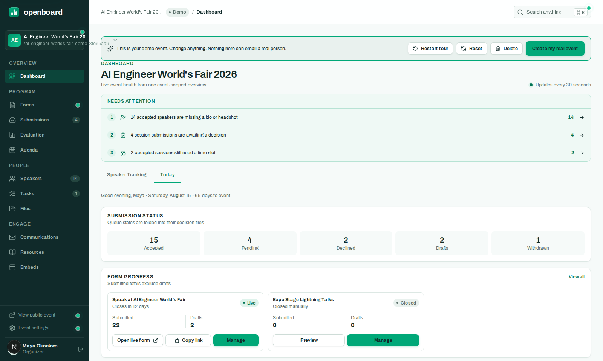

The left rail is the whole product: **Forms → Abstracts → Evaluation → Agenda** for the program,
**Speakers → Tasks → Files** for the people, and **Communications → Resources → Embeds** to reach
your audience.

## 1. Open your call for speakers

Create a submission form under **Forms**. The builder walks you through six steps — setup,
welcome page, the abstract itself, participant details, settings, and notifications — with a live
preview of what speakers will see as you type. Deadlines and per-speaker submission limits are
enforced for you.

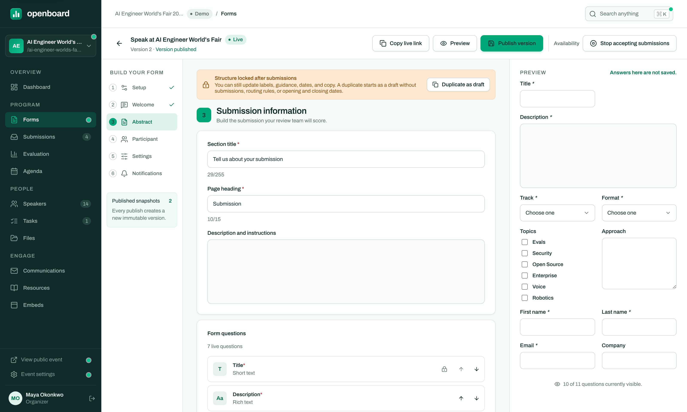

Questions come in eight field types (short/long text, rich text, dropdowns, multi-selects, and
more). Two features do a lot of quiet work here:

- **Conditional visibility** — a question can appear only when it's relevant ("Workshop
  duration" only when the format is *Workshop*).
- **Category routing** — rules like *"When Format is Workshop → set Track AI Agents, add tag
  Tooling"* file each submission into the right bucket the moment it arrives.

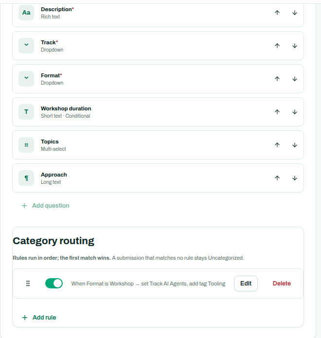

Every save pins an immutable snapshot of the form, so a proposal is always reviewed against the
exact form the speaker filled in — even if you tweak the wording later. Once submissions exist,
the structure locks (labels, guidance, and dates stay editable).

When the form is ready, publish it and share the public link — each row in the Forms list has a
copy-link button.

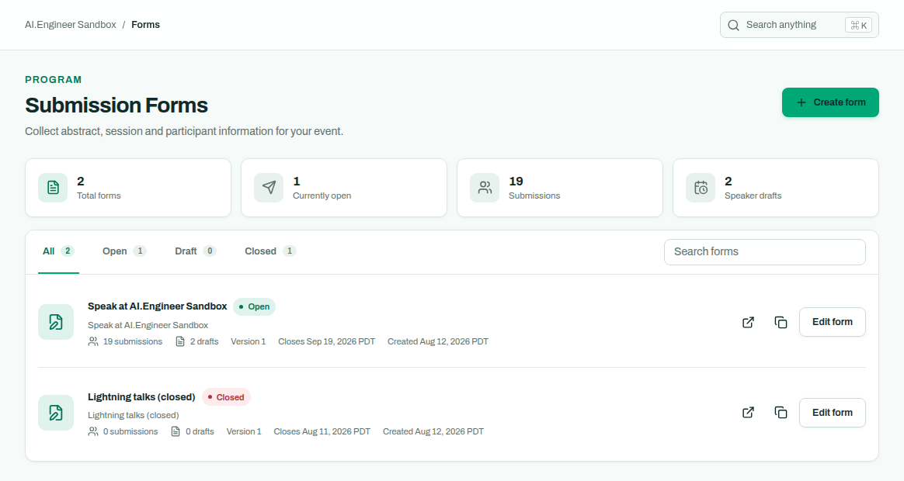

### What speakers see

Speakers get a clean five-step wizard: verify email with a one-time code, fill in the proposal,
add speaker details, review, submit. Drafts save to the server as they go, so nothing is lost to
a closed tab, and speakers can come back and **edit their proposal until the form closes or you
decide** — no "please re-open my submission" email threads.

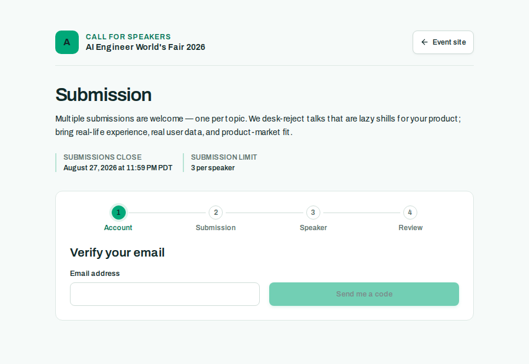

That *Workshop duration* question is the conditional one from the builder above — it appeared
because this speaker picked *Workshop*.

## 2. Review proposals and decide

**Abstracts** is every proposal for the event with its status, track, and rating in one table.
Tabs slice it into the queues you actually work: pending, accept queue, decline queue, decided.
Click any row to work the proposal in a slide-over panel — no page loads, and keyboard next/prev
lets you clear a queue without touching the mouse. Bulk-select rows to move a batch at once, or
export the lot to CSV.

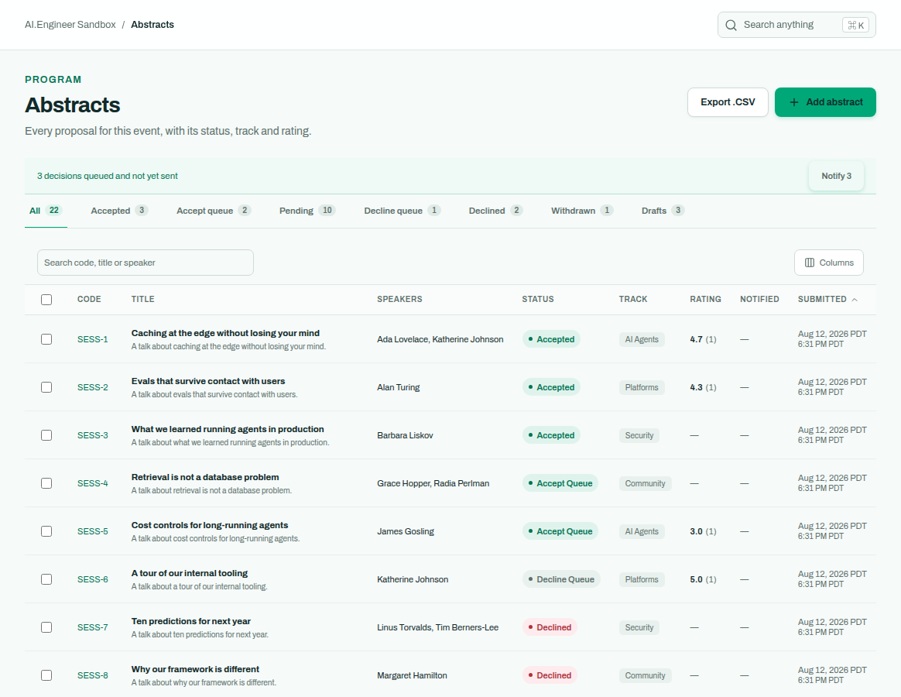

The panel shows the speaker's answers exactly as submitted, rendered against the form version
they saw:

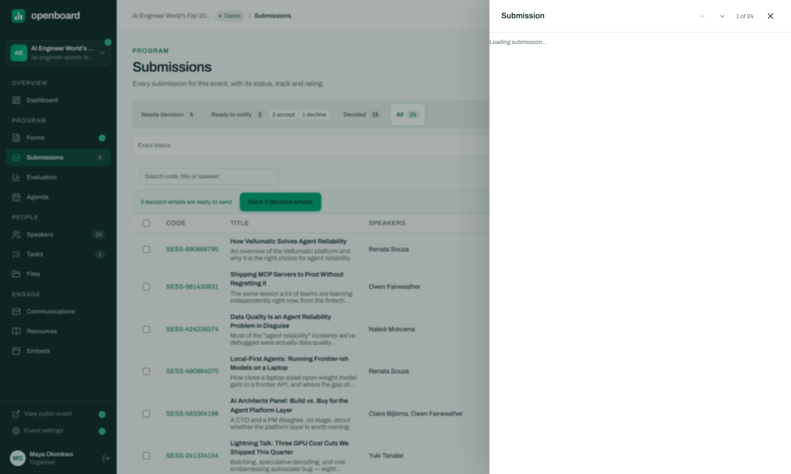

### Structured scoring, if you want it

For a lightweight event, decide straight from the Abstracts queues. For a program committee,
**Evaluation** runs scoring rounds: pick the scale and criteria, choose which tracks are in
scope, assign reviewers (with recusal for conflicts of interest), and optionally make a round
**blind** — reviewers see the proposal content but not who wrote it. Progress bars show who is
falling behind, and reviewer invitations and reminders are sent for you.

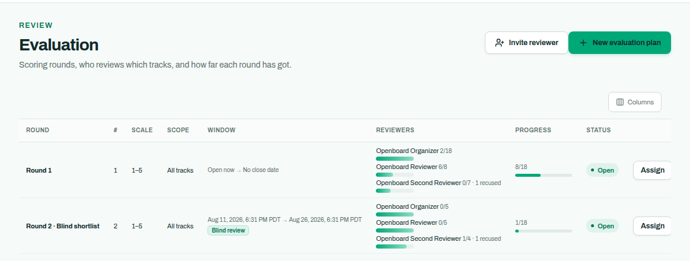

Scores roll up into the rating column in Abstracts, so the decision queue is already sorted by
the committee's verdict.

### Telling the speakers

Decisions queue rather than send instantly — accept and decline in any order, then hit
**Notify** once (the banner at the top of Abstracts counts what's queued). Each speaker gets one
clear email, and the notification is recorded in the delivery log.

## 3. Keep speakers on track

**Speakers** tracks every accepted human: confirmation status, what's missing (bio, headshot),
and their open tasks — with filter tabs for exactly the chasing lists you need before the
printed program deadline. Import speakers by CSV for invited talks, or let the CFP populate the
roster.

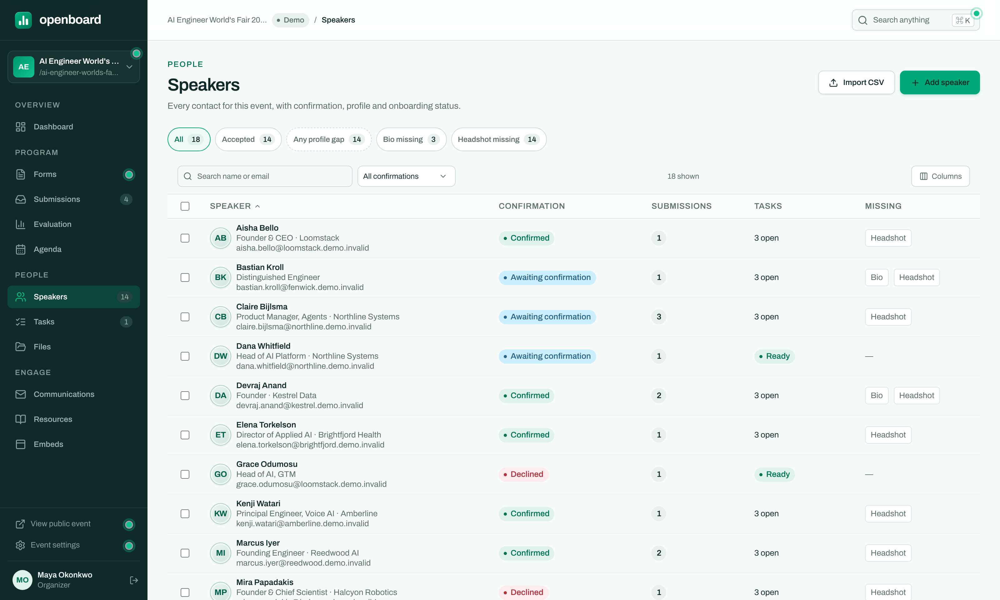

Each speaker gets a **portal** — they sign in with a one-time code or magic link (no password to
forget), update their profile, upload a headshot, see their submissions and statuses, and
complete the **tasks** you assign (sign the speaker agreement, upload slides, confirm AV needs —
manual, form, or file-upload tasks, with deadlines and automatic reminders).

When a speaker is stuck, open their portal *as them* from the Speakers screen (real
impersonation, clearly badged) and fix it together on the phone.

## 4. Build the schedule

**Agenda** is where accepted talks become a program. Unscheduled sessions wait in a tray on the
left; drag one onto the day grid to give it a time and room. Conflicts — same room double-booked,
same speaker in two places, two sessions of one track overlapping — are computed server-side and
flagged in red, in the grid, the list, and the Conflicts tab, always in agreement. **Auto-place**
suggests a conflict-free slot when you don't want to hunt for one.

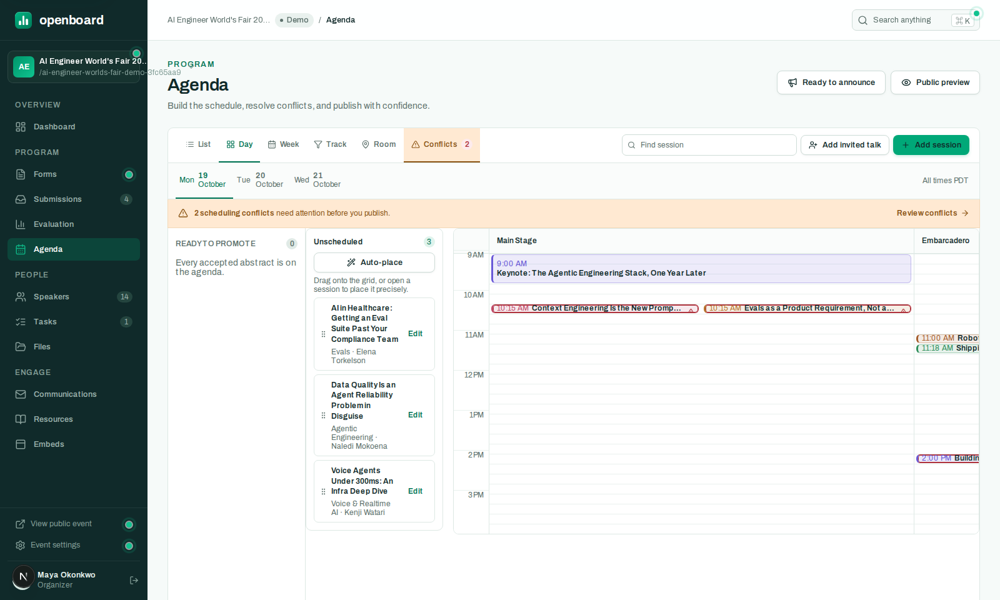

List, week, track, and room views cover the other ways you'll want to look at the same program.

## 5. Publish your event site

Nothing leaks until you publish: the public pages render only published sessions and speakers.
Your event gets a public site with sessions, a day-by-day agenda, a speaker directory and photo
gallery, and a personal itinerary where attendees star sessions and export them to their
calendar (ICS).

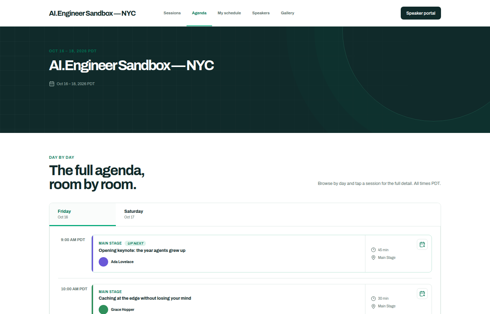

Already have a conference website? **Embeds** gives you an iframe for each surface — agenda,
sessions list, itinerary, speakers list, speaker gallery — that you paste into your own site.
They're live: reschedule a talk in the Agenda and every embed updates.

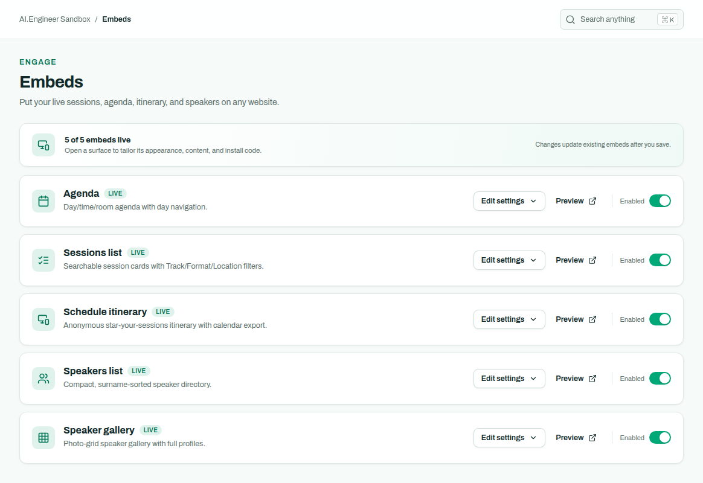

## 6. Let the email run itself

**Communications** owns every routine message: submission received, accepted, declined, task
assigned and overdue, schedule assigned and changed, portal sign-in. Edit any template with live
preview and merge tags; schedule-assigned mail carries a calendar invite with Google/Outlook
links, and schedule *changes* send an updated one.

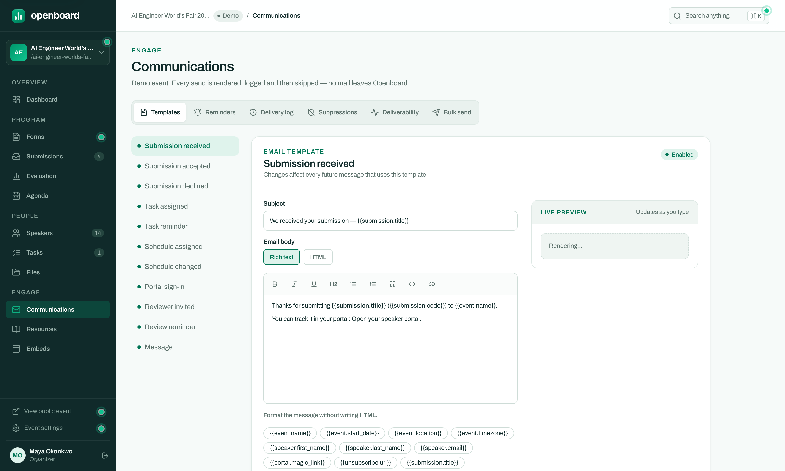

The other tabs are your deliverability cockpit: a **reminder ladder** (how many nudges, how far
apart), the full **delivery log**, **suppressions** (bounces and unsubscribes are honored
automatically — every message carries `List-Unsubscribe`), and a **bulk send** for the one-off
"speaker dinner is Thursday" announcement.

## Beyond one event

Openboard is multi-tenant: an **organization** holds your team and all its events. Invite
co-organizers and reviewers with role-based access and an audit log, sign in with email/password
or Google, and reuse your speaker relationships across years with the org-level **speaker CRM**
(directory, segments, pipeline, duplicate merge). GDPR tooling — per-contact export, erasure,
and retention rules — is built in, and there's a [public API](docs/api.md) for whatever we
didn't think of.

## For developers and self-hosters

Openboard is MIT-licensed TypeScript: Next.js 15 on Cloudflare Workers, Postgres (Neon),
Drizzle, Resend for email, R2 for files.

- [`docs/development.md`](docs/development.md) — current status, architecture, local setup,
  testing, and deploying.
- [`docs/provisioning.md`](docs/provisioning.md) — standing up Neon/R2/Resend/Cloudflare from
  scratch.
- [`docs/api.md`](docs/api.md) — the public API reference.
- [`DECISIONS.md`](DECISIONS.md) — the standing decisions that govern the codebase.

## License

MIT — see [`LICENSE`](LICENSE).

Copyright (c) 2026 Openboard contributors.
