# Openboard

Openboard is an open-source platform for running the speaker side of a conference: open a
call for speakers, review the proposals, keep your speakers on track, build a conflict-free
schedule, and publish it — all from one place, with the routine email handled for you.

This README is written for **event organizers**. If you want to hack on Openboard or host it
yourself, jump to [For developers and self-hosters](#for-developers-and-self-hosters).

**The fastest way to understand Openboard is to let it build you a conference and walk you
through running it.** It takes about ten minutes, costs nothing, and cannot email a real
person. Start at <https://openboard.events> — or read
[Your first ten minutes](#your-first-ten-minutes) below, which is the same path with pictures.

---

## Your first ten minutes

### 1. Create your workspace

Sign up with your name, your organization's name, an email address, and a password. Confirm the
address from the mail we send, and you land in your new organization.

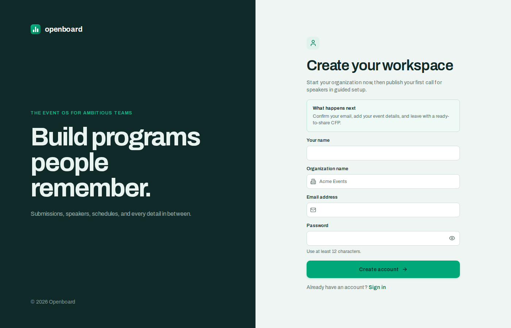

An **organization** is your team's home: it holds every event you run, your co-organizers and
reviewers, and the speaker relationships you build up over the years.

### 2. Pick a door

A brand-new organization is offered a choice before anything else. Neither door is a trap —
*Skip both* is right there, and the offer stays on your organization home until you take it.

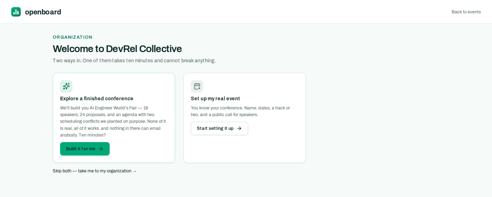

### 3. Watch a conference get built

Choose *Explore a finished conference* and Openboard writes you one, live, in ten narrated
phases: a venue and eight tracks, eighteen speakers who do not exist, a call for speakers,
twenty-four proposals, a review queue, a schedule with two scheduling conflicts planted in it
on purpose, speaker tasks, resources, and a full outbox.

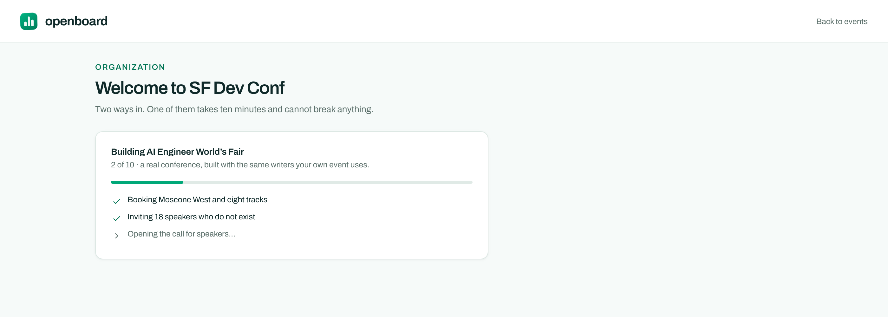

It is a **real event**, not a fixture: it is built through the same code your own event will
use, so you can rename it, delete things, publish it, and generally break it without
consequence.

### 4. Take the tour

Then a guided tour — *First Fair* — walks you through actually running it, chapter by chapter:
the dashboard, building a form, triaging proposals, scoring them, deciding and notifying,
visiting a speaker's portal, fixing a scheduling conflict, publishing to the public site, and
the email machinery underneath.

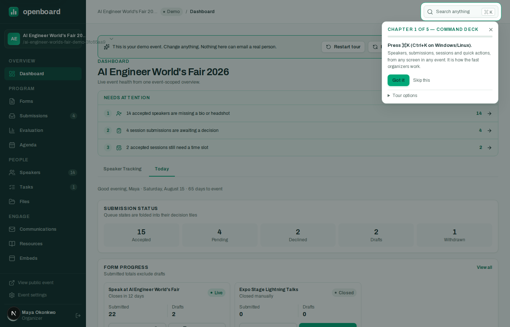

Each step is verified against what is actually in the database rather than against clicks, so
finishing one in another tab, on your phone, or by a route nobody scripted all count.
<kbd>Esc</kbd> pauses with nothing lost; every step can be skipped; the tour can be resumed or
restarted from the ribbon at the top of the demo event.

**Four things to know about the demo event:**

| | |
|---|---|
| **It is labelled.** | A `Demo` badge in the topbar and on the event switcher, and a *"Sample event · built with Openboard"* ribbon on its public pages, which are also `noindex`. |
| **It cannot email anybody.** | Every fabricated address ends in `.demo.invalid` (a domain that cannot resolve, anywhere), *and* the mail dispatcher refuses demo events outright. Mail queued by the tour is logged — and then skipped, with the reason on the row. |
| **It is free.** | It never counts toward your organization's event allowance. |
| **It is disposable.** | *Reset* rebuilds it from scratch; *Delete* (owner only, typed confirmation) removes it and everything under it. Neither can touch a real event. |

### 5. Set up your real event

When you are ready, **Create my real event** opens a four-step guided setup: event details,
tracks, your first submission form, and the link to share. It takes a few minutes and leaves you
with a call for speakers you can publish.

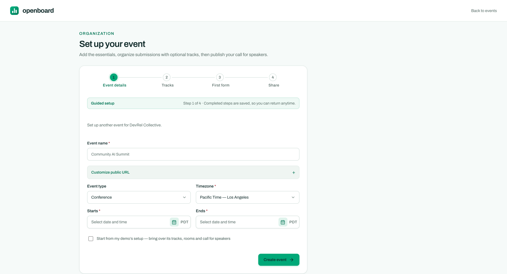

If you took the tour, tick **Start from my demo's setup** and your real event inherits the
demo's vocabulary and one form's structure — tracks, rooms, formats, tags, questions,
conditional rules — and nothing else. No fake people, no fake proposals, no fake sessions.

Already run events here? You are never interrupted by the fork; the demo is available whenever
you want it, from your organization home or the command palette (<kbd>⌘K</kbd> →
*Explore a demo event*).

---

## The product, screen by screen

Every screenshot below is the demo conference — the one Openboard will build for you.

Sign in, pick your event, and the dashboard tells you where your attention is needed *today*:
proposals awaiting a decision, accepted sessions without a time slot, speakers missing a bio or
headshot. Each line links straight to the screen where you fix it.

The left rail is the whole product: **Forms → Submissions → Evaluation → Agenda** for the
program, **Speakers → Tasks → Files** for the people, and **Communications → Resources →
Embeds** to reach your audience.

### 1. Open your call for speakers

Create a submission form under **Forms**. The builder walks you through six steps — setup,
welcome page, the abstract, participant details, settings, and notifications — with a live
preview of what speakers will see as you type. Deadlines and per-speaker submission limits
are enforced for you.

Questions come in eight field types (short and long text, rich text, dropdowns, multi-selects,
email, URL, and file upload). Two features do a lot of quiet work here:

- **Conditional visibility** — a question can appear only when it's relevant ("Workshop
  duration" only when the format is *Workshop*).
- **Category routing** — rules like *"When Track is Security → add tag Enterprise"* file each
  submission into the right bucket the moment it arrives.

Every publish pins an immutable snapshot of the form, so a proposal is always reviewed against
the exact form the speaker filled in — even if you tweak the wording later. Once real
submissions exist, the structure locks (labels, guidance, and dates stay editable, and
*Duplicate as draft* gives you a fresh copy to restructure).

When the form is ready, publish it and share the public link — every live form in the Forms list
has copy-link and open-in-a-new-tab actions.

#### What speakers see

Speakers get a clean four-step wizard: verify email with a one-time code, fill in the proposal,
add speaker details, review — then submit. (Three steps if you don't collect speaker details.)
Drafts save to the server as they go, so nothing is lost to a closed tab, and speakers can come
back and **edit their proposal until the form closes or you decide** — no "please re-open my
submission" email threads.

A talk is often not one person's. If you turn the roles on, the speaker step takes co-speakers,
moderators and panelists alongside the submitter, each answering the participant questions in
their own right; everyone on the proposal can see it in their portal, while editing stays with
the person who submitted it.

### 2. Review proposals and decide

**Submissions** is every proposal for the event with its status, track, and rating in one table.
Tabs slice it into the queues you actually work: needs decision, ready to notify, decided, all.
Click any row to work the proposal in a slide-over panel — no page loads, and keyboard next/prev
lets you clear a queue without touching the mouse. Bulk-select rows to move a batch at once, or
export the lot to CSV.

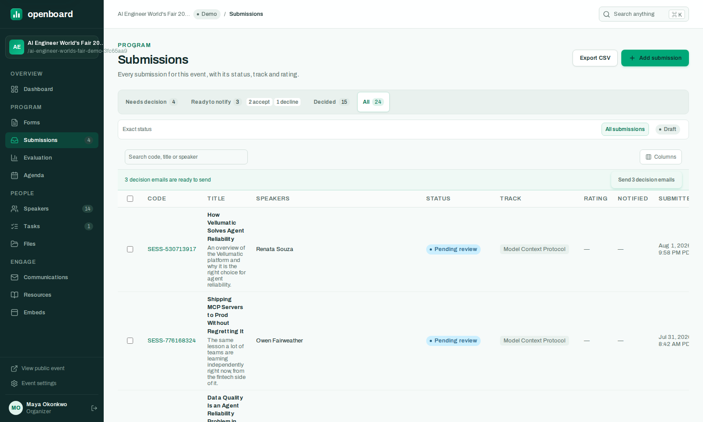

The panel shows the speaker's answers exactly as submitted, rendered against the form version
they saw:

#### Structured scoring, if you want it

For a lightweight event, decide straight from the Submissions queues. For a program committee,
**Evaluation** runs scoring rounds: pick the scale and criteria, choose which tracks are in
scope, assign reviewers (with recusal for conflicts of interest), and optionally make a round
**blind** — reviewers see the proposal content but not who wrote it. Committee averages stay
organizer-only by default so reviewers score independently; turn on score sharing for a
deliberate calibration round. Progress bars show who is falling behind, and reviewer invitations
and reminders are sent for you. Open any proposal as an organizer to see its attributed score
history, including the values and rubric labels preserved from before an edit.

Scores roll up into the rating column in Submissions, so the decision queue is already sorted by
the committee's verdict.

#### Telling the speakers

Decisions queue rather than send instantly — accept and decline in any order, then hit
**Notify** once (the banner at the top of Submissions counts what's queued). Each speaker gets
one clear email, and the notification is recorded in the delivery log. The proposal panel also
keeps an attributed decision timeline, so queue moves, reversals, notification finalization, and
speaker withdrawals remain explainable later.

### 3. Keep speakers on track

**Speakers** tracks every accepted human: confirmation status, what's missing (bio, headshot),
and their open tasks — with filter tabs for exactly the chasing lists you need before the
printed program deadline. Import speakers by CSV for invited talks, or let the call for speakers
populate the roster.

Each speaker gets a **portal** — they sign in with a one-time code or magic link (no password to
forget), update their profile, upload a headshot, see their submissions and statuses, and
complete the **tasks** you assign (sign the speaker agreement, upload slides, confirm AV needs —
manual, form, or file-upload tasks, with deadlines and automatic reminders).

When a speaker is stuck, open their portal *as them* from their panel on the Speakers screen
(real impersonation, clearly badged) and fix it together on the phone.

### 4. Build the schedule

**Agenda** is where accepted talks become a program. Unscheduled sessions wait in a tray on the
left; drag one onto the day grid to give it a time and room. **Auto-place** proposes slots for
you when you don't want to hunt for one — checked against room and speaker clashes, speaker
blackouts, and room capacity before it offers them.

Conflicts — same room double-booked, same speaker in two places, two sessions of one track
overlapping — are computed on the server and flagged in red, in the grid, the list, and the
Conflicts tab, always in agreement.

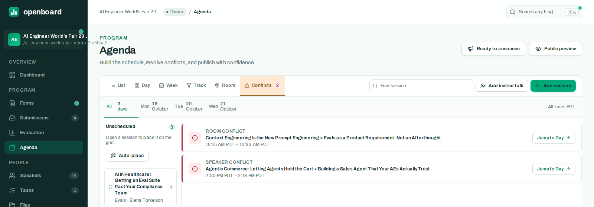

List, week, track, and room views cover the other ways you'll want to look at the same program.

### 5. Publish your event site

Nothing leaks until you publish: the public pages render only published sessions and speakers.
Your event gets a public site with sessions, a day-by-day agenda, a speaker directory and photo
gallery, and a personal itinerary where attendees star sessions and export them to their
calendar (ICS). The site carries the logo, background artwork, and accent color configured in
Event settings, so the attendee experience stays recognizably yours.

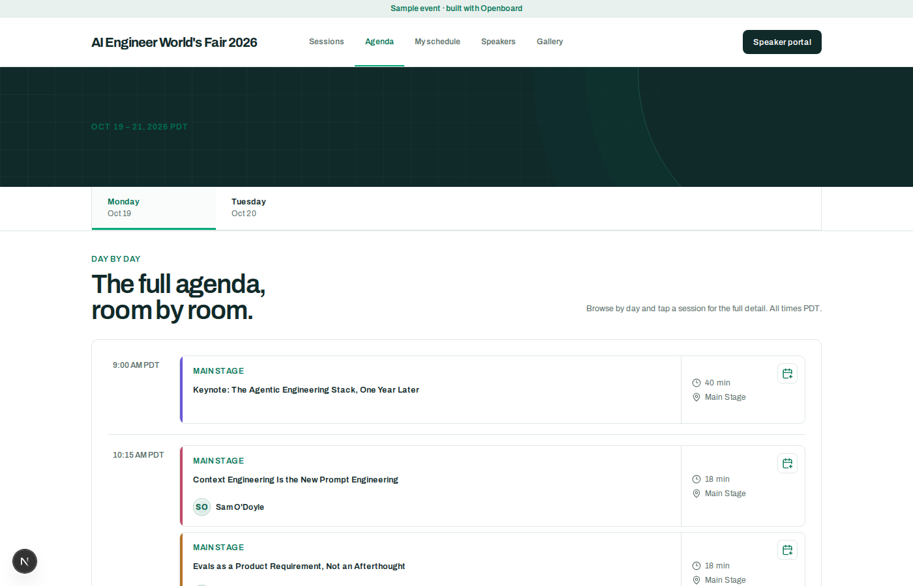

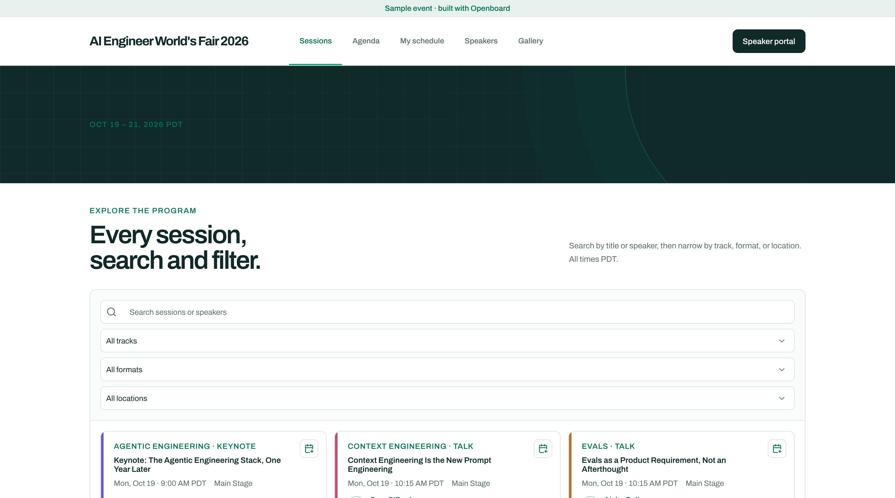

Publishing means what it says: a session needs a time before you can publish it, so you cannot
mark a talk published and quietly leave it off the schedule everyone reads. Pull a published
talk back to the unscheduled tray later and it leaves the public pages again — with a
cancellation for every speaker whose calendar had it.

Already have a conference website? **Embeds** gives you an iframe for each surface — agenda,
sessions list, itinerary, speakers list, speaker gallery — that you paste into your own site.
They're live: reschedule a talk in the Agenda and every embed updates.

Once something is public, **Ready to announce** on the Agenda hands you the announcement in one
place: suggested copy, the link to every public page, an embed snippet, and a personal
"I'm speaking!" page for each speaker to post. Your speakers find the same link waiting on their
portal home. The button appears only once there is a published schedule behind it — announcing
an empty page is worse than announcing nothing.

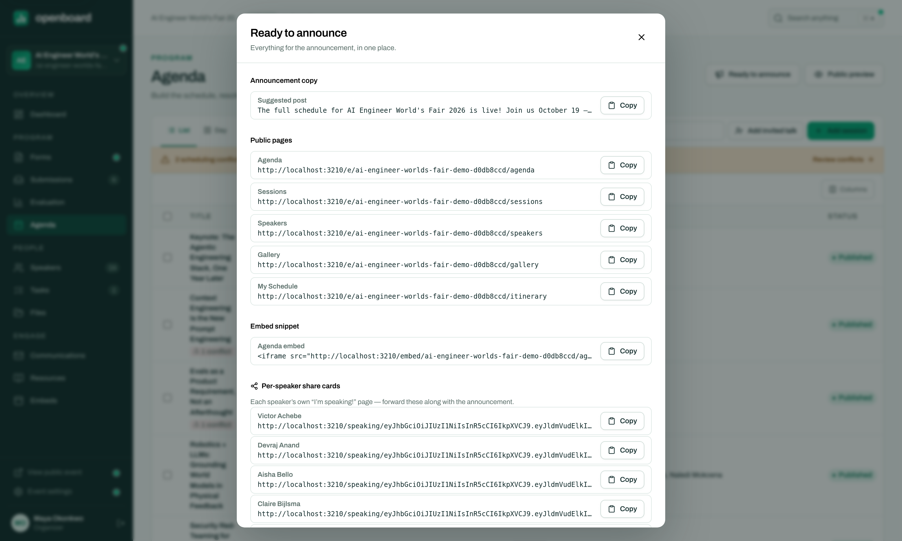

### 6. Let the email run itself

**Communications** owns every routine message: submission received, accepted, declined, task
assigned and reminded, schedule assigned and changed, portal sign-in, reviewer invited and
reminded, and your own bulk announcements — eleven templates you can edit, with live preview and
merge tags. Schedule-assigned mail carries a calendar invite with Google/Outlook links, schedule
*changes* send an updated one, and cancelling a talk sends a real cancellation that still
describes the meeting your speaker actually has in their calendar.

The other tabs are your deliverability cockpit: a **reminder ladder** (how many nudges, how far
apart), the full **delivery log**, **suppressions** (bounces and unsubscribes are honored
automatically — every message carries `List-Unsubscribe`), and a **bulk send** for the one-off
"speaker dinner is Thursday" announcement.

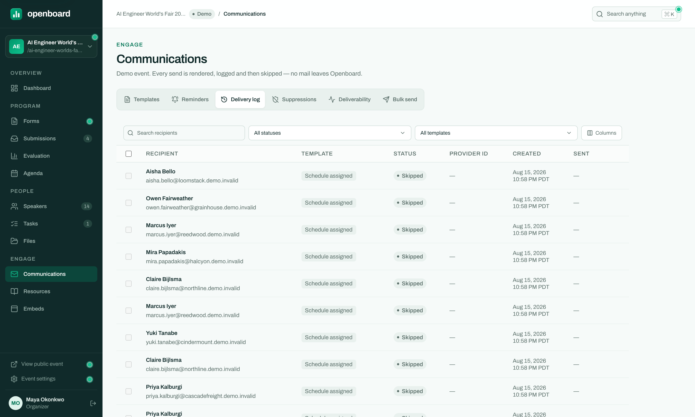

That screenshot is from the demo conference, which is why every row reads **Skipped**: the
dispatcher refuses demo events before the message is ever rendered, and the log records the
skip and its reason instead of inventing a subject line. In your real event those rows read
*Sent*, with the subject the recipient saw and the provider's message id beside it.

---

## Beyond one event

Openboard is multi-tenant: an **organization** holds your team and all its events. Invite
co-organizers and reviewers with role-based access and an audit log, sign in with email and
password or with Google, and reuse your speaker relationships across years with the org-level
**speaker CRM** (directory, segments, pipeline, duplicate merge). GDPR tooling — per-contact
export, erasure, and retention rules — is built in, and there's a [public API](docs/api.md) for
whatever we didn't think of.

## For developers and self-hosters

Openboard is MIT-licensed TypeScript: Next.js 15 on Cloudflare Workers, Postgres (Neon),
Drizzle, Resend for email, R2 for files.

- [`docs/development.md`](docs/development.md) — current status, architecture, local setup,
  testing, and deploying.
- [`docs/provisioning.md`](docs/provisioning.md) — standing up Neon/R2/Resend/Cloudflare from
  scratch.
- [`docs/demo-script.md`](docs/demo-script.md) — the guided tour chapter by chapter, and a
  manual walkthrough for verifying a build.
- [`docs/api.md`](docs/api.md) — the public API reference.
- [`docs/manual-test-plans.md`](docs/manual-test-plans.md) — the manual plans, the design bar
  every screen is held to, and the fixed seed data they run against.
- [`DECISIONS.md`](DECISIONS.md) — the standing decisions that govern the codebase.

## License

MIT — see [`LICENSE`](LICENSE).

Copyright (c) 2026 Openboard contributors.
