# openboard — parallel execution schedule

**7 agents · 44 modules · Sat Aug 8 evening → Wed Aug 12, 10 PM PT.** **Weekday labels in this file and in every module doc are the plan's logical day names — Aug 8 2026 is a Saturday; see PLAN §7 / delta #21 for the mapping (plan-"Tue" ends Wed 2 PM = CP4; plan-"Wed" is Wed afternoon).** This file is the transcription of `PLAN.md` §5 (dependency graph), §6 (workstreams + integration points), §7 (timeline) and §9 (cut lines) into a form an agent can execute from. `PLAN.md` remains authoritative; nothing here overrides it.

**How to read this**
- **Solid edge `A --> B`** = B's *completion* needs A's completion.
- **Dashed edge `A -.-> B`** = B *starts* against A's Phase-0 stub or fixture and swaps in the real artifact when it lands. **A dashed dependency never blocks a start.** This distinction is the whole parallelism strategy — schedule off it.
- In the wave table, a cell marked **°** is a half-day placement derived from §6's stated lane order where §7 assigns the day but not the half. Every unmarked cell is stated in §7.
- Where `PLAN.md` assigns a lane no module in a slot, the lane is on **hardening / swarm duty** — that is the default state, not idleness.
- Every day ends with an integration checkpoint **on the deployed preview**, architect-driven. Demo-or-it-didn't-happen.

---

## 0. Rebaseline overlay — rev. 4 (Sat Aug 8), updated rev. 8 (Sun Aug 9 late evening)

The dependency graph and original wave table below remain valid choreography, but they are not a claim that their scheduled work happened. [`status.md`](status.md) is the live evidence ledger. At the rev. 4 rebaseline, CP0/CP1/the thin slice/CP2 were not met, no module was `DONE`, and the implementation merged through PR #5 was primarily a local browser demo.

**Rev. 8 update:** the foundation stack (#10–#12) and PRs #15–#57 are merged, and the preview is
deployed from current `main`. CP0 is **green except the browser R2 probe and the deployed
auth-throttle proof**; the **Saturday thin slice is GREEN** on the deployed server path,
including a delivered Gmail confirmation from the verified sending domain (status §2a). **R1 is
essentially exited** (three bookkeeping items: `sb-prod` + production secrets, a green `Deploy`
run, the browser R2 probe — the CP1 freeze declaration is recorded in `DECISIONS.md`) and
**R2 is the active gate**. Still no module is `DONE` under the evidence rules.

Run this recovery queue before resuming the original wave placements:

| Gate | Parallel work allowed | Exit condition |
|---|---|---|
| **R0 Stack safety** — **exited** | Planning/configuration reconciliation; canonical environments; CI/deploy, migration runner, fail-closed authorization, and review hardening | Stack truth is current; clean-install CI green; configuration PR ready; no current P1 hidden in a draft |
| **R1 Deployed foundation** — **essentially exited** (see status §5 for the three remaining bookkeeping items) | M01–M05a, M06a/M06b, M07, M09, deploy half of M08, and M10's runnable six-spec CP1 skeleton; pure tests/fixtures elsewhere | CP0 + CP1 green on Cloudflare/Neon with real auth, admin shell, seed, secrets, R2, zero-failure Playwright skeleton, and external spike evidence |
| **R2 Server spine** — **active** | M05b before M12 rich-text integration, then M11–M18 + M34; consumers may build only against frozen contracts/fixtures | Real deployed CFP → Neon Abstracts → accept/notify → one email/portal-link path green |
| **R3 Judged loop** | Minimum M19, M21/M22/M23/M25, M28/M29/M32/M33, M35/M36/M38 slices | Full PLAN §9 minimum bar, including persisted reviewer scoring, works cold on the deployed URL |
| **R4 Release proof** | Complete M10 after its R1 skeleton and perform P0-only hardening; bonuses only after exit | Six e2e specs, load/smoke/external probes, docs/spend, checklist, submission accepted |

**Dependency note (rev. 8, replacing the rev. 5 caution):** the foundation stack is merged —
solid edges into M03, M04, M06a, and M06b are **satisfied** hard dependencies. M16's pipeline,
M18's server half (`transitionStatus`, `notifyQueues`, #57), M34's dispatcher, and M21's portal
server are likewise merged and buildable-against. The old warning not to branch off open
`agent/*` stacks still applies to any future stacked work.

**Active swarm rule:** while an earlier recovery gate is red, later UI expansion and bonus work stop. M39 is paused and M40's *keyed* half is deferred (its three unkeyed public read endpoints are deployed); M30 uses manual scheduling as its cut-line fallback; M31/M37 polish cannot displace the minimum loop. Unsafe fixture APIs may be disabled rather than completed before R3.

Checkpoint boxes later in this file are historical targets. Their live state is the table in `status.md`; only update a box after the named deployed evidence exists.

---

## 1. Dependency graph (PLAN §5, reproduced)

```mermaid
graph TD
  subgraph WSA["WS-A Platform (architect)"]
    M01[M01 Scaffold+CI+Deploy]
    M02[M02 Contracts]
    M03[M03 Schema+Views]
    M04[M04 Shared libs+Snapshot compiler]
    M05a[M05a Admin shell+DataTable]
    M06a[M06a Admin auth]
    M06b[M06b Portal auth+OTP]
    M09[M09 Seed orchestrator+Demo]
    M10[M10 E2E+Release]
  end
  subgraph WSB["WS-B Forms+CFP (B1 builder / B2 runtime)"]
    M11[M11 Events+Vocab B1]
    M12[M12 Builder core B1]
    M13a[M13a Evaluator B2]
    M13b[M13b Rules UI B1]
    M14[M14 Form settings B1]
    M15[M15 CFP wizard B2]
    M16[M16 Submit pipeline B2]
  end
  subgraph WSC["WS-C Review (+ portal-admin Mon)"]
    M17[M17 Abstracts+Answers]
    M18[M18 Mutations+Lifecycle+Notify]
    M19[M19 Evaluation]
    M20[M20 CSV export]
    M26[M26 Resources]
    M27[M27 Speakers admin]
  end
  subgraph WSD["WS-D Portal (+ R2, rich UI)"]
    M05b[M05b Rich primitives]
    M07[M07 R2 Storage]
    M21[M21 Portal shell+My Sessions]
    M22[M22 Profile]
    M23[M23 Tasks admin]
    M24[M24 Portal form builder]
    M25[M25 Task runtime]
    M41[M41 Submission editing]
  end
  subgraph WSE["WS-E Agenda+Embeds"]
    M28[M28 Sessions+List]
    M29[M29 Conflict engine]
    M30[M30 Day-grid DnD]
    M31[M31 Other views]
    M32[M32 Public pages]
    M33[M33 Embed shells]
  end
  subgraph WSF["WS-F Comms+Dash+API (+ jobs worker)"]
    M08[M08 Jobs worker]
    M34[M34 Outbox+Renderer]
    M35[M35 ICS]
    M36[M36 Scan: assigned+reminders]
    M37[M37 Comms admin]
    M38[M38 Dashboard]
    M39[M39 Airtable]
    M40[M40 Public API]
  end

  M01 --> M02
  M02 --> M03
  M02 --> M04
  M01 --> M05a
  M04 --> M05a
  M03 --> M06a
  M04 --> M06a
  M06a --> M06b
  M03 --> M06b
  M03 --> M09
  M04 --> M09

  M04 --> M05b
  M05a --> M05b
  M07 --> M05b
  M03 --> M07
  M04 --> M07

  M03 --> M11
  M05a -.-> M11
  M06a -.-> M11
  M07 -.-> M11
  M34 -.-> M11
  M05a --> M12
  M05b --> M12
  M04 --> M12
  M11 --> M12
  M02 --> M13a
  M12 --> M13b
  M13a --> M13b
  M12 --> M14
  M13a --> M15
  M14 -.-> M15
  M06b --> M15
  M07 --> M15
  M16 --> M15
  M13a --> M16
  M03 --> M16
  M04 --> M16
  M18 -.-> M16

  M03 --> M17
  M05a --> M17
  M07 -.-> M17
  M02 --> M18
  M03 --> M18
  M04 --> M18
  M17 --> M19
  M03 --> M19
  M17 --> M20
  M21 --> M26
  M04 --> M26
  M05b --> M26
  M05a --> M27
  M06b --> M27
  M03 --> M27
  M34 -.-> M27

  M05a --> M21
  M06b --> M21
  M28 -.-> M21
  M21 --> M22
  M07 --> M22
  M05b --> M22
  M05a --> M23
  M05b --> M23
  M03 --> M23
  M12 --> M24
  M21 --> M25
  M23 --> M25
  M24 --> M25
  M15 -.-> M25
  M07 --> M25
  M03 --> M25
  M21 --> M41
  M15 --> M41
  M16 --> M41
  M18 --> M41
  M14 --> M41

  M03 --> M28
  M05a --> M28
  M11 -.-> M28
  M18 -.-> M28
  M02 --> M29
  M28 --> M30
  M29 --> M30
  M28 --> M31
  M29 --> M31
  M03 --> M32
  M28 --> M32
  M07 --> M32
  M32 --> M33

  M01 --> M08
  M03 --> M34
  M04 --> M34
  M08 --> M34
  M06b -.-> M34
  M34 --> M35
  M02 --> M35
  M06b -.-> M35
  M34 --> M36
  M03 --> M36
  M34 --> M37
  M05a --> M37
  M03 --> M38
  M05a --> M38
  M03 --> M39
  M08 --> M39
  M32 --> M40
  M38 --> M40
  M04 --> M40

  M16 --> M10
  M18 --> M10
  M25 --> M10
  M30 --> M10
  M32 --> M10
  M34 --> M10
```

**No cycles.** The 13 cross-workstream edges and the contract each rides on — all stubbed in Phase 0, so dependents start immediately against types + fixtures:

| Edge | Contract carried | Stub story |
|---|---|---|
| **M18 → M16** | `createSubmission(eventId, CreateSubmissionInput)` (res. #8) | Signature stub Fri; real slice Sat PM |
| **M15 -.-> M25** | `FormFieldRendererProps` `{snapshot, answers, onChange, mode: 'edit'\|'review'\|'readonly'}` — **there is no `'fill'`** | Golden fixture snapshot (`src/shared/fixtures/form-snapshot.ts`); real import swapped at the **Mon-noon micro-checkpoint** |
| **M12 → M24** | shared builder engine + field CRUD components | portal builder is `context='portal'` over the same engine |
| **M18 -.-> M28** | `getAcceptedForScheduling(eventId): AcceptedForSchedulingRow[]` (promotion; filter on `!alreadyPromoted`) | stub Sat, real Sun |
| **M28 -.-> M21** | `getMySessions(eventId, contactId): MySessionDTO[]` for the My Sessions card | fixture-backed until M28 lands |
| **M34 -.-> M27** | `listLog(eventId, filters): CommLogRow[]` | fixture comm-log rows Monday, real Tue with M37 |
| **M34 -.-> M11** | `seedDefaultTemplates(dbOrTx, eventId)` | stub in event-create until M34 lands |
| **M06b -.-> M34**, **M06b → M35** | `issuePortalToken(dbOrTx, {contactId, eventId, purpose, ttl, withOtp?})` → `{tokenId, raw, otp?, expiresAt}` (res. #12) + `verifyPortalToken(raw, {purpose})` (non-consuming; **hard** for M35's `/cal` routes) | ordinary links minted at dispatch; `portal_login` uses `withOtp:true`, `tokenId` for idempotency, encrypted delivery, and clear-after-dispatch |
| **M07 → M32** | `/f/{fileId}` immutable file URLs | seeded headshots are real R2 objects, so the gallery works without WS-D |
| **M32 → M40**, **M38 → M40** | `getPublishedSchedule`/`getPublishedSpeakers`, overview endpoint | API is a thin wrapper: zero drift, zero leak paths |

---

## 2. Wave table

Seven lanes: **Architect** (WS-A) · **B1** + **B2** (WS-B) · **WS-C** · **WS-D** · **WS-E** · **WS-F**.

### Plan-day "Fri" = Sat Aug 8 (evening) — Phase 0

| Lane | Fri evening |
|---|---|
| **Architect** | **M01** — scaffold, pinned Next+OpenNext versions, CI with all invariant greps, canonical environment configs, measured Workers Free bundle/CPU gate, mandatory application auth throttles, hello page deployed to workers.dev. A custom-domain WAF rule is optional defense-in-depth. **Existential spikes S1–S4 + checks C1–C2 only**: S1 OpenNext deploy (+ R2 ISR cache vs Cache-API fallback), S2 `withTx`/Neon WS Pool **on deployed Workers**, S3 `xss` pkg on Workers, S4 better-auth full sign-in round-trip **on the deployed artifact**; C1 Resend `Idempotency-Key` honored (curl, 10 min), C2 `wrangler versions` preview URLs on the OpenNext artifact. **Fallbacks adopted the same hour on any failure.** Resend domain DNS (SPF/DKIM/DMARC) submitted. **M02 contracts draft** (every Phase-0 signature stub, fan-out rule, key recipes, `FormFieldRendererProps`, the golden FormSnapshot fixture). **M03 schema draft** incl. §3 ★ deltas. **M04 slice**: `compileFormSnapshot` draft + tests. |
| **B1** | Read `PLAN.md` + `analysis/event-config-cfp.md` + `analysis/form-builder.md`; prep M11/M12 against the contracts draft. |
| **B2** | **M13a** — evaluator + the ~30-case table-driven test file, written against the contracts draft. Needs nothing but M02. |
| **WS-C** | Read `analysis/abstracts-review.md`; **[M20](modules/M20-csv-export.md)'s `toCsv` + `csv.test.ts`** — pure RFC-4180 serializer + the quoting/newline/injection test table. Zero dependencies (fixtures only); the test file is the spec. |
| **WS-D** | Read `analysis/speaker-portal.md`; **[M07](modules/M07-r2-storage.md) Steps 1–3** — typed signatures, the kind-policy table, the object-key scheme + filename sanitization, all unit-tested against a **mocked** R2 binding per M07's own If-blocked note. |
| **WS-E** | **M29** — pure conflict engine + fast-check properties. Needs nothing but contracts. |
| **WS-F** | Read `analysis/dashboard-comms.md`; **[M35](modules/M35-ics-calendar-invites.md) Step 1** — the pure RFC 5545 builder + `__fixtures__/{request,cancel,feed}.ics` + the folding/escaping tests. Needs only the M02 draft, and M35's own If-blocked calls these "the highest-value tests in the module". Then prep M08/M34. |
| **All** | A designated agent **watches the already-published Friday walkthrough video before CP0** and diffs it against the six analyses → `DECISIONS.md`. **Discord-watch rotation starts; question queue posted** (conditional-logic UI, routing UI, drafts semantics). |

### Plan-day "Sat" = Sun Aug 9 — foundation freeze + fan-out

| Lane | Sat AM | Sat PM |
|---|---|---|
| **Architect** | **M03** migrations landed on sb-dev + **sb-test** + sb-prod · **M04** (incl. compiler) · **M05a** · **M06a** · **M09 seed orchestrator** · deferred spikes in parallel (revalidate-60, aws4fetch presigned PUT, PGlite schema compat, embed headers) | **M06b** (portal auth, OTP, `issuePortalToken`, `verifyPortalToken`, `EMAIL_FALLBACK_UI`) · **M10 skeleton** (`playwright.config.ts`, `e2e/helpers/*`, six `*.spec.ts` with `test.skip` markers) |
| **B1** | **M11-server** (starts against schema alone — M05a/M06a/M07 are dashed) · **`scripts/seed/events.ts`** | **M11 UI half** (settings hub, Details tab, vocab tabs — the Sat-night demo bar item "create/edit an event with branding") · **M12 Step 1** (forms barrel + `getPublicForm`/`getPinnedSnapshot`/`getCurrentSnapshot` contract slice, ~1 h — it is what unblocks B2) |
| **B2** | ° **M13a** finish + **M16** pure pipeline start against the golden fixture (§6: M15 skeleton + M16 pipeline land Saturday) | **M15 skeleton vs golden fixture** + **M16 pipeline** |
| **WS-C** | **M17** against seed (zero WS-B dependency) · **`scripts/seed/contacts.ts`** (step 2a — 12 speakers with real-R2 headshots; **before** `submissions.ts`, four downstream modules render against it) | ° **M17 continues** (drawer, Answers tab, bulk select) ∥ **M18 `createSubmission`/`nextSubmissionCode` slice** — the slice is ~2 h and powers the Sat-night thin slice |
| **WS-D** | **M07** R2 storage · **M05b Step 1 (prop stubs)** — the six prop types pushed the hour M05a lands; M12/M22/M23/M26/M37 are all downstream of it | **M05b** internals (`<FileUpload>` wired once presign is live) · **M21** start (incl. **Step 0 `features/portal/server/contacts.ts`** — gates M06b and M18 this afternoon) · **`scripts/seed/portal.ts`** |
| **WS-E** | Finish M29 frozen-contract reconciliation + property/acceptance suite; M28 independent scaffolding may start, but conflict wiring stays blocked | **M28** continues only through gates that are green · **M32 Step 1** (public shell + fixture DTOs + `/e/[slug]/{schedule,speakers}` returning 200) |
| **WS-F** | **M08** jobs worker · **M34** start | **M34** continues · **canned METHOD:REQUEST ICS curl'd to a real Gmail + a real Outlook inbox** (screenshot → `DECISIONS.md`) · **Airtable base + 5 tables + fields provisioned, one hand-run `performUpsert fieldsToMergeOn:['PG ID']` verified** |
| **All** | | Watch swyx's Saturday walkthrough video → diff against assumptions; **adjust copy/fields, not architecture**. Discord clarifications → `DECISIONS.md`. |

### Plan-day "Sun" = Mon Aug 10 — the golden path

| Lane | Sun AM | Sun PM |
|---|---|---|
| **Architect** | ° **M09 seed v2** (per-feature modules composed) | ° **M10 golden-path spec** · CP2 drive on the deployed preview · **Sun-noon production-email go/no-go decision** |
| **B1** | ° **M12 builder core + finish** (Step 1's contract slice landed Sat PM) | ° **M13b** rules UI · **M14** form settings + notifications |
| **B2** | ° **M16 complete** (version pinning, `FORM_VERSION_STALE`, draft promotion) | ° **M15 end-to-end** incl. Account step (M06b) + server-draft upsert |
| **WS-C** | ° **M18 complete** (notify w/ `notify_revision`, auto-confirm, submitter-only recipient) · ° **M17 polish** rides along (column picker, empty states, `?submission=` deep link) — same agent, same feature folder | **M19 start** (§6: Sun PM–Mon) · **Sun-noon swarm-capacity check** |
| **WS-D** | ° **M21 finish** | ° **M22** profile · **M25 manual + file modes** |
| **WS-E** | **M28 finish** | **M32 real published-view queries + views + mobile pass** (Step 1's shell landed Sat PM — MUST with no fallback, must not queue behind M30) |
| **WS-F** | ° **M35** ICS + calendar invites | ° **M36** burst-safe scan · **full seeded ICS lifecycle to the real inboxes: REQUEST → reschedule SEQUENCE bump → CANCEL** (one full day before CP3) |
| **All** | Sunday-morning clarification video + Discord → final requirement adjustments **before Sunday-night freeze of requirements**. | |

### Plan-day "Mon" = Tue Aug 11 — full feature surface

| Lane | Mon AM | Mon PM |
|---|---|---|
| **Architect** | Integration; CP3 prep (day-level in §7) | ↳ same, cont. |
| **B1** | Polish; closed-form / limit / stale-version states; success page (day-level in §7) | ↳ same, cont. |
| **B2** | Polish; closed-form / limit / stale-version states; success page (day-level in §7) · ° on call for WS-D's real-renderer swap at the noon micro-checkpoint | ↳ same, cont. |
| **WS-C** | ° **M19 done** · **M26** resources | ° **M27** speakers admin (fixture comm-log rows) |
| **WS-D** | **M23** · **M24** · **M25 form-mode** — fixture-first against `FormFieldRendererProps`; **noon: renderer micro-checkpoint** (day-level in §7) | ↳ same, cont. |
| **WS-E** | **M30 DnD** · **M31 Conflicts tab** · **M33 embeds framed in a scratch host page** (day-level in §7) | ↳ same, cont. |
| **WS-F** | **M38 dashboard both tabs** · reminder + `task_assigned` scan live on cron | **M40 start** |

### Plan-day "Tue" = Wed Aug 12, until 2 PM — bonuses, hardening, perf (CP4 = Wed 2 PM; delta #21)

| Lane | Tue AM | Tue PM |
|---|---|---|
| **Architect** | ° **M10**: full 6-spec Playwright green vs sb-test · **M09 seed v3** matched to the walkthrough videos | ° perf pass (cache headers verified, bundle gz check, Neon scale-to-zero off, dashboard single-endpoint confirmed) · prod email config re-verified (`EMAIL_MODE=send`, allowlist unset, domain green) · README / API docs / demo-script complete (admin + reviewer + speaker credentials; preview-only email-diagnostics instructions) · daily spend evidence captured · **CP4 drive** |
| **B1** | closed-form / limit / `FORM_VERSION_STALE` copy pass + forms-list **Closed**-tab counts | deferred post-CP4 COULDs **only if CP4 is green**: phone/number/date field types (the pgEnum is already extensible; the builder's type picker and M15's `field-inputs/` are the only edits) |
| **B2** | pair on **M41** — B2 owns both artifacts M41 consumes (M16's `runSubmitPipeline`, M15's `<FormFieldRenderer>`), so take the **PATCH-handler half** while WS-D takes the page + gate | `cfp-submit.spec` de-flake vs `sb-test` + the 390 px phone pass |
| **WS-C** | ° **M20 CSV export** | ° AI-review button (M19 stretch) — **only if everything above is green** |
| **WS-D** | **M41 speaker edit-until-close** | ° hardening (phone-width passes, portal polish) |
| **WS-E** | **M31 Week / Track / Room views** | ° hardening |
| **WS-F** | **M39 Airtable** — first 15 min: re-verify `performUpsert` merge on the provisioned base, *then* sync code + double-run idempotency runbook | ° **M40 finish** (public API + docs) · **M37 comms admin** (sanitize-on-save + rendered-body log detail) |

### Plan-day "Wed" = Wed Aug 12, 2–10 PM (deadline day — submit by 8 PM PT; compressed per delta #21)

| Lane | Wed AM | Wed midday → PM |
|---|---|---|
| **All 7 agents** | **Full bug bash of judge flows on production** — every agent runs the demo script cold, **fix P0s only**. Includes a complete **OTP round-trip to one fresh Gmail AND one fresh Outlook address typed into the CFP wizard exactly as a judge would**, plus a portal magic-link and a decision-email check on the same inboxes, **and a calendar invite landed on the fresh Gmail's calendar** (schedule that speaker's session — first-contact inboxes are where spam/DMARC treatment differs from the warmed team inboxes used Sat/Sun; rev. 3 delta #17). | Midday: final seed reset · `wrangler rollback` rehearsed · post-deploy smoke green · comms log clean · **reimbursement proof compiled into `docs/spend/`**. PM: repo public (license, README, setup) · submission form filled · walkthrough recording (optional) · **submit by 8 PM PT**. **8–10 PM: emergency only.** |

---

## 3. Integration checkpoints

Each checkpoint is a gate on the **deployed preview**, driven by the architect. Tick every box or say out loud which one is red and what fires.

### ☐ CP0 — Fri midnight

- [ ] Deployed skeleton URL exists (hello page live on Cloudflare)
- [ ] Spike results recorded in `DECISIONS.md`: **S1** OpenNext deploy + R2 ISR cache (or Cache-API fallback adopted), **S2** `withTx`/Neon WebSocket Pool on deployed Workers, **S3** `xss` pkg on Workers, **S4** better-auth full sign-in round-trip **on the deployed workers.dev artifact**
- [ ] Check results recorded: **C1** Resend `Idempotency-Key` header honored, **C2** `wrangler versions` preview URLs work on the OpenNext artifact
- [ ] Any failed spike → its **pre-decided fallback adopted the same hour** (ISR → force-dynamic + Cache-API; better-auth → jose-signed HMAC cookie + seeded creds behind the same `requireAdmin` signature; per-PR previews → staging worker)
- [ ] Contracts draft circulated (all Phase-0 signature stubs, fan-out rule, idempotency-key recipes, `FormFieldRendererProps`, golden FormSnapshot fixture)
- [ ] Friday walkthrough video watched and diffed against the six analyses → `DECISIONS.md`
- [ ] CI red/green demonstrably gates a PR; Workers gzip/CPU decision and application auth-throttle proof recorded; Resend domain DNS submitted; any custom-domain WAF rule labeled optional defense-in-depth
- [ ] Discord-watch rotation started; organizer question queue posted

**Demo bar:** a URL on Cloudflare loads.

### ☐ CP1 — Sat noon · **CONTRACTS + SCHEMA FREEZE**

Gates **M02 / M03 / M04 + M05a + M06a only**. M07 and M05b's prop stubs land **Sat AM** (they gate five downstream modules, so they are not afternoon work); M05b's internals and M06b land Sat PM. None of the three gates CP1.

- [ ] Schema migrated to **all three** DBs (sb-dev, sb-test, sb-prod)
- [ ] Seed loads
- [ ] Admin login works
- [ ] Every route renders a stub page
- [ ] CI + deploy pipeline green
- [ ] **Contracts FROZEN** — from here, `src/shared/contracts` changes require architect-labeled PRs
- [ ] **HARD GATE: Resend domain verification checked.** Checked = a probe email **sent through Resend from the production `EMAIL_FROM`** to a team Gmail shows `Authentication-Results: spf=pass dkim=pass dmarc=pass` **with aligned identities** (`header.from` and DKIM `header.d`/`header.i` on the `EMAIL_FROM` domain; Show original; screenshot → `DECISIONS.md`) — the dashboard flag alone does not gate, and a generic pass from another sender proves nothing (rev. 3 delta #17). Not propagated → debug/resubmit **immediately**, re-check Sat night, production-email go/no-go Sun noon
- [ ] Idempotency-key recipes frozen in `contracts/`; fan-out rule (res. #14) written into the 0001 view SQL and `contracts/`
- [ ] **Six Playwright specs exist and run with most steps skipped (0 failures)** — M10's skeleton. A spec that has been running skipped since Saturday goes green in minutes; one that appears the day its feature lands has never been debugged.

### ☐ Sat night — **thin-slice integration** (the drift detector)

The point of this slice is to surface `defineHandler` / session / DTO drift **a full day before CP2**.

- [ ] **A seeded fixture-snapshot CFP form submits through the real `/api/internal` submit endpoint (B2's route → WS-C's `createSubmission`) and appears in the real Abstracts table — on the deployed preview**
- [ ] Create/edit an event with branding
- [ ] Forms list + builder skeleton
- [ ] Abstracts table shows seeded data with working tabs
- [ ] Portal login via a logged OTP (`EMAIL_MODE=log`)
- [ ] Sessions CRUD
- [ ] An email row dispatched in log mode
- [ ] **Canned ICS renders as a native invite in both Gmail and Outlook** (screenshot in `DECISIONS.md`) — if it fails, the email reorders to lead with deeplink buttons, decided **two days before CP3**
- [ ] A headshot uploads to R2 on the deployed preview
- [ ] Resend domain verification **re-checked**
- [ ] Airtable base provisioned + one hand-run `performUpsert` verified

### ☐ CP2 — Sun night · **the spine**

On the deployed preview, in one run:

- [ ] Create event
- [ ] Build form (conditional field + routing rule)
- [ ] **Public CFP submit on a phone**, incl. the draft persisted at the Account step
- [ ] Abstract appears **pre-tagged** with its SESS code
- [ ] Bulk accept + Notify → **exactly one logged email per submission**, magic link **minted at send time**
- [ ] Speaker portal shows the submission Accepted + a task
- [ ] **Public schedule + gallery pages live**
- [ ] Golden-path Playwright green
- [x] **50-concurrent submit load test run against the preview (M10), p95 recorded** — 50/50 `200 ok`, p95 27703 ms, zero duplicate codes; answer batching (#73) landed first as the roadmap required. Numbers and the per-event throughput ceiling in `DECISIONS.md`
- [ ] **Sun noon decision point (email):** domain verified → prod flips to `EMAIL_MODE=send`, allowlist unset, `EMAIL_FALLBACK_UI=0`. Not verified → production email/auth stays red; preview log/fallback tooling remains diagnostics-only and the team swarms deliverability
- [ ] **Sun noon swarm check:** golden path red → WS-C pauses M19 and takes wizard/pipeline tasks from B2's queue

**Demo bar:** brief feature #1 fully demoable; #2 / #4 / #9 substantially demoable.

### ☐ Mon noon — **renderer micro-checkpoint**

- [ ] **A portal form task renders WS-B's real snapshot end-to-end** (M25 swaps the fixture import for M15's real `<FormFieldRenderer>`)
- [ ] Miss → **cut-line #13 fires today, not Tuesday**: portal form builder UI → 2 seeded portal forms (profile-update, session-info), task/form/file runtime intact

### ☐ CP3 — Mon night

- [ ] Agenda DnD + conflicts + promotion demoable
- [ ] Public schedule/gallery live since Sunday **+ iframe verified cross-origin**
- [ ] ICS end-to-end **from a real scheduling action** (lifecycle already proven Sunday)
- [ ] Dashboard Speaker Tracking **live-updating on task completion**
- [ ] **Reminders fired by cron for the seeded overdue task — exactly ONE email + two `skipped` rows, verified in the log**
- [ ] Resources page with an iframe embed renders in the portal

**Demo bar:** all 9 primary features demoable end-to-end (rough edges allowed).

### ☐ CP4 — plan-Tue / Wed Aug 12, 2:00 PM PT · **FEATURE FREEZE**

- [ ] M39 Airtable (double-run idempotency runbook clean: zero duplicates, hash-skips logged, watermark resume proven)
- [ ] M40 public API + docs (paste-and-run curl examples)
- [ ] M37 comms admin (sanitize-on-save + rendered-body log detail)
- [ ] M31 Week/Track/Room views
- [ ] M41 speaker edit-until-close
- [ ] M20 CSV export
- [ ] Perf pass: cache headers verified, bundle gz check, Neon scale-to-zero off, dashboard single-endpoint confirmed
- [ ] **Full 6-spec Playwright green vs sb-test**
- [ ] Seed v3 matched to the walkthrough videos
- [ ] Prod email config re-verified (`EMAIL_MODE=send`, allowlist unset, domain green)
- [ ] README / API docs / `docs/demo-script.md` complete — admin + reviewer + speaker credentials, preview-only email-diagnostics instructions
- [ ] Daily spend evidence in `docs/spend/`
- [ ] AI-review button **only if everything above is green**

**Anything not merged by Wed Aug 12 at 2:00 PM PT (CP4) is cut.** Branch protection then tightens: bug fixes + copy + seed only.

**Demo bar:** a judge following `docs/demo-script.md` completes all 9 features unassisted.

---

## 4. Maximum parallelism

The goal is that **no lane waits on another lane to write its first line of code**. Two mechanisms make this true: the Phase-0 stub drop (the architect's hour-~6 fan-out gate) and the dashed edges in §1.

### 4.1 Cold start — what each lane does before any cross-lane dependency lands

| Lane | Starts on | Needs from others to start | Ships to others |
|---|---|---|---|
| **Architect** | **Hour 0, Friday.** M01 scaffold + spikes; then M02/M03/M04 drafts the same night. | Nothing. | The stub drop: contracts, schema, snapshot compiler, fixtures (incl. the **golden FormSnapshot**), core UI, auth, CI. **This is the fan-out gate — everything downstream is scheduled off its hour.** |
| **B1** | **Sat AM, M11-server against the schema alone.** M05a/M06a/M07/M34 are all **dashed** — the server half does not wait for the admin shell, auth, uploads, or templates. | M03 (Sat AM). | `getEvent`/`getEventBySlug`, vocab queries (→ WS-E, fixture-stubbed on their side), `getPublicForm` + `<FormFieldRenderer>` (→ WS-D). |
| **B2** | **Fri night, M13a** — the pure evaluator needs only the contracts draft: no DB, no UI, no auth. Saturday it builds **M15's skeleton and M16's pipeline against the golden FormSnapshot fixture**, not against M12's real builder output. | M02 (Fri). `createSubmission` exists as a Phase-0 **signature stub** — B2 codes the call site Saturday and the real slice arrives Sat PM. | The pure 5-step pipeline (→ M41), `<FormFieldRenderer>` conforming to `FormFieldRendererProps` (→ M25). |
| **WS-C** | **Fri night, [M20](modules/M20-csv-export.md)'s `toCsv` + `csv.test.ts`** — pure, zero deps. Then **Sat AM, M17 against seed** (plus `scripts/seed/contacts.ts` as step 2a). Seeded submissions make the whole review surface fully buildable with **zero WS-B dependency** — real CFP intake arrives via the DB at CP2 **with no code change**. | M03 + seed (Sat AM), `enqueueEmail` (M04). M07 file links and M34's `listLog` are dashed → fixture rows. | **All submission write mutations** (→ M16/M17/M41, res. #8) — the `createSubmission`/`nextSubmissionCode` slice ships **Sat PM** specifically to unblock the Sat-night thin slice. Plus `getAcceptedForScheduling` stub (Sat), status mapping (→ WS-D), `<SubmissionAnswers>` (→ M19). |
| **WS-D** | **Fri night, [M07](modules/M07-r2-storage.md) Steps 1–3** against a mocked R2 binding (signatures, kind-policy table, key scheme + sanitization). **Sat AM, M07** proper — it needs only M03 + M04 — **plus M05b Step 1's six prop stubs**, which five modules across three lanes are downstream of. M05b's internals follow Sat PM. | M03, M04. Everything else is stubbed: **fixture contact session** (until M06b Sat PM), **fixture tasks**, **fixture snapshot** (until M15 lands Sun night–Mon), fixture my-sessions card (until M28). | R2 + `<FileUpload>` + the rich UI primitives — **to everyone, on Saturday**. Profile data → `published_speakers_v` (WS-E gallery); completions → `task_assignments_v` (WS-F dashboard). |
| **WS-E** | **Fri night, M29** — the pure conflict engine needs only contracts. **Sat AM M28** against schema + seed. | M03 + seed (Sat AM). Vocab (M11) and `getAcceptedForScheduling` (M18) are **dashed** → fixture-stubbed. M07 file URLs arrive Sat PM for the gallery. | `getPublishedSchedule`/`getPublishedSpeakers` (→ M40 and the embed deliverable, **available from Sunday**), `moveSession` outbox events (→ WS-F ICS), my-sessions query (→ M21). |
| **WS-F** | **Fri night, [M35](modules/M35-ics-calendar-invites.md) Step 1** — the pure ICS builder + golden fixtures + folding/escaping tests need only the M02 draft. **Sat AM, M08** — the jobs worker needs only M01 and has **zero app imports**. M34 starts the same morning. | M03 views + seed (Sat AM) — the dashboard builds against **seeded views** and swaps to live data automatically. `issuePortalToken` is stubbed Sat. Outbox rows from WS-B/C/E arrive **via the DB, with no code coupling at all**. | `listLog` (→ M27), `seedDefaultTemplates` (→ M11), the aggregated overview endpoint (→ M40 `/stats`). |

### 4.2 The stub-first obligations

A lane that owns an interface **ships the typed stub before it ships the implementation**. Missing a stub is a schedule bug, not a style preference.

- **Architect, Friday night:** every cross-workstream signature in M02 — `createSubmission` / `updateSubmissionFromCfp` / `upsertDraft` / `nextSubmissionCode`, `issuePortalToken`, `getOrCreateContact` / `updateContactFields`, `seedDefaultTemplates`, `listLog`, `getAcceptedForScheduling`, `getPublishedSchedule` / `getPublishedSpeakers`, `FormFieldRendererProps` — **plus the golden FormSnapshot fixture at `src/shared/fixtures/form-snapshot.ts`** (that exact path, quoted identically by M13a/M15/M25) exporting **both** `GOLDEN_SNAPSHOT` and `GOLDEN_AUTHORING_ROWS` — what B2, WS-D and the seed all render against before any builder exists, and what M04's compiler asserts against.
- **WS-C, Sat PM:** the real `createSubmission` / `nextSubmissionCode` slice (thin slice depends on it).
- **WS-D, Sat:** R2 + `<FileUpload>` + rich primitives (M12, M22, M23, M26 all block on them).
- **Architect, Sat PM:** `issuePortalToken` + `ensurePortalSession` (M15's Account step needs it by Sun AM).
- **WS-B (B2), Sun night–Mon:** the real `<FormFieldRenderer>` behind the unchanged `FormFieldRendererProps` — WS-D swaps one import, nothing else.
- **WS-F, Sat:** `seedDefaultTemplates` (M11 calls a stub until then) and `listLog` (M27 renders fixtures until Tuesday).

Consequence: **the only genuinely serial thing in this build is the architect's Friday night.** After the stub drop, all six other lanes are simultaneously productive — and even on Friday itself, four of the six have dependency-free work (M13a, M29, M35 Step 1, M07 Steps 1–3, M20's `toCsv`), so no lane spends the evening only reading.

### 4.3 Standing swarm rules

1. **WS-C → B2 at Sun noon (formal, not advisory).** If CP2's golden path is red at Sun noon, **WS-C pauses M19 and takes wizard/pipeline tasks from B2's queue.** WS-C is the designated swarm capacity precisely because its Saturday work has zero WS-B coupling and its Sunday remainder (M19) is the most deferrable L in the build.
2. **Golden path red at any checkpoint → all agents swarm it; all NICE work stops.** (Risk #10.)
3. **Sun noon, builder not demoable → drop builder drag-reorder** (arrow buttons instead), keep the golden path. **Sun night, still red → seed-authored forms (builder read-only) and ALL agents swarm the public wizard + submit pipeline.** (Risk #3.)
4. **A workstream blocked >½ day on a contract dispute → the architect decides same-day and both sides adapt.** Repeated collisions on one file → the architect takes sole ownership of that file. (Risk #8.)
5. **Monday was de-loaded in advance** so that swarm capacity exists on the hardest day: M32 → Sunday, M37 / M20 / M31-views → Tuesday, M26 / M27 → WS-C.

---

## 5. Cut lines (PLAN §9) — ordered, drop from the top first

Each cut keeps the feature **present in reduced form**. The 9 primary features are never cut entirely. Cross-field character limits and participant-role min/max are *not* here — they are on the never-build list, since no module owns them.

| # | Cut | Reduced form that ships | Trigger |
|---|---|---|---|
| 1 | AI-assisted review button | Human scoring only | Explicitly "very optional" — builds Tue PM **only if everything else is green** at CP4 |
| 2 | Import Sessions CSV; XLSX export; download-all-files zip | **Keep CSV export** | M20 is Tue and S-sized; the import stretch is cut on any Tue slippage |
| 3 | Embed configurator admin (Style / Filters / Field Options) | Two canonical pages + snippet + enable toggle | M33 Monday runs long, or CP3 embeds unverified cross-origin |
| 4 | Saved views / column-preference persistence beyond localStorage; row density; ⌘K | localStorage column show/hide only | Any lane needs the hours; these are NICE by construction |
| 5 | **M41 speaker edit-until-close** | Portal submission detail stays read-only. Remove "and updated submissions" from M14's close-date copy and **note the deviation in the demo script so it reads as a decision, not a bug** | M41 is Tue AM; not merged by the **Tue-midnight CP4 freeze** → cut |
| 6 | **Server-side CFP drafts** | localStorage-only; Drafts tab labeled "(seeded)"; form-card draft counts hidden; limit semantics unchanged (already counts submitted only) | Draft row / version pinning destabilizes the submit path before CP2 |
| 7 | Multi-round evaluation UI | Single plan + Rating column (schema keeps rounds) | M19 slips past Monday, or WS-C is swarming B2 from Sun noon |
| 8 | Dashboard Today tab extras (pacing chart, form progress cards, participants donut) | KPI tiles + attention strip + **Speaker Tracking (CORE)** | M38 runs long Monday; Speaker Tracking is never cut |
| 9 | Airtable cron sync → manual button only. Then Airtable export entirely | Manual "Sync to Airtable" button; then nothing (it is a bonus, not core) | `performUpsert` merge re-verification fails in M39's first 15 min Tue, or Tue is over-subscribed |
| 10 | Week / Track / Room views (already Tue-scheduled) | List + Day + Conflicts; the brief's views claim reduced **and noted honestly** | Tue AM slips |
| 11 | Public API keyed endpoints | The 3 unkeyed public read endpoints (bonus still claimed) | M40 not finished Tue |
| 12 | **Agenda DnD** | Click-to-place (click session, click slot) + resize via dialog; conflict detection and all views intact; demoed as click-drag-lite, **honestly noted** | **Mon noon: drag unreliable** (risk #5) |
| 13 | **Portal form builder UI** | 2 seeded portal forms (profile-update, session-info); task / form / file runtime intact | **The Mon-noon renderer micro-checkpoint — not Tuesday.** Miss → fires the same day |
| 14 | Reminder ladder | Single overdue reminder + per-speaker manual "send reminder now" | **Any double-send observed** (risk #7) → disable the ladder for judging |
| 15 | Embed auto-resize script | Plain iframe snippet with a generous min-height | postMessage/ResizeObserver flaky cross-origin at CP3 |
| 16 | Admin impersonation; event switcher polish | Single-event demo | Last resort before the minimum bar |

**Escalation above the cut list:** *Wed noon — any primary feature undemoable → cut to its §9 minimum form and rewrite the demo script around what works.*

**The minimum bar that still wins** is quoted in [`README.md`](README.md) §7. Everything above that line is margin; nothing below it ships half-broken.
